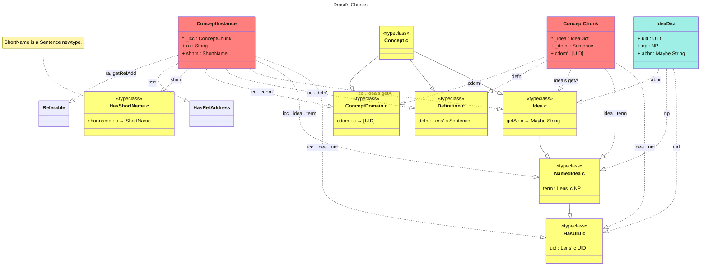

# Examining Drasil's Chunks

Let:
* Boxes represent chunks or typeclasses:
  * Yellow boxes represent typeclasses.
  * Turquoise boxes represent standalone chunks.
  * Red boxes represent chunks that “extend” others, reusing a `UID`.
* Solid line arrows with an empty triangle head from `B` to `A` represent
  extension.
* Dashed line arrows with an empty triangle head from `B` to `A` represent
  typeclass satisfaction with commentary explaining _how_ `B` satisfies `A`.

in:

Note: Regrettably, the above might be difficult to read. You can try
copy/pasting the code into [mermaid.live](https://mermaid.live/edit) to view a
more interactive version.

## Examples and Usage

* [IdeaDict](./examples/IdeaDict.md)
