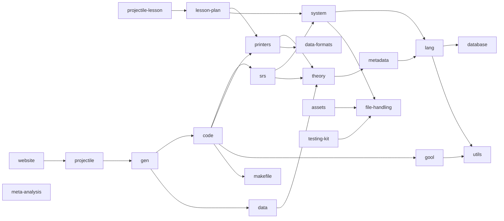
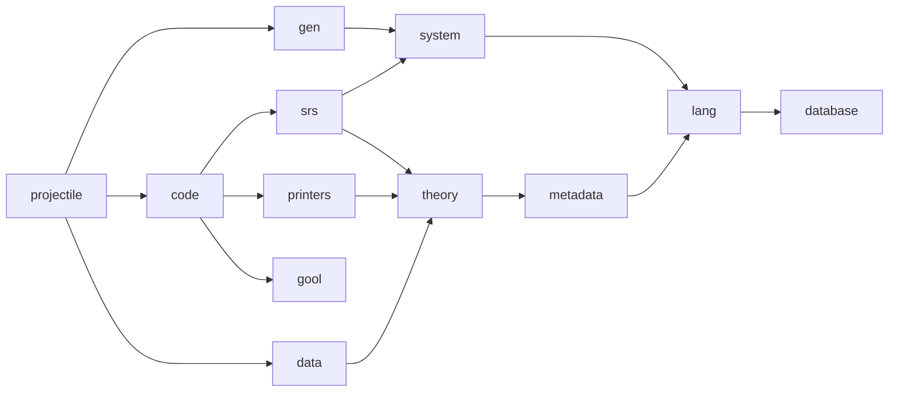
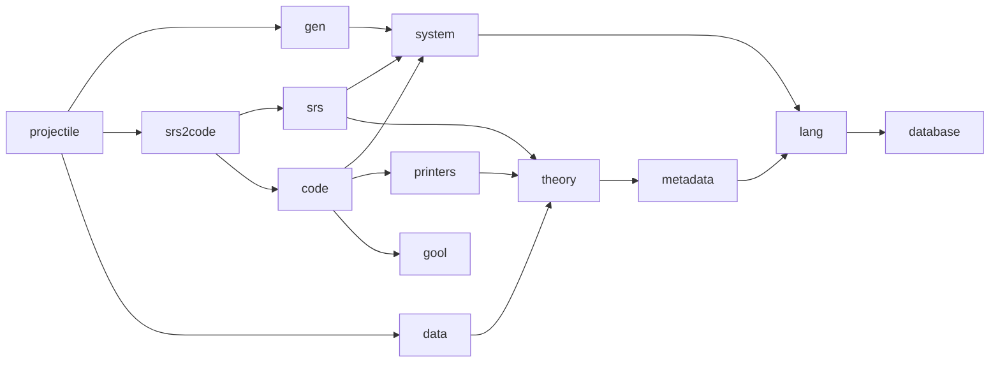
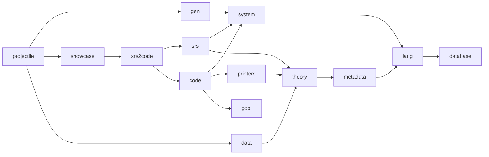
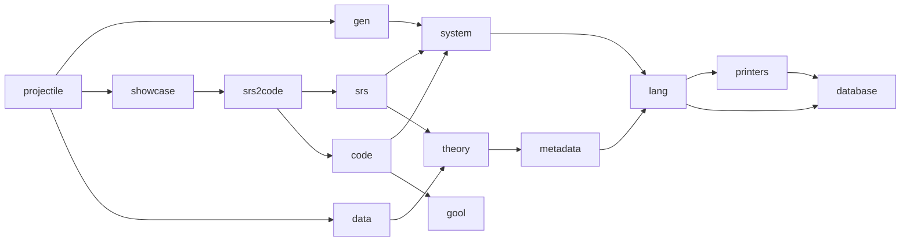
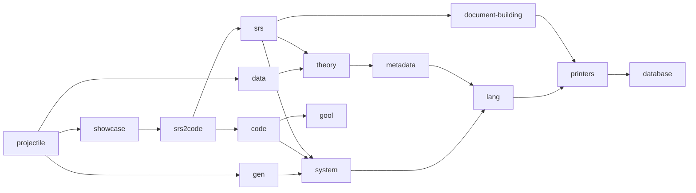
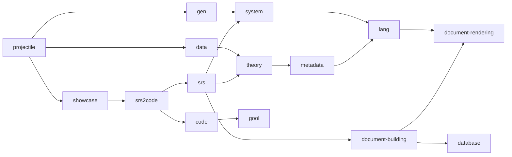
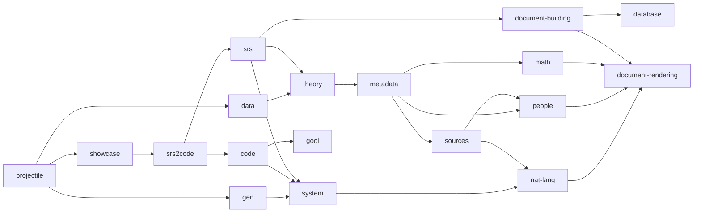

## Discussion Preliminary Steps Found in Shallow File Analysis

**Objectives**: For display in the GHRC paper:

1. Generate more code artifacts (more generation options in the code generator).
2. Explainable `-code` internals.

**Method**: Shallow file analysis to understand state of the code, and gradually revising until the code is explainable and can generate more variants.

**Progress**: We've done a shallow file analysis on `gen`, `code`, `printers`, `system`, and `makefile`, and have been making select changes. The next subsection will discuss the current state and the following ones will propose changes that target the package dependency graph to gradually improve explainability of the codebase more broadly.

### 0. Current State

These are Drasil's essential packages. We've done a shallow file analysis on `gen`, `code`, `printers`, `system`, and `database`.

Current understanding of packages:

1. **`database`**: Foundational package that establishes a definition of a "chunk" (reusable information with a `UID` and references to [dependencies on] other chunks), along with the in-memory typed database (`ChunkDB`) and lookup and reference machinery.
2. **`lang`**: The core knowledge representation DSL and foundational chunk typeclasses. Defines mathematical expressions (`Expr`, `ModelExpr`, `Literal`), types (`Space`), physical units (`UnitDefn`), symbols (`Symbol`), natural language sentences (`Sentence`), base document ASTs (`Document`), and chunk classes and types (`Quantity`, `Concept`, `Constrained`, etc. and `DefinedQuantityDict`, `ConstrConcept`, `UnitDefn`, etc.).
3. **`metadata`**: Shared Drasil-level concepts, including relevant papers the SRS references, people that contributed to said papers, domain-specific definitions, and standard concepts (software terminology, math concepts, and Drasil metadata).
4. **`system`**: Defines `SystemMeta`, binding top-level contextual project descriptors (via `HasSystemMeta`, system name, authors, purpose, scope, background, motivation) to a knowledge base (`ChunkDB`), intended to be carried by "projects" (which are intended to represent choice-free core components of a high-level representation of a specific kind of software project).
5. **`theory`**: Scientific theory abstractions and mathematical model schemas (`ModelKinds`). Also contains pretty displayable variants (`DataDefinition`, `GenDefn`, `TheoryModel`, and `InstanceModel`), along with derivations and constraint sets.
6. **`data`**: Reusable scientific ontology and physical knowledge repository. Contains standard physical quantities, SI units, physical constants, and foundational physical/mathematical theories (kinematics, thermodynamics, etc.).
7. **`printers`**: Document renderers and backend format printers. Translates Drasil's internal document ASTs, expressions, layout objects, and citations into concrete target formats (LaTeX/PDF, HTML with CSS, Markdown, JSON, and plain text).
8. **`srs`**: Software Requirements Specification layout DSL and schema compiler (based on the Smith et al. framework). Compiles declarative document descriptions (`DocDecl`) into generic `Document` ASTs, erasing as many chunks as possible along the way.
9. **`gool`**: A language-polymorphic embedded DSL abstracting imperative, object-oriented, and procedural programming languages, with target-specific printers generating (locally, not architecturally) idiomatic code in Python, Java, C++, C#, Swift, Julia, and MATLAB.
10. **`code`**: ICO program code generator. Transforms scientific models (`srs` & `theory`) and architectural/implementation design decisions (`Choices`) into imperative program specifications (`CodeSpec`), linking numerical ODE solvers and generating code (via GOOL/GProc), build scripts (Makefiles), and READMEs.
11. **`gen`**: A facade! High-level APIs for building various kinds of software artifacts (currently only the SRS and SRS+Code and SRS+CodeZoo showcases), but actively being reworked. Currently also exposes "common knowledge" intended to be used by all examples. The 'best' version of those only wraps artbitrary systems with an extra generator that exposes options for writing Drasil debugging data (from the `ChunkDB`).
12. **`projectile`**: (1) an executable that exercises one of the off-the-shelf generators declared in `gen` and (2) a library containing the "projectile" problem encoding along with generation options for the executable to use.
13. **`file-handling`**: Virtualized file hierarchy (`FileLayout`, `FileTree`), supporting disk IO with configurable overwrite policies.
14. **`assets`**: Capture external static artifacts (images, stylesheets, raw binary/text files) as `Asset`s with simple sentences describing their contents. Uses Template Haskell to embed the files at compile-time.
15. **`testing-kit`**: Golden testing framework specialized to `file-handling`-based files. Supports a `--accept` parameter to accept new golden artifacts.
16. **`utils`**: `Data.List.Extras` and natural language English formatting combinators (i.e., comma-separated lists and capitalization).
17. **`data-formats`**: IRs and renderers for common data serialization formats (CSV, JSON) and document formats (HTML, Markdown; both in progress).
18. **`makefile`**: AST for `Makefile`s with a pretty-printer and a utility for building OS-specific variables.
19. **`lesson-plan`**: Layout DSL and schema for generating interactive lesson plans (`LessonPlan`, `LsnDesc`). Bundles together a rendering pipeline reusing code from `drasil-printers` heavily.
20. **`website`**: Drasil's "project website" system representation and renderer. Assembles project metadata, case-study example showcases, and generated artifacts into an HTML website.
21. **`meta-analysis`**: Codebase introspection tooling (`ClassInstDepGen` and `TypeDepGen`). Analyzes Drasil's own source modules to generate Graphviz/Dot and HTML graphs illustrating type and class instance dependencies. While used in the project website, the package is not depended on. The chunks representing the figures in particular, are captured in `drasil-srs`.

### 1. `gen --> code & data`

`drasil-gen` depends on `-srs`, `-code`, and `-data` directly because it wraps up the file generators for the SRS generator and the code generator. It also contains the "basis `ChunkDB`" that is intended to be used by all our existing projects.

### 2. `code --> srs`

Create an `srs-extract` project

### 3. Drasil generates artifact showcases!

Generated artifacts create showcases of artifacts

### 4. `drasil-lang` contains code that belongs in `-code`, but dependency cycle!

#### 4.1. Move `-printers` down

#### 4.2. Move `-code` code in `-lang` up to `-code`

No change.

### 5. Documents, documents, documents

#### 5.1. Building

#### 5.2. Rendering

### 6. Splitting up `-lang`

