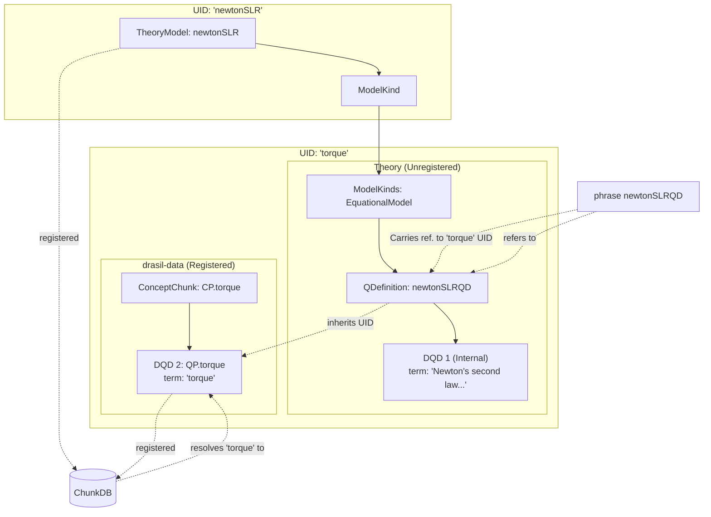

## Current Capture (As of 69b96d)

In this section, we will dissect all chunk-like types associated with the following code:

```haskell
-- * Newton's Second Law of Rotational Motion

newtonSLR :: TheoryModel
newtonSLR = tm (equationalModelU "newtonSLR" newtonSLRQD) [dRef hibbeler2004]
  "NewtonSecLawRotMot" newtonSLRNotes

newtonSLRQD :: ModelQDef
newtonSLRQD = mkQuantDef' QP.torque (nounPhraseSP "Newton's second law for rotational motion") newtonSLRExpr

newtonSLRExpr :: ExprC r => r
newtonSLRExpr = sy QP.momentOfInertia $* sy QP.angularAccel

newtonSLRNotes :: [Sentence]
newtonSLRNotes = [foldlSent
  [S "The net", getTandS QP.torque, S "on a", phrase rigidBody `S.is`
   S "proportional to its", getTandS QP.angularAccel `sC` S "where",
   ch QP.momentOfInertia, S "denotes", phrase QP.momentOfInertia `S.the_ofThe`
   phrase rigidBody, S "as the", phrase constant `S.of_` S "proportionality"]]
```

More precisely, we will focus on discussing things exposed through classy lenses.

### Visualized

Note:

1. Subgraphs (boxes) indicate that all nodes contained within share the same `UID`.
2. Edge labels of dashed arrows describe their meaning. Meaningless without.
3. Plain arrows mean "contains."



    <!--DQD2 --> Out["'torque' (incorrect)"]-->

### 1. A `TheoryModel`

```haskell
newtonSLR :: TheoryModel
newtonSLR = tm (equationalModelU "newtonSLR" newtonSLRQD) [dRef hibbeler2004]
  "NewtonSecLawRotMot" newtonSLRNotes
```

The `TheoryModel` exposes the following:

* A `UID` (from inner `ModelKind`): "newtonSLR"
* A `term` (from inner `ModelKind`): Newton's second law for rotational motion
* A `Maybe` abbreviation (from inner `ModelKind`) via `Idea`: `Nothing`
* A human-readable definition (from inner `ModelKind`): `EmptyS`
* A list of decorated references: `hibbeler2004`
* A list of 'notes' (see [Notes](#notes-sentence))
* A "shortname": "NewtonSecLawRotMot"
* A reference address: "TM:NewtonSecLawRotMot"
* Another abbreviation (different from the earlier one!) via `CommonIdea`: "TM"
* An axiomatization of its body (from inner `ModelKind`): $\symbf{τ}=\symbf{I}α$
* Duplicate reference address exposure: both `HasRefAddress` (`getRefAdd`) and `Referable` (`renderRef`) yield `"TM:NewtonSecLawRotMot"`

### 2. A `ModelKind`

Note: `ModelKind` is a wrapper around `ModelKinds` that inherits everything, but permits overriding the `UID` and the `term`. The reason why we have _both_ `ModelKind` and `ModelKinds` was purely for operational reasons: to get Drasil working, without affecting `stable/`. Now that we want do things 'correctly,' this hack is at the front of the line. 

```haskell
equationalModelU "newtonSLR" newtonSLRQD
```

The above code is nested in `newtonSLR`'s definition.

The `ModelKind ModelExpr` exposes the following:

* A `UID` (it owns!): "newtonSLR"
* A `term` (it owns, but cloned from the internal `QDefinition`): Newton's second law for rotational motion
* A `Maybe` abbreviation (from inner `M-K-s`) via `Idea`: `Nothing`
* A human-readable definition (from inner `M-K-s`): `EmptyS`
* An axiomatization of its body (from inner `M-K-s`): $\symbf{τ}=\symbf{I}α$
* A list of type-checkable expressions (from inner `M-K-s`): $\symbf{τ}=\symbf{I}α$

### 3. A `ModelKinds ModelExpr`

This is constructed by automatically through the `equationalModelU` constructor:

```haskell
-- | Smart constructor for 'EquationalModel's, deriving Term from the 'QDefinition'
equationalModelU :: String -> QDefinition e -> ModelKind e
equationalModelU u qd = MK (EquationalModel qd) (mkUid' u) (qd ^. term)
```

Called with `equationalModelU "newtonSLR" newtonSLRQD` and we get a `EquationalModel newtonSLRQD :: ModelKinds ModelExpr` exposing the following through lenses, **all inherited from the internal `QDefinition`**:

* A `UID`: "torque"
* A `term`: "Newton's second law for rotational motion"
* A `Maybe` abbreviation: `Nothing`
* A human-readable definition: `EmptyS`
* An axiomatization of its body: $\symbf{τ}=\symbf{I}α$
* A list of type-checkable expressions: $\symbf{τ}=\symbf{I}α$

### 4. A `QDefinition`

```haskell
newtonSLRQD :: ModelQDef
newtonSLRQD = mkQuantDef' QP.torque (nounPhraseSP "Newton's second law for rotational motion") newtonSLRExpr
```

The `ModelQDef` (`QDefinition ModelExpr`) exposes the following through lenses:

* A `UID` (cloned from internal `DefinedQuantityDict`, derived from `QP.torque`): "torque"
* A `term` (inherited from internal `DefinedQuantityDict`): "Newton's second law for rotational motion"
* A `Maybe` abbreviation (inherited from internal `DefinedQuantityDict`): `Nothing`
* A `DefinedQuantityDict` it "defines": (its internal `DefinedQuantityDict`!)
* A `Space` (inherited from inner DQD): `Real`
* A `Symbol` (inherited from inner DQD): $\symbf{τ}$
* A human-readable definition (inherited from inner DQD): `EmptyS`
* A `Maybe UnitDefn` (inherited from inner DQD): `Just` (called "torque", derived from $Nm$)
* A "defining expression" (exposing the right-hand-side information; a `ModelExpr` here): $\symbf{I}α$
* An axiomatization: $\symbf{τ}=\symbf{I}α$
  The axiomatization is based on a list of input variables and the defining expression. If there were input symbols, the final expression would have been of the form: $\symbf{τ}(x,y,z,...)=\symbf{I}α$
* A list of type-checkable expressions: $\symbf{τ}=\symbf{I}α$

### 5. `DefinedQuantityDict`s

#### 5.1. One internally held in the `QDefinition` from (4)

Constructed inside `mkQuantDef'` via `quant' (c ^. uid) t EmptyS (symbol c) (c ^. typ) (getUnit c)`:

* A `UID` (inherited from `QP.torque`): "torque"
* A `term` (overridden with `t` above): "Newton's second law for rotational motion"
* A `Maybe` abbreviation via `Idea`: `Nothing`
* A human-readable definition: `EmptyS`
* A `Space`: `Real`
* A `Symbol`: $\symbf{τ}$
* A `Maybe UnitDefn`: `Just` (called "torque", derived from $\text{N}\cdot\text{m}$)

This one is **not inserted** into the `ChunkDB`.

#### 5.2. `drasil-data`'s `torque`

Defined in `Data.Drasil.Quantities.Physics` via `dqd CP.torque (vec lTau) Real torqueU`:

* A `UID` (from `CP.torque`): "torque"
* A `term` (from `CP.torque`): "torque"
* A `Maybe` abbreviation via `Idea`: `Nothing`
* A human-readable definition (from `CP.torque`): "a twisting force that tends to cause rotation"
* A `Space`: `Real`
* A `Symbol`: $\symbf{τ}$
* A `Maybe UnitDefn`: `Just` (called "torque", derived from $\text{N}\cdot\text{m}$)

This one **is inserted into the `ChunkDB`**.

#### 5.3. The Clash

5.1 and 5.2 are distinct `DefinedQuantityDict` sharing a `UID` (`"torque"`), symbol ($\symbf{τ}$), space (`Real`), and unit (`torqueU`). However, their **terms** and **definitions** are in conflict:

* 5.1 has term *"Newton's second law for rotational motion"* and definition `EmptyS`.
* 5.2 has term *"torque"* and definition *"a twisting force that tends to cause rotation"*.

Since only `QP.torque` (5.2) is registered in the `ChunkDB`, any sentence referencing `newtonSLRQD` (which emits `Ch TermStyle NoCap "torque"` as a `Sentence` fragment) resolves to 5.2, completely discarding the overridden term in 5.1.

Of course, there is a background issue: `newtonSLRQD` should not have created its own duplicate DQD.

### Miscellaneous

#### `ExprC r => r`

```haskell
newtonSLRExpr :: ExprC r => r
newtonSLRExpr = sy QP.momentOfInertia $* sy QP.angularAccel
```

#### Notes (`[Sentence]`)

```haskell
newtonSLRNotes :: [Sentence]
newtonSLRNotes = [foldlSent
  [S "The net", getTandS QP.torque, S "on a", phrase rigidBody `S.is`
   S "proportional to its", getTandS QP.angularAccel `sC` S "where",
   ch QP.momentOfInertia, S "denotes", phrase QP.momentOfInertia `S.the_ofThe`
   phrase rigidBody, S "as the", phrase constant `S.of_` S "proportionality"]]
```
