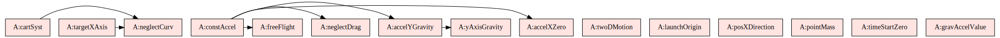
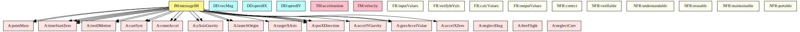
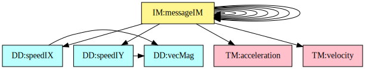
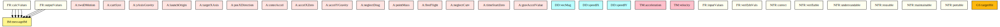
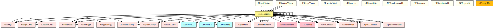

# Traceability Matrices and Graphs

The purpose of the traceability matrices is to provide easy references on what has to be additionally modified if a certain component is changed. Every time a component is changed, the items in the column of that component that are marked with an "X" should be modified as well. [Tab:TraceMatAvsA](./matrices-and-graphs.md#Table:TraceMatAvsA) shows the dependencies of the assumptions on each other. [Tab:TraceMatAvsAll](./matrices-and-graphs.md#Table:TraceMatAvsAll) shows the dependencies of the data definitions, theoretical models, general definitions, instance models, requirements, likely changes, and unlikely changes on the assumptions. [Tab:TraceMatRefvsRef](./matrices-and-graphs.md#Table:TraceMatRefvsRef) shows the dependencies of the data definitions, theoretical models, general definitions, and instance models on each other. [Tab:TraceMatAllvsR](./matrices-and-graphs.md#Table:TraceMatAllvsR) shows the dependencies of the requirements and goal statements on the data definitions, theoretical models, general definitions, and instance models.

||[A:twoDMotion](./assumptions.md#twoDMotion)|[A:cartSyst](./assumptions.md#cartSyst)|[A:yAxisGravity](./assumptions.md#yAxisGravity)|[A:launchOrigin](./assumptions.md#launchOrigin)|[A:targetXAxis](./assumptions.md#targetXAxis)|[A:posXDirection](./assumptions.md#posXDirection)|[A:constAccel](./assumptions.md#constAccel)|[A:accelXZero](./assumptions.md#accelXZero)|[A:accelYGravity](./assumptions.md#accelYGravity)|[A:neglectDrag](./assumptions.md#neglectDrag)|[A:pointMass](./assumptions.md#pointMass)|[A:freeFlight](./assumptions.md#freeFlight)|[A:neglectCurv](./assumptions.md#neglectCurv)|[A:timeStartZero](./assumptions.md#timeStartZero)|[A:gravAccelValue](./assumptions.md#gravAccelValue)|
|-|-|-|-|-|-|-|-|-|-|-|-|-|-|-|-|
|[A:twoDMotion](./assumptions.md#twoDMotion)||||||||||||||||
|[A:cartSyst](./assumptions.md#cartSyst)|||||||||||||X|||
|[A:yAxisGravity](./assumptions.md#yAxisGravity)||||||||||||||||
|[A:launchOrigin](./assumptions.md#launchOrigin)||||||||||||||||
|[A:targetXAxis](./assumptions.md#targetXAxis)|||||||||||||X|||
|[A:posXDirection](./assumptions.md#posXDirection)||||||||||||||||
|[A:constAccel](./assumptions.md#constAccel)||||||||X|X|X||X||||
|[A:accelXZero](./assumptions.md#accelXZero)||||||||||||||||
|[A:accelYGravity](./assumptions.md#accelYGravity)|||X|||||||||||||
|[A:neglectDrag](./assumptions.md#neglectDrag)||||||||||||||||
|[A:pointMass](./assumptions.md#pointMass)||||||||||||||||
|[A:freeFlight](./assumptions.md#freeFlight)||||||||||||||||
|[A:neglectCurv](./assumptions.md#neglectCurv)||||||||||||||||
|[A:timeStartZero](./assumptions.md#timeStartZero)||||||||||||||||
|[A:gravAccelValue](./assumptions.md#gravAccelValue)||||||||||||||||

**
Traceability Matrix Showing the Connections Between Assumptions and Other Assumptions
**

 

||[A:twoDMotion](./assumptions.md#twoDMotion)|[A:cartSyst](./assumptions.md#cartSyst)|[A:yAxisGravity](./assumptions.md#yAxisGravity)| [A:launchOrigin](./assumptions.md#launchOrigin)|[A:targetXAxis](./assumptions.md#targetXAxis)|[A:posXDirection](./assumptions.md#posXDirection)|[A:constAccel](./assumptions.md#constAccel)|[A:accelXZero](./assumptions.md#accelXZero)|[A:accelYGravity](./assumptions.md#accelYGravity)|[A:neglectDrag](./assumptions.md#neglectDrag)|[A:pointMass](./assumptions.md#pointMass)|[A:freeFlight](./assumptions.md#freeFlight)|[A:neglectCurv](./assumptions.md#neglectCurv)|[A:timeStartZero](./assumptions.md#timeStartZero)|[A:gravAccelValue](./assumptions.md#gravAccelValue)|
|-|-|-|-|-|-|-|-|-|-|-|-|-|-|-|-|
|[DD:vecMag](./data-definitions.md#DD:vecMag)||||||||||||||||
|[DD:speedIX](./data-definitions.md#DD:speedIX)||||||||||||||||
|[DD:speedIY](./data-definitions.md#DD:speedIY)||||||||||||||||
|[TM:acceleration](./theoretical-models.md#TM:acceleration)||||||||||||||||
|[TM:velocity](./theoretical-models.md#TM:velocity)||||||||||||||||
|[GD:rectVel](./general-definitions.md#GD:rectVel)|||||||||||X|||X||
|[GD:rectPos](./general-definitions.md#GD:rectPos)|||||||||||X|||X||
|[GD:velVec](./general-definitions.md#GD:velVec)|X|X|||||X|||||||X||
|[GD:posVec](./general-definitions.md#GD:posVec)||||||||||||||||
|[IM:calOfLandingTime](./instance-models.md#IM:calOfLandingTime)|||X|X|X|X|||X|||||X|X|
|[IM:calOfLandingDist](./instance-models.md#IM:calOfLandingDist)|||X|X||X||X|||||||X|
|[IM:offsetIM](./instance-models.md#IM:offsetIM)||||||X||||||||||
|[IM:messageIM](./instance-models.md#IM:messageIM)||||||X||||||||||
|[FR:Input-Values](./functional-req.md#inputValues)||||||||||||||||
|[FR:Verify-Input-Values](./functional-req.md#verifyInVals)||||||||||||||||
|[FR:Calculate-Values](./functional-req.md#calcValues)||||||||||||||||
|[FR:Output-Values](./functional-req.md#outputValues)||||||||||||||||
|[NFR:Correct](./non-functional-req.md#correct)||||||||||||||||
|[NFR:Verifiable](./non-functional-req.md#verifiable)||||||||||||||||
|[NFR:Understandable](./non-functional-req.md#understandable)||||||||||||||||
|[NFR:Reusable](./non-functional-req.md#reusable)||||||||||||||||
|[NFR:Maintainable](./non-functional-req.md#maintainable)||||||||||||||||
|[NFR:Portable](./non-functional-req.md#portable)||||||||||||||||

**
Traceability Matrix Showing the Connections Between Assumptions and Other Items
**

 

||[DD:vecMag](./data-definitions.md#DD:vecMag)|[DD:speedIX](./data-definitions.md#DD:speedIX)|[DD:speedIY](./data-definitions.md#DD:speedIY)|[TM:acceleration](./theoretical-models.md#TM:acceleration)|[TM:velocity](./theoretical-models.md#TM:velocity)|[GD:rectVel](./general-definitions.md#GD:rectVel)|[GD:rectPos](./general-definitions.md#GD:rectPos)|[GD:velVec](./general-definitions.md#GD:velVec)|[GD:posVec](./general-definitions.md#GD:posVec)|[IM:calOfLandingTime](./instance-models.md#IM:calOfLandingTime)|[IM:calOfLandingDist](./instance-models.md#IM:calOfLandingDist)|[IM:offsetIM](./instance-models.md#IM:offsetIM)|[IM:messageIM](./instance-models.md#IM:messageIM)|
|-|-|-|-|-|-|-|-|-|-|-|-|-|-|
|[DD:vecMag](./data-definitions.md#DD:vecMag)||||||||||||||
|[DD:speedIX](./data-definitions.md#DD:speedIX)|X|||||||||||||
|[DD:speedIY](./data-definitions.md#DD:speedIY)||X||||||||||||
|[TM:acceleration](./theoretical-models.md#TM:acceleration)||||||||||||||
|[TM:velocity](./theoretical-models.md#TM:velocity)||||||||||||||
|[GD:rectVel](./general-definitions.md#GD:rectVel)||||X||||||||||
|[GD:rectPos](./general-definitions.md#GD:rectPos)|||||X|X||||||||
|[GD:velVec](./general-definitions.md#GD:velVec)|||||||X|||||||
|[GD:posVec](./general-definitions.md#GD:posVec)|||||||X|||||||
|[IM:calOfLandingTime](./instance-models.md#IM:calOfLandingTime)|||X||||||X|||||
|[IM:calOfLandingDist](./instance-models.md#IM:calOfLandingDist)||X|||||||X|X||||
|[IM:offsetIM](./instance-models.md#IM:offsetIM)|||||||||||X|||
|[IM:messageIM](./instance-models.md#IM:messageIM)||||||||||||X||

**
Traceability Matrix Showing the Connections Between Items and Other Sections
**

 

||[DD:vecMag](./data-definitions.md#DD:vecMag)|[DD:speedIX](./data-definitions.md#DD:speedIX)|[DD:speedIY](./data-definitions.md#DD:speedIY)|[TM:acceleration](./theoretical-models.md#TM:acceleration)|[TM:velocity](./theoretical-models.md#TM:velocity)|[GD:rectVel](./general-definitions.md#GD:rectVel)|[GD:rectPos](./general-definitions.md#GD:rectPos)|[GD:velVec](./general-definitions.md#GD:velVec)|[GD:posVec](./general-definitions.md#GD:posVec)|[IM:calOfLandingTime](./instance-models.md#IM:calOfLandingTime)|[IM:calOfLandingDist](./instance-models.md#IM:calOfLandingDist)|[IM:offsetIM](./instance-models.md#IM:offsetIM)|[IM:messageIM](./instance-models.md#IM:messageIM)|[FR:Input-Values](./functional-req.md#inputValues)|[FR:Verify-Input-Values](./functional-req.md#verifyInVals)|[FR:Calculate-Values](./functional-req.md#calcValues)|[FR:Output-Values](./functional-req.md#outputValues)|[NFR:Correct](./non-functional-req.md#correct)|[NFR:Verifiable](./non-functional-req.md#verifiable)|[NFR:Understandable](./non-functional-req.md#understandable)|[NFR:Reusable](./non-functional-req.md#reusable)|[NFR:Maintainable](./non-functional-req.md#maintainable)|[NFR:Portable](./non-functional-req.md#portable)|
|-|-|-|-|-|-|-|-|-|-|-|-|-|-|-|-|-|-|-|-|-|-|-|-|
|[GS:targetHit](./goal-statements.md#targetHit)||||||||||||||||||||||||
|[FR:Input-Values](./functional-req.md#inputValues)||||||||||||||||||||||||
|[FR:Verify-Input-Values](./functional-req.md#verifyInVals)||||||||||||||||||||||||
|[FR:Calculate-Values](./functional-req.md#calcValues)|||||||||||X|X|X|X||||||||||
|[FR:Output-Values](./functional-req.md#outputValues)|||||||||||X||X|X||||||||||
|[NFR:Correct](./non-functional-req.md#correct)||||||||||||||||||||||||
|[NFR:Verifiable](./non-functional-req.md#verifiable)||||||||||||||||||||||||
|[NFR:Understandable](./non-functional-req.md#understandable)||||||||||||||||||||||||
|[NFR:Reusable](./non-functional-req.md#reusable)||||||||||||||||||||||||
|[NFR:Maintainable](./non-functional-req.md#maintainable)||||||||||||||||||||||||
|[NFR:Portable](./non-functional-req.md#portable)||||||||||||||||||||||||

**
Traceability Matrix Showing the Connections Between Requirements, Goal Statements and Other Items
**

The purpose of the traceability graphs is also to provide easy references on what has to be additionally modified if a certain component is changed. The arrows in the graphs represent dependencies. The component at the tail of an arrow is depended on by the component at the head of that arrow. Therefore, if a component is changed, the components that it points to should also be changed. [Fig:TraceGraphAvsA](./matrices-and-graphs.md#Figure:TraceGraphAvsA) shows the dependencies of assumptions on each other. [Fig:TraceGraphAvsAll](./matrices-and-graphs.md#Figure:TraceGraphAvsAll) shows the dependencies of data definitions, theoretical models, general definitions, instance models, requirements, likely changes, and unlikely changes on the assumptions. [Fig:TraceGraphRefvsRef](./matrices-and-graphs.md#Figure:TraceGraphRefvsRef) shows the dependencies of data definitions, theoretical models, general definitions, and instance models on each other. [Fig:TraceGraphAllvsR](./matrices-and-graphs.md#Figure:TraceGraphAllvsR) shows the dependencies of requirements and goal statements on the data definitions, theoretical models, general definitions, and instance models. [Fig:TraceGraphAllvsAll](./matrices-and-graphs.md#Figure:TraceGraphAllvsAll) shows the dependencies of dependencies of assumptions, models, definitions, requirements, goals, and changes with each other.

**
TraceGraphAvsA
**

**
TraceGraphAvsAll
**

**
TraceGraphRefvsRef
**

**
TraceGraphAllvsR
**

**
TraceGraphAllvsAll
**

For convenience, the following graphs can be found at the links below:

- [TraceGraphAvsA](./traceygraphs/avsa.svg)
- [TraceGraphAvsAll](./traceygraphs/avsall.svg)
- [TraceGraphRefvsRef](./traceygraphs/refvsref.svg)
- [TraceGraphAllvsR](./traceygraphs/allvsr.svg)
- [TraceGraphAllvsAll](./traceygraphs/allvsall.svg)
