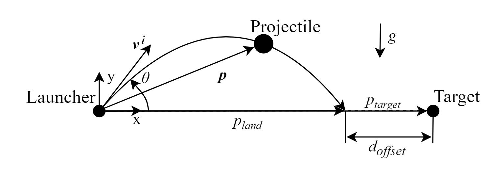

# Physical System Description

The physical system of Projectile, as shown in [Fig:Launch](./physical-sys-description.md#Figure:Launch), includes the following elements:

PS1: The launcher.

PS2: The projectile (with initial velocity \\({\boldsymbol{v}^{\text{i}}}\\) and launch angle \\(θ\\)).

PS3: The target.

**
The physical system
**

