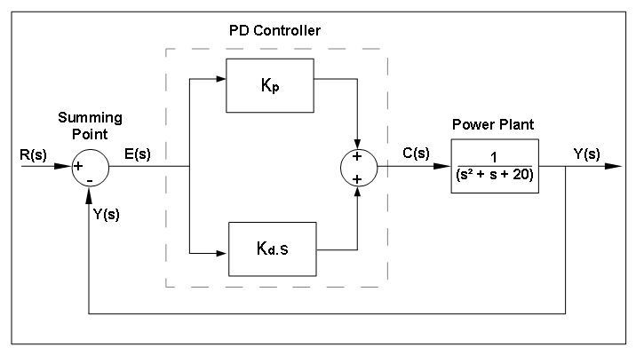
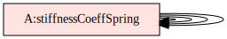
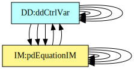
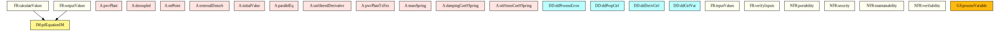
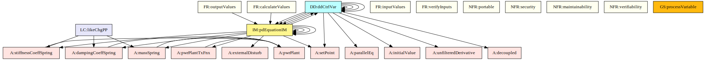

# Software Requirements Specification for PD Controller
Naveen Ganesh Muralidharan

# Table of Contents {#Sec:ToC}

An outline of all sections included in this SRS is recorded here for easy reference.

- [Table of Contents](#Sec:ToC)
- [Reference Material](#Sec:RefMat)
  - [Table of Units](#Sec:ToU)
  - [Table of Symbols](#Sec:ToS)
  - [Abbreviations and Acronyms](#Sec:TAbbAcc)
- [Introduction](#Sec:Intro)
  - [Purpose of Document](#Sec:DocPurpose)
  - [Scope of Requirements](#Sec:ReqsScope)
  - [Characteristics of Intended Reader](#Sec:ReaderChars)
  - [Organization of Document](#Sec:DocOrg)
- [General System Description](#Sec:GenSysDesc)
  - [System Context](#Sec:SysContext)
  - [User Characteristics](#Sec:UserChars)
  - [System Constraints](#Sec:SysConstraints)
- [Specific System Description](#Sec:SpecSystDesc)
  - [Problem Description](#Sec:ProbDesc)
    - [Terminology and Definitions](#Sec:TermDefs)
    - [Physical System Description](#Sec:PhysSyst)
    - [Goal Statements](#Sec:GoalStmt)
  - [Solution Characteristics Specification](#Sec:SolCharSpec)
    - [Assumptions](#Sec:Assumps)
    - [Theoretical Models](#Sec:TMs)
    - [General Definitions](#Sec:GDs)
    - [Data Definitions](#Sec:DDs)
    - [Instance Models](#Sec:IMs)
    - [Data Constraints](#Sec:DataConstraints)
- [Requirements](#Sec:Requirements)
  - [Functional Requirements](#Sec:FRs)
  - [Non-Functional Requirements](#Sec:NFRs)
- [Likely Changes](#Sec:LCs)
- [Traceability Matrices and Graphs](#Sec:TraceMatrices)
- [References](#Sec:References)

# Reference Material {#Sec:RefMat}

This section records information for easy reference.

# Table of Units {#Sec:ToU}

The unit system used throughout is SI (Système International d'Unités). In addition to the basic units, several derived units are also used. For each unit, the [Table of Units](#Table:ToU) lists the symbol, a description, and the SI name.

|Symbol           |Description|SI Name |
|:----------------|:----------|:-------|
|\\({\text{kg}}\\)|mass       |kilogram|
|\\({\text{s}}\\) |time       |second  |

**
Table of Units
**

# Table of Symbols {#Sec:ToS}

The symbols used in this document are summarized in the [Table of Symbols](#Table:ToS) along with their units. The symbols are listed in alphabetical order.

|Symbol                  |Description                                 |Units            |
|:-----------------------|:-------------------------------------------|:----------------|
|\\(\mathit{AbsTol}\\)   |Absolute Tolerance                          |--               |
|\\({C\_{\text{s}}}\\)   |Control Variable in the frequency domain    |--               |
|\\(c\\)                 |Damping coefficient of the spring           |--               |
|\\({c\_{\text{t}}}\\)   |Control Variable in the time domain         |--               |
|\\({D\_{\text{s}}}\\)   |Derivative control in the frequency domain  |--               |
|\\({E\_{\text{s}}}\\)   |Process Error in the frequency domain       |--               |
|\\({e\_{\text{t}}}\\)   |Process Error in the time domain            |--               |
|\\({F\_{\text{s}}}\\)   |Laplace Transform of a function             |--               |
|\\({f\_{\text{t}}}\\)   |Function in the time domain                 |--               |
|\\({H\_{\text{s}}}\\)   |Transfer Function in the frequency domain   |--               |
|\\({K\_{\text{d}}}\\)   |Derivative Gain                             |--               |
|\\({K\_{\text{p}}}\\)   |Proportional Gain                           |--               |
|\\(k\\)                 |Stiffness coefficient of the spring         |\\({\text{s}}\\) |
|\\(\mathit{L⁻¹[F(s)]}\\)|Inverse Laplace Transform of a function     |--               |
|\\(m\\)                 |Mass                                        |\\({\text{kg}}\\)|
|\\({P\_{\text{s}}}\\)   |Proportional control in the frequency domain|--               |
|\\({R\_{\text{s}}}\\)   |Set-Point in the frequency domain           |--               |
|\\({r\_{\text{t}}}\\)   |Set-Point                                   |--               |
|\\(\mathit{RelTol}\\)   |Relative Tolerance                          |--               |
|\\(s\\)                 |Complex frequency-domain parameter          |--               |
|\\(t\\)                 |Time                                        |\\({\text{s}}\\) |
|\\({t\_{\text{sim}}}\\) |Simulation Time                             |\\({\text{s}}\\) |
|\\({t\_{\text{step}}}\\)|Step Time                                   |\\({\text{s}}\\) |
|\\({Y\_{\text{s}}}\\)   |Process Variable in the frequency domain    |--               |
|\\({y\_{\text{t}}}\\)   |Process Variable                            |--               |

**
Table of Symbols
**

# Abbreviations and Acronyms {#Sec:TAbbAcc}

|Abbreviation|Full Form                          |
|:-----------|:----------------------------------|
|A           |Assumption                         |
|D           |derivative                         |
|DD          |Data Definition                    |
|GD          |General Definition                 |
|GS          |Goal Statement                     |
|I           |integral                           |
|IM          |Instance Model                     |
|P           |proportional                       |
|PD          |proportional derivative            |
|PID         |proportional integral derivative   |
|PS          |Physical System Description        |
|R           |Requirement                        |
|RefBy       |Referenced by                      |
|Refname     |Reference Name                     |
|SRS         |Software Requirements Specification|
|TM          |Theoretical Model                  |
|Uncert.     |Typical Uncertainty                |

**
Abbreviations and Acronyms
**

# Introduction {#Sec:Intro}

Automatic process control with a controller (P/PI/PD/PID) is used in a variety of applications such as thermostats, automobile cruise-control, etc. The gains of a controller in an application must be tuned before the controller is ready for production. Therefore a simulation of the PD Controller with a Second Order System is created in this project that can be used to tune the gain constants.

The following section provides an overview of the Software Requirements Specification (SRS) for PD Controller. This section explains the purpose of this document, the scope of the requirements, the characteristics of the intended reader, and the organization of the document.

# Purpose of Document {#Sec:DocPurpose}

The purpose of this document is to capture all the necessary information including assumptions, data definitions, constraints, models, and requirements to facilitate an unambiguous development of the PD Controller software and test procedures.

# Scope of Requirements {#Sec:ReqsScope}

The scope of the requirements includes a PD Control Loop with three subsystems, namely: a PD Controller, a Summing Point, and a Power Plant. Only the Proportional and Derivative controllers are used in this software; the Integral controller is beyond the scope of this project. Additionally, this software is intended to aid with the manual tuning of the PD Controller.

# Characteristics of Intended Reader {#Sec:ReaderChars}

Reviewers of this documentation should have an understanding of control systems (control theory and controllers) at the fourth-year undergraduate level and engineering mathematics at a second-year undergraduate level. The users of PD Controller can have a lower level of expertise, as explained in [Sec:User Characteristics](#Sec:UserChars).

# Organization of Document {#Sec:DocOrg}

The organization of this document follows the template for an SRS for scientific computing software proposed by [koothoor2013](#koothoor2013), [smithLai2005](#smithLai2005), [smithEtAl2007](#smithEtAl2007), and [smithKoothoor2016](#smithKoothoor2016). The presentation follows the standard pattern of presenting goals, theories, definitions, and assumptions. For readers that would like a more bottom up approach, they can start reading the [data definitions](#Sec:IMs) and trace back to find any additional information they require.

The [goal statements](#Sec:GoalStmt) are refined to the theoretical models and the [theoretical models](#Sec:TMs) to the [instance models](#Sec:IMs). The instance model referred as [IM:pdEquationIM](#IM:pdEquationIM) provides an Ordinary Differential Equation (ODE) that models the PD Controller.

# General System Description {#Sec:GenSysDesc}

This section provides general information about the system. It identifies the interfaces between the system and its environment, describes the user characteristics, and lists the system constraints.

# System Context {#Sec:SysContext}

[Fig:systemContextDiag](#Figure:systemContextDiag) shows the system context. The circle represents an external entity outside the software, the user in this case. The rectangle represents the software system itself, PD Controller in this case. Arrows are used to show the data flow between the system and its environment.

**
System Context
**

PD Controller is self-contained. The only external interaction is with the user. The responsibilities of the user and the system are as follows:

- User Responsibilities
  - Feed inputs to the model
  - Review the response of the Power Plant
  - Tune the controller gains
- PD Controller Responsibilities
  - Check the validity of the inputs
  - Calculate the outputs of the PD Controller and Power Plant

# User Characteristics {#Sec:UserChars}

The end-user of PD Controller is expected to have taken a course on Control Systems at an undergraduate level.

# System Constraints {#Sec:SysConstraints}

There are no system constraints.

# Specific System Description {#Sec:SpecSystDesc}

This section first presents the problem description, which gives a high-level view of the problem to be solved. This is followed by the solution characteristics specification, which presents the assumptions, theories, and definitions that are used.

# Problem Description {#Sec:ProbDesc}

A system is needed to provide a model of a PD Controller that can be used for the tuning of the gain constants before the deployment of the controller.

# Terminology and Definitions {#Sec:TermDefs}

This subsection provides a list of terms that are used in the subsequent sections and their meaning, with the purpose of reducing ambiguity and making it easier to correctly understand the requirements.

- PD Control Loop: Closed-Loop control system with PD Controller, Summing Point and Power Plant.
- PD Controller: Proportional-Derivative Controller.
- Summing Point: Control block where the difference between the Set-Point and the Process Variable is computed.
- Power Plant: A second order system to be controlled.
- Second Order System: A system whose input-output relationship is denoted by a second-order differential equation.
- Process Error: Input to the PID controller. Process Error is the difference between the Set-Point and the Process Variable.
- Simulation Time: Total execution time of the PD simulation.
- Process Variable: The output value from the power plant.
- Set-Point: The desired value that the control system must reach. This also knows as the reference variable.
- Proportional Gain: Gain constant of the proportional controller.
- Derivative Gain: Gain constant of the derivative controller.
- Proportional control: A linear feedback control system where correction is applied to the controlled variable which is proportional to the difference between desired and measured values.
- Derivative control: Monitors the rate of change of the error signal and contributes a component of the output signal (proportional to a derivative of the error signal).
- Frequency domain: The analysis of mathematical functions in terms of frequency, instead of time.
- Time domain: The analysis of mathematical functions in terms of time.
- Laplace transform: An integral transform that converts a function of a real variable t (often time) to a function of a complex variable s (complex frequency).
- Control Variable: The Control Variable is the output of the PD controller.
- Step Time: Simulation step time.
- Absolute Tolerance: Absolute tolerance for the integrator.
- Relative Tolerance: Relative tolerance for the integrator.
- Transfer Function: The Transfer Function of a system is the ratio of the output to the input functions in the frequency domain.
- Damping Coefficient: Quantity that characterizes a second order system's oscillatory response.
- Stiffness Coefficient: Quantity that characterizes a spring's stiffness.

# Physical System Description {#Sec:PhysSyst}

The physical system of PD Controller, as shown in [Fig:pidSysDiagram](#Figure:pidSysDiagram), includes the following elements:

PS1: The Summing Point.

PS2: The PD Controller.

PS3: The Power Plant.

**
The physical system
**

# Goal Statements {#Sec:GoalStmt}

Given Set-Point, Simulation Time, Proportional Gain, Derivative Gain, and Step Time, the goal statement is:

Process-Variable: Calculate the output of the Power Plant (Process Variable) over time.

# Solution Characteristics Specification {#Sec:SolCharSpec}

The instance models that govern PD Controller are presented in the [Instance Model Section](#Sec:IMs). The information to understand the meaning of the instance models and their derivation is also presented, so that the instance models can be verified.

# Assumptions {#Sec:Assumps}

This section simplifies the original problem and helps in developing the theoretical models by filling in the missing information for the physical system. The assumptions refine the scope by providing more detail.

Power plant: The Power Plant and the Sensor are coupled as a single unit. (RefBy: [A:Spring Stiffness Coefficient](#stiffnessCoeffSpring), [A:Transfer Function](#pwrPlantTxFnx), [A:Spring Mass](#massSpring), and [A:Spring Damping Coefficient](#dampingCoeffSpring).)

Decoupled equation: The decoupled form of the PD Controller equation used in this simulation. (RefBy: [DD:ddCtrlVar](#DD:ddCtrlVar).)

Set-Point: The Set-Point is constant throughout the simulation. (RefBy: [IM:pdEquationIM](#IM:pdEquationIM) and [DD:ddProcessError](#DD:ddProcessError).)

External disturbance: There are no external disturbances to the Power Plant during the simulation. (RefBy: [GD:gdPowerPlant](#GD:gdPowerPlant).)

Initial Value: The initial value of the Process Variable is assumed to be zero. (RefBy: [DD:ddProcessError](#DD:ddProcessError).)

Parallel Equation: The Parallel form of the equation is used for the PD Controller. (RefBy: [DD:ddCtrlVar](#DD:ddCtrlVar).)

Unfiltered Derivative: A pure derivative function is used for this simulation; there are no filters applied. (RefBy: [DD:ddDerivCtrl](#DD:ddDerivCtrl).)

Transfer Function: The combined Power Plant and Sensor ([A:Power plant](#pwrPlant)) are characterized by a Second Order mass-spring-damper System. (RefBy: [TM:tmSOSystem](#TM:tmSOSystem).)

Spring Mass: The mass of the spring in the mass-spring-damper system ([A:Power plant](#pwrPlant)) is assumed to be 1 kilogram. (RefBy: [GD:gdPowerPlant](#GD:gdPowerPlant) and [LC:DC Gain and Time Constant](#likeChgPP).)

Spring Damping Coefficient: The Damping Coefficient of the spring in the mass-spring-damper system ([A:Power plant](#pwrPlant)) is assumed to be 1. (RefBy: [GD:gdPowerPlant](#GD:gdPowerPlant) and [LC:DC Gain and Time Constant](#likeChgPP).)

Spring Stiffness Coefficient: The Stiffness Coefficient of the spring in the mass-spring-damper system ([A:Power plant](#pwrPlant)) is assumed to be 20. (RefBy: [GD:gdPowerPlant](#GD:gdPowerPlant) and [LC:DC Gain and Time Constant](#likeChgPP).)

# Theoretical Models {#Sec:TMs}

This section focuses on the general equations and laws that PD Controller is based on.

## Laplace Transform {#TM:laplaceTransform}

|Refname    |TM:laplaceTransform                                                                                                                                                                                                                                                                      |
|:----------|:----------------------------------------------------------------------------------------------------------------------------------------------------------------------------------------------------------------------------------------------------------------------------------------|
|Label      |Laplace Transform                                                                                                                                                                                                                                                                        |
|Equation   |\\[{F\_{\text{s}}}=\int\_{\mathit{-∞}}^{∞}{{f\_{\text{t}}} e^{-s t}}\\,dt\\]                                                                                                                                                                                                             |
|Description|<ul><li>\\({F\_{\text{s}}}\\) is the Laplace Transform of a function (Unitless)</li><li>\\({f\_{\text{t}}}\\) is the Function in the time domain (Unitless)</li><li>\\(s\\) is the Complex frequency-domain parameter (Unitless)</li><li>\\(t\\) is the time (\\({\text{s}}\\))</li></ul>|
|Notes      |<ul><li>Bilateral Laplace Transform. The Laplace transforms are typically inferred from a pre-computed table of Laplace Transforms ([laplaceWiki](#laplaceWiki)).</li></ul>                                                                                                              |
|Source     |[laplaceWiki](#laplaceWiki)                                                                                                                                                                                                                                                              |
|RefBy      |[GD:gdPowerPlant](#GD:gdPowerPlant), [DD:ddPropCtrl](#DD:ddPropCtrl), [DD:ddProcessError](#DD:ddProcessError), and [DD:ddDerivCtrl](#DD:ddDerivCtrl)                                                                                                                                     |

## Inverse Laplace Transform {#TM:invLaplaceTransform}

|Refname    |TM:invLaplaceTransform                                                                                                                                                                   |
|:----------|:----------------------------------------------------------------------------------------------------------------------------------------------------------------------------------------|
|Label      |Inverse Laplace Transform                                                                                                                                                                |
|Equation   |\\[{f\_{\text{t}}}=\mathit{L⁻¹[F(s)]}\\]                                                                                                                                                 |
|Description|<ul><li>\\({f\_{\text{t}}}\\) is the Function in the time domain (Unitless)</li><li>\\(\mathit{L⁻¹[F(s)]}\\) is the Inverse Laplace Transform of a function (Unitless)</li></ul>         |
|Notes      |<ul><li>Inverse Laplace Transform of F(S). The Inverse Laplace transforms are typically inferred from a pre-computed table of Laplace Transforms ([laplaceWiki](#laplaceWiki)).</li></ul>|
|Source     |[laplaceWiki](#laplaceWiki)                                                                                                                                                              |
|RefBy      |[IM:pdEquationIM](#IM:pdEquationIM)                                                                                                                                                      |

## Second Order Mass-Spring-Damper System {#TM:tmSOSystem}

|Refname    |TM:tmSOSystem                                                                                                                                                                                                                                                                   |
|:----------|:-------------------------------------------------------------------------------------------------------------------------------------------------------------------------------------------------------------------------------------------------------------------------------|
|Label      |Second Order Mass-Spring-Damper System                                                                                                                                                                                                                                          |
|Equation   |\\[\frac{1}{m s^{2}+c s+k}\\]                                                                                                                                                                                                                                                   |
|Description|<ul><li>\\(m\\) is the mass (\\({\text{kg}}\\))</li><li>\\(s\\) is the Complex frequency-domain parameter (Unitless)</li><li>\\(c\\) is the Damping coefficient of the spring (Unitless)</li><li>\\(k\\) is the Stiffness coefficient of the spring (\\({\text{s}}\\))</li></ul>|
|Notes      |<ul><li>The Transfer Function (from [A:Transfer Function](#pwrPlantTxFnx)) of a Second Order System (mass-spring-damper) is characterized by this equation.</li></ul>                                                                                                           |
|Source     |[abbasi2015](#abbasi2015)                                                                                                                                                                                                                                                       |
|RefBy      |[GD:gdPowerPlant](#GD:gdPowerPlant)                                                                                                                                                                                                                                             |

# General Definitions {#Sec:GDs}

This section collects the laws and equations that will be used to build the instance models.

## The Transfer Function of the Power Plant {#GD:gdPowerPlant}

|Refname    |GD:gdPowerPlant                                                                                                                                                                                                                                                                                                                                                                                                                                                                                                                                                                                                                                                                                |
|:----------|:----------------------------------------------------------------------------------------------------------------------------------------------------------------------------------------------------------------------------------------------------------------------------------------------------------------------------------------------------------------------------------------------------------------------------------------------------------------------------------------------------------------------------------------------------------------------------------------------------------------------------------------------------------------------------------------------|
|Label      |The Transfer Function of the Power Plant                                                                                                                                                                                                                                                                                                                                                                                                                                                                                                                                                                                                                                                       |
|Equation   |\\[\frac{1}{s^{2}+s+20}\\]                                                                                                                                                                                                                                                                                                                                                                                                                                                                                                                                                                                                                                                                     |
|Description|<ul><li>\\(s\\) is the Complex frequency-domain parameter (Unitless)</li></ul>                                                                                                                                                                                                                                                                                                                                                                                                                                                                                                                                                                                                                 |
|Notes      |<ul><li>The Transfer Function of the Second Order System (from [TM:tmSOSystem](#TM:tmSOSystem)) is reduced to this equation by substituting the mass (m) to 1 Kg (from [A:Spring Mass](#massSpring)), the Damping Coefficient (\\(c\\)) to 1 (from [A:Spring Damping Coefficient](#dampingCoeffSpring)), and the Stiffness Coefficient (\\(k\\)) to 20 (from [A:Spring Stiffness Coefficient](#stiffnessCoeffSpring)). The equation is converted to the frequency domain by applying the Laplace transform (from [TM:laplaceTransform](#TM:laplaceTransform)). Additionally, there are no external disturbances to the power plant (from [A:External disturbance](#externalDisturb)).</li></ul>|
|Source     |[pidWiki](#pidWiki) and [abbasi2015](#abbasi2015)                                                                                                                                                                                                                                                                                                                                                                                                                                                                                                                                                                                                                                              |
|RefBy      |[IM:pdEquationIM](#IM:pdEquationIM)                                                                                                                                                                                                                                                                                                                                                                                                                                                                                                                                                                                                                                                            |

# Data Definitions {#Sec:DDs}

This section collects and defines all the data needed to build the instance models.

## Process Error in the frequency domain {#DD:ddProcessError}

|Refname    |DD:ddProcessError                                                                                                                                                                                                                                                                                                                                                                                                                                    |
|:----------|:----------------------------------------------------------------------------------------------------------------------------------------------------------------------------------------------------------------------------------------------------------------------------------------------------------------------------------------------------------------------------------------------------------------------------------------------------|
|Label      |Process Error in the frequency domain                                                                                                                                                                                                                                                                                                                                                                                                                |
|Symbol     |\\({E\_{\text{s}}}\\)                                                                                                                                                                                                                                                                                                                                                                                                                                |
|Units      |Unitless                                                                                                                                                                                                                                                                                                                                                                                                                                             |
|Equation   |\\[{E\_{\text{s}}}={R\_{\text{s}}}-{Y\_{\text{s}}}\\]                                                                                                                                                                                                                                                                                                                                                                                                |
|Description|<ul><li>\\({E\_{\text{s}}}\\) is the Process Error in the frequency domain (Unitless)</li><li>\\({R\_{\text{s}}}\\) is the Set-Point in the frequency domain (Unitless)</li><li>\\({Y\_{\text{s}}}\\) is the Process Variable in the frequency domain (Unitless)</li></ul>                                                                                                                                                                           |
|Notes      |<ul><li>The Process Error is the difference between the Set-Point and Process Variable. The equation is converted to the frequency domain by applying the Laplace transform (from [TM:laplaceTransform](#TM:laplaceTransform)). The Set-Point is assumed to be constant throughout the simulation (from [A:Set-Point](#setPoint)). The initial value of the Process Variable is assumed to be zero (from [A:Initial Value](#initialValue)).</li></ul>|
|Source     |[johnson2008](#johnson2008)                                                                                                                                                                                                                                                                                                                                                                                                                          |
|RefBy      |[IM:pdEquationIM](#IM:pdEquationIM), [DD:ddPropCtrl](#DD:ddPropCtrl), and [DD:ddDerivCtrl](#DD:ddDerivCtrl)                                                                                                                                                                                                                                                                                                                                          |

## Proportional control in the frequency domain {#DD:ddPropCtrl}

|Refname    |DD:ddPropCtrl                                                                                                                                                                                                                                                                                      |
|:----------|:--------------------------------------------------------------------------------------------------------------------------------------------------------------------------------------------------------------------------------------------------------------------------------------------------|
|Label      |Proportional control in the frequency domain                                                                                                                                                                                                                                                       |
|Symbol     |\\({P\_{\text{s}}}\\)                                                                                                                                                                                                                                                                              |
|Units      |Unitless                                                                                                                                                                                                                                                                                           |
|Equation   |\\[{P\_{\text{s}}}={K\_{\text{p}}} {E\_{\text{s}}}\\]                                                                                                                                                                                                                                              |
|Description|<ul><li>\\({P\_{\text{s}}}\\) is the Proportional control in the frequency domain (Unitless)</li><li>\\({K\_{\text{p}}}\\) is the Proportional Gain (Unitless)</li><li>\\({E\_{\text{s}}}\\) is the Process Error in the frequency domain (Unitless)</li></ul>                                     |
|Notes      |<ul><li>The Proportional Controller is the product of the Proportional Gain and the Process Error (from [DD:ddProcessError](#DD:ddProcessError)). The equation is converted to the frequency domain by applying the Laplace transform (from [TM:laplaceTransform](#TM:laplaceTransform)).</li></ul>|
|Source     |[johnson2008](#johnson2008)                                                                                                                                                                                                                                                                        |
|RefBy      |[DD:ddCtrlVar](#DD:ddCtrlVar)                                                                                                                                                                                                                                                                      |

## Derivative control in the frequency domain {#DD:ddDerivCtrl}

|Refname    |DD:ddDerivCtrl                                                                                                                                                                                                                                                                                                                                                                                                                                   |
|:----------|:------------------------------------------------------------------------------------------------------------------------------------------------------------------------------------------------------------------------------------------------------------------------------------------------------------------------------------------------------------------------------------------------------------------------------------------------|
|Label      |Derivative control in the frequency domain                                                                                                                                                                                                                                                                                                                                                                                                       |
|Symbol     |\\({D\_{\text{s}}}\\)                                                                                                                                                                                                                                                                                                                                                                                                                            |
|Units      |Unitless                                                                                                                                                                                                                                                                                                                                                                                                                                         |
|Equation   |\\[{D\_{\text{s}}}={K\_{\text{d}}} {E\_{\text{s}}} s\\]                                                                                                                                                                                                                                                                                                                                                                                          |
|Description|<ul><li>\\({D\_{\text{s}}}\\) is the Derivative control in the frequency domain (Unitless)</li><li>\\({K\_{\text{d}}}\\) is the Derivative Gain (Unitless)</li><li>\\({E\_{\text{s}}}\\) is the Process Error in the frequency domain (Unitless)</li><li>\\(s\\) is the Complex frequency-domain parameter (Unitless)</li></ul>                                                                                                                  |
|Notes      |<ul><li>The Derivative Controller is the product of the Derivative Gain and the differential of the Process Error (from [DD:ddProcessError](#DD:ddProcessError)). The equation is converted to the frequency domain by applying the Laplace transform (from [TM:laplaceTransform](#TM:laplaceTransform)). A pure form of the Derivative controller is used in this application (from [A:Unfiltered Derivative](#unfilteredDerivative)).</li></ul>|
|Source     |[johnson2008](#johnson2008)                                                                                                                                                                                                                                                                                                                                                                                                                      |
|RefBy      |[DD:ddCtrlVar](#DD:ddCtrlVar)                                                                                                                                                                                                                                                                                                                                                                                                                    |

## Control Variable in the frequency domain {#DD:ddCtrlVar}

|Refname    |DD:ddCtrlVar                                                                                                                                                                                                                                                                                                                                                                                         |
|:----------|:----------------------------------------------------------------------------------------------------------------------------------------------------------------------------------------------------------------------------------------------------------------------------------------------------------------------------------------------------------------------------------------------------|
|Label      |Control Variable in the frequency domain                                                                                                                                                                                                                                                                                                                                                             |
|Symbol     |\\({C\_{\text{s}}}\\)                                                                                                                                                                                                                                                                                                                                                                                |
|Units      |Unitless                                                                                                                                                                                                                                                                                                                                                                                             |
|Equation   |\\[{C\_{\text{s}}}={E\_{\text{s}}} \left({K\_{\text{p}}}+{K\_{\text{d}}} s\right)\\]                                                                                                                                                                                                                                                                                                                 |
|Description|<ul><li>\\({C\_{\text{s}}}\\) is the Control Variable in the frequency domain (Unitless)</li><li>\\({E\_{\text{s}}}\\) is the Process Error in the frequency domain (Unitless)</li><li>\\({K\_{\text{p}}}\\) is the Proportional Gain (Unitless)</li><li>\\({K\_{\text{d}}}\\) is the Derivative Gain (Unitless)</li><li>\\(s\\) is the Complex frequency-domain parameter (Unitless)</li></ul>      |
|Notes      |<ul><li>The Control Variable is the output of the controller. In this case, it is the sum of the Proportional (from [DD:ddPropCtrl](#DD:ddPropCtrl)) and Derivative (from [DD:ddDerivCtrl](#DD:ddDerivCtrl)) controllers. The parallel (from [A:Parallel Equation](#parallelEq)) and de-coupled (from [A:Decoupled equation](#decoupled)) form of the PD equation is used in this document.</li></ul>|
|Source     |[johnson2008](#johnson2008)                                                                                                                                                                                                                                                                                                                                                                          |
|RefBy      |[IM:pdEquationIM](#IM:pdEquationIM)                                                                                                                                                                                                                                                                                                                                                                  |

# Instance Models {#Sec:IMs}

This section transforms the problem defined in the [problem description](#Sec:ProbDesc) into one which is expressed in mathematical terms. It uses concrete symbols defined in the [data definitions](#Sec:DDs) to replace the abstract symbols in the models identified in [theoretical models](#Sec:TMs) and [general definitions](#Sec:GDs).

## Computation of the Process Variable as a function of time {#IM:pdEquationIM}

|Refname           |IM:pdEquationIM                                                                                                                                                                                                                                                                                                      |
|:-----------------|:--------------------------------------------------------------------------------------------------------------------------------------------------------------------------------------------------------------------------------------------------------------------------------------------------------------------|
|Label             |Computation of the Process Variable as a function of time                                                                                                                                                                                                                                                            |
|Input             |\\({r\_{\text{t}}}\\), \\({K\_{\text{p}}}\\), \\({K\_{\text{d}}}\\)                                                                                                                                                                                                                                                  |
|Output            |\\({y\_{\text{t}}}\\)                                                                                                                                                                                                                                                                                                |
|Input Constraints |\\[{r\_{\text{t}}}\gt{}0\\]\\[{K\_{\text{p}}}\gt{}0\\]\\[{K\_{\text{d}}}\gt{}0\\]                                                                                                                                                                                                                                    |
|Output Constraints|\\[{y\_{\text{t}}}\gt{}0\\]                                                                                                                                                                                                                                                                                          |
|Equation          |\\[\frac{\\,d^{2}{y\_{\text{t}}}}{\\,dt^{2}}+\left(1+{K\_{\text{d}}}\right) \frac{\\,d{y\_{\text{t}}}}{\\,dt}+\left(20+{K\_{\text{p}}}\right) {{y\_{\text{t}}}}={r\_{\text{t}}} {K\_{\text{p}}}\\]                                                                                                                   |
|Description       |<ul><li>\\(t\\) is the time (\\({\text{s}}\\))</li><li>\\({y\_{\text{t}}}\\) is the Process Variable (Unitless)</li><li>\\({K\_{\text{d}}}\\) is the Derivative Gain (Unitless)</li><li>\\({K\_{\text{p}}}\\) is the Proportional Gain (Unitless)</li><li>\\({r\_{\text{t}}}\\) is the Set-Point (Unitless)</li></ul>|
|Source            |[abbasi2015](#abbasi2015) and [johnson2008](#johnson2008)                                                                                                                                                                                                                                                            |
|RefBy             |[FR:Output-Values](#outputValues) and [FR:Calculate-Values](#calculateValues)                                                                                                                                                                                                                                        |

#### Detailed derivation of Process Variable: {#IM:pdEquationIMDeriv}

The Process Variable \\({Y\_{\text{s}}}\\) in a PD Control Loop is the product of the Process Error (from [DD:ddProcessError](#DD:ddProcessError)), Control Variable (from [DD:ddCtrlVar](#DD:ddCtrlVar)), and the Power Plant (from [GD:gdPowerPlant](#GD:gdPowerPlant)).

\\[{Y\_{\text{s}}}=\left({R\_{\text{s}}}-{Y\_{\text{s}}}\right) \left({K\_{\text{p}}}+{K\_{\text{d}}} s\right) \frac{1}{s^{2}+s+20}\\]

Substituting the values and rearranging the equation.

\\[s^{2} {Y\_{\text{s}}}+\left(1+{K\_{\text{d}}}\right) {Y\_{\text{s}}} s+\left(20+{K\_{\text{p}}}\right) {Y\_{\text{s}}}-{R\_{\text{s}}} s {K\_{\text{d}}}-{R\_{\text{s}}} {K\_{\text{p}}}=0\\]

Computing the Inverse Laplace Transform of a function (from [TM:invLaplaceTransform](#TM:invLaplaceTransform)) of the equation.

\\[\frac{\\,d\frac{\\,d{y\_{\text{t}}}}{\\,dt}}{\\,dt}+\left(1+{K\_{\text{d}}}\right) \frac{\\,d{y\_{\text{t}}}}{\\,dt}+\left(20+{K\_{\text{p}}}\right) {y\_{\text{t}}}-{K\_{\text{d}}} \frac{\\,d{r\_{\text{t}}}}{\\,dt}-{r\_{\text{t}}} {K\_{\text{p}}}=0\\]

The Set-Point \\({r\_{\text{t}}}\\) is a step function and a constant (from [A:Set-Point](#setPoint)). Therefore the differential of the set point is zero. Hence the equation reduces to

\\[\frac{\\,d\frac{\\,d{y\_{\text{t}}}}{\\,dt}}{\\,dt}+\left(1+{K\_{\text{d}}}\right) \frac{\\,d{y\_{\text{t}}}}{\\,dt}+\left(20+{K\_{\text{p}}}\right) {y\_{\text{t}}}-{r\_{\text{t}}} {K\_{\text{p}}}=0\\]

# Data Constraints {#Sec:DataConstraints}

The [Data Constraints Table](#Table:InDataConstraints) shows the data constraints on the input variables. The column for physical constraints gives the physical limitations on the range of values that can be taken by the variable. The uncertainty column provides an estimate of the confidence with which the physical quantities can be measured. This information would be part of the input if one were performing an uncertainty quantification exercise. The constraints are conservative to give the user of the model the flexibility to experiment with unusual situations. The column of typical values is intended to provide a feel for a common scenario.

|Var                     |Physical Constraints                                              |Typical Value               |Uncert.    |
|:-----------------------|:-----------------------------------------------------------------|:---------------------------|:----------|
|\\({K\_{\text{d}}}\\)   |\\({K\_{\text{d}}}\geq{}0\\)                                      |\\(1\\)                     |10\\(\\%\\)|
|\\({K\_{\text{p}}}\\)   |\\({K\_{\text{p}}}\gt{}0\\)                                       |\\(20\\)                    |10\\(\\%\\)|
|\\({r\_{\text{t}}}\\)   |\\({r\_{\text{t}}}\gt{}0\\)                                       |\\(1\\)                     |10\\(\\%\\)|
|\\({t\_{\text{sim}}}\\) |\\(1\leq{}{t\_{\text{sim}}}\leq{}60\\)                            |\\(10\\) \\({\text{s}}\\)   |10\\(\\%\\)|
|\\({t\_{\text{step}}}\\)|\\(\frac{1}{1000}\leq{}{t\_{\text{step}}}\lt{}{t\_{\text{sim}}}\\)|\\(0.001\\) \\({\text{s}}\\)|10\\(\\%\\)|

**
Input Data Constraints
**

# Requirements {#Sec:Requirements}

This section provides the functional requirements, the tasks and behaviours that the software is expected to complete, and the non-functional requirements, the qualities that the software is expected to exhibit.

# Functional Requirements {#Sec:FRs}

This section provides the functional requirements, the tasks and behaviours that the software is expected to complete.

Input-Values: Input the values from [Tab:ReqInputs](#Table:ReqInputs).

Verify-Input-Values: Ensure that the input values are within the limits specified in the [data constraints](#Sec:DataConstraints).

Calculate-Values: Calculate the Process Variable (from [IM:pdEquationIM](#IM:pdEquationIM)) over the simulation time.

Output-Values: Output the Process Variable (from [IM:pdEquationIM](#IM:pdEquationIM)) over the simulation time.

|Symbol                  |Description      |Units           |
|:-----------------------|:----------------|:---------------|
|\\({K\_{\text{d}}}\\)   |Derivative Gain  |--              |
|\\({K\_{\text{p}}}\\)   |Proportional Gain|--              |
|\\({r\_{\text{t}}}\\)   |Set-Point        |--              |
|\\({t\_{\text{sim}}}\\) |Simulation Time  |\\({\text{s}}\\)|
|\\({t\_{\text{step}}}\\)|Step Time        |\\({\text{s}}\\)|

**
Required Inputs following [FR:Input-Values](#inputValues)
**

# Non-Functional Requirements {#Sec:NFRs}

This section provides the non-functional requirements, the qualities that the software is expected to exhibit.

Portable: The code shall be portable to multiple Operating Systems.

Secure: The code shall be immune to common security problems such as memory leaks, divide by zero errors, and the square root of negative numbers.

Maintainable: If a likely change is made to the finished software, it will take at most 10\\(\\%\\) of the original development time, assuming the same development resources are available.

Verifiable: The code shall be verifiable against a Verification and Validation plan.

# Likely Changes {#Sec:LCs}

This section lists the likely changes to be made to the software.

DC Gain and Time Constant: The mass, Damping Coefficient and the Stiffness Coefficient may be changed to be supplied by the user (from [A:Spring Mass](#massSpring), [A:Spring Damping Coefficient](#dampingCoeffSpring), and [A:Spring Stiffness Coefficient](#stiffnessCoeffSpring)).

# Traceability Matrices and Graphs {#Sec:TraceMatrices}

The purpose of the traceability matrices is to provide easy references on what has to be additionally modified if a certain component is changed. Every time a component is changed, the items in the column of that component that are marked with an "X" should be modified as well. [Tab:TraceMatAvsA](#Table:TraceMatAvsA) shows the dependencies of the assumptions on each other. [Tab:TraceMatAvsAll](#Table:TraceMatAvsAll) shows the dependencies of the data definitions, theoretical models, general definitions, instance models, requirements, likely changes, and unlikely changes on the assumptions. [Tab:TraceMatRefvsRef](#Table:TraceMatRefvsRef) shows the dependencies of the data definitions, theoretical models, general definitions, and instance models on each other. [Tab:TraceMatAllvsR](#Table:TraceMatAllvsR) shows the dependencies of the requirements and goal statements on the data definitions, theoretical models, general definitions, and instance models.

|                                                       |[A:Power plant](#pwrPlant)|[A:Decoupled equation](#decoupled)|[A:Set-Point](#setPoint)|[A:External disturbance](#externalDisturb)|[A:Initial Value](#initialValue)|[A:Parallel Equation](#parallelEq)|[A:Unfiltered Derivative](#unfilteredDerivative)|[A:Transfer Function](#pwrPlantTxFnx)|[A:Spring Mass](#massSpring)|[A:Spring Damping Coefficient](#dampingCoeffSpring)|[A:Spring Stiffness Coefficient](#stiffnessCoeffSpring)|
|:------------------------------------------------------|:-------------------------|:---------------------------------|:-----------------------|:-----------------------------------------|:-------------------------------|:---------------------------------|:-----------------------------------------------|:------------------------------------|:---------------------------|:--------------------------------------------------|:------------------------------------------------------|
|[A:Power plant](#pwrPlant)                             |                          |                                  |                        |                                          |                                |                                  |                                                |                                     |                            |                                                   |                                                       |
|[A:Decoupled equation](#decoupled)                     |                          |                                  |                        |                                          |                                |                                  |                                                |                                     |                            |                                                   |                                                       |
|[A:Set-Point](#setPoint)                               |                          |                                  |                        |                                          |                                |                                  |                                                |                                     |                            |                                                   |                                                       |
|[A:External disturbance](#externalDisturb)             |                          |                                  |                        |                                          |                                |                                  |                                                |                                     |                            |                                                   |                                                       |
|[A:Initial Value](#initialValue)                       |                          |                                  |                        |                                          |                                |                                  |                                                |                                     |                            |                                                   |                                                       |
|[A:Parallel Equation](#parallelEq)                     |                          |                                  |                        |                                          |                                |                                  |                                                |                                     |                            |                                                   |                                                       |
|[A:Unfiltered Derivative](#unfilteredDerivative)       |                          |                                  |                        |                                          |                                |                                  |                                                |                                     |                            |                                                   |                                                       |
|[A:Transfer Function](#pwrPlantTxFnx)                  |X                         |                                  |                        |                                          |                                |                                  |                                                |                                     |                            |                                                   |                                                       |
|[A:Spring Mass](#massSpring)                           |X                         |                                  |                        |                                          |                                |                                  |                                                |                                     |                            |                                                   |                                                       |
|[A:Spring Damping Coefficient](#dampingCoeffSpring)    |X                         |                                  |                        |                                          |                                |                                  |                                                |                                     |                            |                                                   |                                                       |
|[A:Spring Stiffness Coefficient](#stiffnessCoeffSpring)|X                         |                                  |                        |                                          |                                |                                  |                                                |                                     |                            |                                                   |                                                       |

**
Traceability Matrix Showing the Connections Between Assumptions and Other Assumptions
**

|                                                 |[A:Power plant](#pwrPlant)|[A:Decoupled equation](#decoupled)|[A:Set-Point](#setPoint)|[A:External disturbance](#externalDisturb)|[A:Initial Value](#initialValue)|[A:Parallel Equation](#parallelEq)|[A:Unfiltered Derivative](#unfilteredDerivative)|[A:Transfer Function](#pwrPlantTxFnx)|[A:Spring Mass](#massSpring)|[A:Spring Damping Coefficient](#dampingCoeffSpring)|[A:Spring Stiffness Coefficient](#stiffnessCoeffSpring)|
|:------------------------------------------------|:-------------------------|:---------------------------------|:-----------------------|:-----------------------------------------|:-------------------------------|:---------------------------------|:-----------------------------------------------|:------------------------------------|:---------------------------|:--------------------------------------------------|:------------------------------------------------------|
|[DD:ddProcessError](#DD:ddProcessError)          |                          |                                  |X                       |                                          |X                               |                                  |                                                |                                     |                            |                                                   |                                                       |
|[DD:ddPropCtrl](#DD:ddPropCtrl)                  |                          |                                  |                        |                                          |                                |                                  |                                                |                                     |                            |                                                   |                                                       |
|[DD:ddDerivCtrl](#DD:ddDerivCtrl)                |                          |                                  |                        |                                          |                                |                                  |X                                               |                                     |                            |                                                   |                                                       |
|[DD:ddCtrlVar](#DD:ddCtrlVar)                    |                          |X                                 |                        |                                          |                                |X                                 |                                                |                                     |                            |                                                   |                                                       |
|[TM:laplaceTransform](#TM:laplaceTransform)      |                          |                                  |                        |                                          |                                |                                  |                                                |                                     |                            |                                                   |                                                       |
|[TM:invLaplaceTransform](#TM:invLaplaceTransform)|                          |                                  |                        |                                          |                                |                                  |                                                |                                     |                            |                                                   |                                                       |
|[TM:tmSOSystem](#TM:tmSOSystem)                  |                          |                                  |                        |                                          |                                |                                  |                                                |X                                    |                            |                                                   |                                                       |
|[GD:gdPowerPlant](#GD:gdPowerPlant)              |                          |                                  |                        |X                                         |                                |                                  |                                                |                                     |X                           |X                                                  |X                                                      |
|[IM:pdEquationIM](#IM:pdEquationIM)              |                          |                                  |X                       |                                          |                                |                                  |                                                |                                     |                            |                                                   |                                                       |
|[FR:Input-Values](#inputValues)                  |                          |                                  |                        |                                          |                                |                                  |                                                |                                     |                            |                                                   |                                                       |
|[FR:Verify-Input-Values](#verifyInputs)          |                          |                                  |                        |                                          |                                |                                  |                                                |                                     |                            |                                                   |                                                       |
|[FR:Calculate-Values](#calculateValues)          |                          |                                  |                        |                                          |                                |                                  |                                                |                                     |                            |                                                   |                                                       |
|[FR:Output-Values](#outputValues)                |                          |                                  |                        |                                          |                                |                                  |                                                |                                     |                            |                                                   |                                                       |
|[NFR:Portable](#portability)                     |                          |                                  |                        |                                          |                                |                                  |                                                |                                     |                            |                                                   |                                                       |
|[NFR:Secure](#security)                          |                          |                                  |                        |                                          |                                |                                  |                                                |                                     |                            |                                                   |                                                       |
|[NFR:Maintainable](#maintainability)             |                          |                                  |                        |                                          |                                |                                  |                                                |                                     |                            |                                                   |                                                       |
|[NFR:Verifiable](#verifiability)                 |                          |                                  |                        |                                          |                                |                                  |                                                |                                     |                            |                                                   |                                                       |
|[LC:DC Gain and Time Constant](#likeChgPP)       |                          |                                  |                        |                                          |                                |                                  |                                                |                                     |X                           |X                                                  |X                                                      |

**
Traceability Matrix Showing the Connections Between Assumptions and Other Items
**

|                                                 |[DD:ddProcessError](#DD:ddProcessError)|[DD:ddPropCtrl](#DD:ddPropCtrl)|[DD:ddDerivCtrl](#DD:ddDerivCtrl)|[DD:ddCtrlVar](#DD:ddCtrlVar)|[TM:laplaceTransform](#TM:laplaceTransform)|[TM:invLaplaceTransform](#TM:invLaplaceTransform)|[TM:tmSOSystem](#TM:tmSOSystem)|[GD:gdPowerPlant](#GD:gdPowerPlant)|[IM:pdEquationIM](#IM:pdEquationIM)|
|:------------------------------------------------|:--------------------------------------|:------------------------------|:--------------------------------|:----------------------------|:------------------------------------------|:------------------------------------------------|:------------------------------|:----------------------------------|:----------------------------------|
|[DD:ddProcessError](#DD:ddProcessError)          |                                       |                               |                                 |                             |X                                          |                                                 |                               |                                   |                                   |
|[DD:ddPropCtrl](#DD:ddPropCtrl)                  |X                                      |                               |                                 |                             |X                                          |                                                 |                               |                                   |                                   |
|[DD:ddDerivCtrl](#DD:ddDerivCtrl)                |X                                      |                               |                                 |                             |X                                          |                                                 |                               |                                   |                                   |
|[DD:ddCtrlVar](#DD:ddCtrlVar)                    |                                       |X                              |X                                |                             |                                           |                                                 |                               |                                   |                                   |
|[TM:laplaceTransform](#TM:laplaceTransform)      |                                       |                               |                                 |                             |                                           |                                                 |                               |                                   |                                   |
|[TM:invLaplaceTransform](#TM:invLaplaceTransform)|                                       |                               |                                 |                             |                                           |                                                 |                               |                                   |                                   |
|[TM:tmSOSystem](#TM:tmSOSystem)                  |                                       |                               |                                 |                             |                                           |                                                 |                               |                                   |                                   |
|[GD:gdPowerPlant](#GD:gdPowerPlant)              |                                       |                               |                                 |                             |X                                          |                                                 |X                              |                                   |                                   |
|[IM:pdEquationIM](#IM:pdEquationIM)              |X                                      |                               |                                 |X                            |                                           |X                                                |                               |X                                  |                                   |

**
Traceability Matrix Showing the Connections Between Items and Other Sections
**

|                                       |[DD:ddProcessError](#DD:ddProcessError)|[DD:ddPropCtrl](#DD:ddPropCtrl)|[DD:ddDerivCtrl](#DD:ddDerivCtrl)|[DD:ddCtrlVar](#DD:ddCtrlVar)|[TM:laplaceTransform](#TM:laplaceTransform)|[TM:invLaplaceTransform](#TM:invLaplaceTransform)|[TM:tmSOSystem](#TM:tmSOSystem)|[GD:gdPowerPlant](#GD:gdPowerPlant)|[IM:pdEquationIM](#IM:pdEquationIM)|[FR:Input-Values](#inputValues)|[FR:Verify-Input-Values](#verifyInputs)|[FR:Calculate-Values](#calculateValues)|[FR:Output-Values](#outputValues)|[NFR:Portable](#portability)|[NFR:Secure](#security)|[NFR:Maintainable](#maintainability)|[NFR:Verifiable](#verifiability)|
|:--------------------------------------|:--------------------------------------|:------------------------------|:--------------------------------|:----------------------------|:------------------------------------------|:------------------------------------------------|:------------------------------|:----------------------------------|:----------------------------------|:------------------------------|:--------------------------------------|:--------------------------------------|:--------------------------------|:---------------------------|:----------------------|:-----------------------------------|:-------------------------------|
|[GS:Process-Variable](#processVariable)|                                       |                               |                                 |                             |                                           |                                                 |                               |                                   |                                   |                               |                                       |                                       |                                 |                            |                       |                                    |                                |
|[FR:Input-Values](#inputValues)        |                                       |                               |                                 |                             |                                           |                                                 |                               |                                   |                                   |                               |                                       |                                       |                                 |                            |                       |                                    |                                |
|[FR:Verify-Input-Values](#verifyInputs)|                                       |                               |                                 |                             |                                           |                                                 |                               |                                   |                                   |                               |                                       |                                       |                                 |                            |                       |                                    |                                |
|[FR:Calculate-Values](#calculateValues)|                                       |                               |                                 |                             |                                           |                                                 |                               |                                   |X                                  |                               |                                       |                                       |                                 |                            |                       |                                    |                                |
|[FR:Output-Values](#outputValues)      |                                       |                               |                                 |                             |                                           |                                                 |                               |                                   |X                                  |                               |                                       |                                       |                                 |                            |                       |                                    |                                |
|[NFR:Portable](#portability)           |                                       |                               |                                 |                             |                                           |                                                 |                               |                                   |                                   |                               |                                       |                                       |                                 |                            |                       |                                    |                                |
|[NFR:Secure](#security)                |                                       |                               |                                 |                             |                                           |                                                 |                               |                                   |                                   |                               |                                       |                                       |                                 |                            |                       |                                    |                                |
|[NFR:Maintainable](#maintainability)   |                                       |                               |                                 |                             |                                           |                                                 |                               |                                   |                                   |                               |                                       |                                       |                                 |                            |                       |                                    |                                |
|[NFR:Verifiable](#verifiability)       |                                       |                               |                                 |                             |                                           |                                                 |                               |                                   |                                   |                               |                                       |                                       |                                 |                            |                       |                                    |                                |

**
Traceability Matrix Showing the Connections Between Requirements, Goal Statements and Other Items
**

The purpose of the traceability graphs is also to provide easy references on what has to be additionally modified if a certain component is changed. The arrows in the graphs represent dependencies. The component at the tail of an arrow is depended on by the component at the head of that arrow. Therefore, if a component is changed, the components that it points to should also be changed. [Fig:TraceGraphAvsA](#Figure:TraceGraphAvsA) shows the dependencies of assumptions on each other. [Fig:TraceGraphAvsAll](#Figure:TraceGraphAvsAll) shows the dependencies of data definitions, theoretical models, general definitions, instance models, requirements, likely changes, and unlikely changes on the assumptions. [Fig:TraceGraphRefvsRef](#Figure:TraceGraphRefvsRef) shows the dependencies of data definitions, theoretical models, general definitions, and instance models on each other. [Fig:TraceGraphAllvsR](#Figure:TraceGraphAllvsR) shows the dependencies of requirements and goal statements on the data definitions, theoretical models, general definitions, and instance models. [Fig:TraceGraphAllvsAll](#Figure:TraceGraphAllvsAll) shows the dependencies of dependencies of assumptions, models, definitions, requirements, goals, and changes with each other.

**
TraceGraphAvsA
**

**
TraceGraphAvsAll
**

**
TraceGraphRefvsRef
**

**
TraceGraphAllvsR
**

**
TraceGraphAllvsAll
**

For convenience, the following graphs can be found at the links below:

- [TraceGraphAvsA](../../../../traceygraphs/pdcontroller/avsa.svg)
- [TraceGraphAvsAll](../../../../traceygraphs/pdcontroller/avsall.svg)
- [TraceGraphRefvsRef](../../../../traceygraphs/pdcontroller/refvsref.svg)
- [TraceGraphAllvsR](../../../../traceygraphs/pdcontroller/allvsr.svg)
- [TraceGraphAllvsAll](../../../../traceygraphs/pdcontroller/allvsall.svg)

# References {#Sec:References}

[1]: Abbasi, Nasser M. *A differential equation view of closed loop control systems*. November, 2020. <https://www.12000.org/my_notes/connecting_systems/report.htm>.

[2]: Johnson, Michael A. and Moradi, Mohammad H. *PID Control: New Identification and Design Methods, Chapter 1*. Springer Science and Business Media, 2006. Print.

[3]: Koothoor, Nirmitha. *A Document Driven Approach to Certifying Scientific Computing Software*. McMaster University, Hamilton, ON, Canada: 2013. Print.

[4]: Smith, W. Spencer and Koothoor, Nirmitha. "A Document-Driven Method for Certifying Scientific Computing Software for Use in Nuclear Safety Analysis." * Nuclear Engineering and Technology*, vol. 48, no. 2, April, 2016. <http://www.sciencedirect.com/science/article/pii/S1738573315002582>. pp. 404&ndash;418.

[5]: Smith, W. Spencer and Lai, Lei. "A new requirements template for scientific computing." *Proceedings of the First International Workshop on Situational Requirements Engineering Processes - Methods, Techniques and Tools to Support Situation-Specific Requirements Engineering Processes, SREP'05*. Edited by PJ Agerfalk, N. Kraiem, and J. Ralyte, Paris, France: 2005. pp. 107&ndash;121. In conjunction with 13th IEEE International Requirements Engineering Conference,

[6]: Smith, W. Spencer, Lai, Lei, and Khedri, Ridha. "Requirements Analysis for Engineering Computation: A Systematic Approach for Improving Software Reliability." *Reliable Computing, Special Issue on Reliable Engineering Computation*, vol. 13, no. 1, February, 2007. <https://doi.org/10.1007/s11155-006-9020-7>. pp. 83&ndash;107.

[7]: Wikipedia Contributors. *Laplace transform*. November, 2020. <https://en.wikipedia.org/wiki/Laplace_transform>.

[8]: Wikipedia Contributors. *PID controller*. October, 2020. <https://en.wikipedia.org/wiki/PID_controller>.

