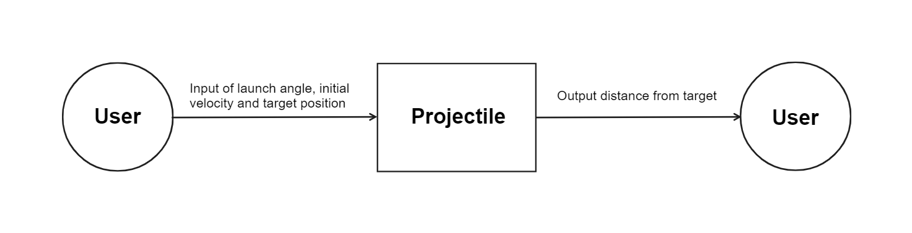

# Software Requirements Specification for Projectile
Samuel J. Crawford, Brooks MacLachlan, and W. Spencer Smith

# Table of Contents {#Sec:ToC}

An outline of all sections included in this SRS is recorded here for easy reference.

- [Table of Contents](#Sec:ToC)
- [Reference Material](#Sec:RefMat)
  - [Table of Units](#Sec:ToU)
  - [Table of Symbols](#Sec:ToS)
  - [Abbreviations and Acronyms](#Sec:TAbbAcc)
- [Introduction](#Sec:Intro)
  - [Purpose of Document](#Sec:DocPurpose)
  - [Scope of Requirements](#Sec:ReqsScope)
  - [Characteristics of Intended Reader](#Sec:ReaderChars)
  - [Organization of Document](#Sec:DocOrg)
- [General System Description](#Sec:GenSysDesc)
  - [System Context](#Sec:SysContext)
  - [User Characteristics](#Sec:UserChars)
  - [System Constraints](#Sec:SysConstraints)
- [Specific System Description](#Sec:SpecSystDesc)
  - [Problem Description](#Sec:ProbDesc)
    - [Terminology and Definitions](#Sec:TermDefs)
    - [Physical System Description](#Sec:PhysSyst)
    - [Goal Statements](#Sec:GoalStmt)
  - [Solution Characteristics Specification](#Sec:SolCharSpec)
    - [Assumptions](#Sec:Assumps)
    - [Theoretical Models](#Sec:TMs)
    - [General Definitions](#Sec:GDs)
    - [Data Definitions](#Sec:DDs)
    - [Instance Models](#Sec:IMs)
    - [Data Constraints](#Sec:DataConstraints)
    - [Properties of a Correct Solution](#Sec:CorSolProps)
- [Requirements](#Sec:Requirements)
  - [Functional Requirements](#Sec:FRs)
  - [Non-Functional Requirements](#Sec:NFRs)
- [Traceability Matrices and Graphs](#Sec:TraceMatrices)
- [Values of Auxiliary Constants](#Sec:AuxConstants)
- [References](#Sec:References)

# Reference Material {#Sec:RefMat}

This section records information for easy reference.

# Table of Units {#Sec:ToU}

The unit system used throughout is SI (Système International d'Unités). In addition to the basic units, several derived units are also used. For each unit, the [Table of Units](#Table:ToU) lists the symbol, a description, and the SI name.

|Symbol            |Description|SI Name|
|:-----------------|:----------|:------|
|\\({\text{m}}\\)  |length     |metre  |
|\\({\text{rad}}\\)|angle      |radian |
|\\({\text{s}}\\)  |time       |second |

**
Table of Units
**

# Table of Symbols {#Sec:ToS}

The symbols used in this document are summarized in the [Table of Symbols](#Table:ToS) along with their units. Throughout the document, symbols in bold will represent vectors, and scalars otherwise. The symbols are listed in alphabetical order. For vector quantities, the units shown are for each component of the vector.

|Symbol                               |Description                                                  |Units                              |
|:------------------------------------|:------------------------------------------------------------|:----------------------------------|
|\\(a\\)                              |Scalar acceleration                                          |\\(\frac{\text{m}}{\text{s}^{2}}\\)|
|\\({a^{c}}\\)                        |Constant acceleration                                        |\\(\frac{\text{m}}{\text{s}^{2}}\\)|
|\\({a\_{\text{x}}}\\)                |\\(x\\)-component of acceleration                            |\\(\frac{\text{m}}{\text{s}^{2}}\\)|
|\\({{a\_{\text{x}}}^{\text{c}}}\\)   |\\(x\\)-component of constant acceleration                   |\\(\frac{\text{m}}{\text{s}^{2}}\\)|
|\\({a\_{\text{y}}}\\)                |\\(y\\)-component of acceleration                            |\\(\frac{\text{m}}{\text{s}^{2}}\\)|
|\\({{a\_{\text{y}}}^{\text{c}}}\\)   |\\(y\\)-component of constant acceleration                   |\\(\frac{\text{m}}{\text{s}^{2}}\\)|
|\\(\boldsymbol{a}\text{(}t\text{)}\\)|Acceleration                                                 |\\(\frac{\text{m}}{\text{s}^{2}}\\)|
|\\({\boldsymbol{a}^{\text{c}}}\\)    |Constant acceleration vector                                 |\\(\frac{\text{m}}{\text{s}^{2}}\\)|
|\\({d\_{\text{offset}}}\\)           |Distance between the target position and the landing position|\\({\text{m}}\\)                   |
|\\(g\\)                              |Magnitude of gravitational acceleration                      |\\(\frac{\text{m}}{\text{s}^{2}}\\)|
|\\(p\\)                              |Scalar position                                              |\\({\text{m}}\\)                   |
|\\(p\text{(}t\text{)}\\)             |1D position                                                  |\\({\text{m}}\\)                   |
|\\({p^{\text{i}}}\\)                 |Initial position                                             |\\({\text{m}}\\)                   |
|\\({p\_{\text{land}}}\\)             |Landing position                                             |\\({\text{m}}\\)                   |
|\\({p\_{\text{target}}}\\)           |Target position                                              |\\({\text{m}}\\)                   |
|\\({p\_{\text{x}}}\\)                |\\(x\\)-component of position                                |\\({\text{m}}\\)                   |
|\\({{p\_{\text{x}}}^{\text{i}}}\\)   |\\(x\\)-component of initial position                        |\\({\text{m}}\\)                   |
|\\({p\_{\text{y}}}\\)                |\\(y\\)-component of position                                |\\({\text{m}}\\)                   |
|\\({{p\_{\text{y}}}^{\text{i}}}\\)   |\\(y\\)-component of initial position                        |\\({\text{m}}\\)                   |
|\\(\boldsymbol{p}\text{(}t\text{)}\\)|Position                                                     |\\({\text{m}}\\)                   |
|\\(s\\)                              |Output message as a string                                   |--                                 |
|\\(t\\)                              |Time                                                         |\\({\text{s}}\\)                   |
|\\({t\_{\text{flight}}}\\)           |Flight duration                                              |\\({\text{s}}\\)                   |
|\\(v\\)                              |Speed                                                        |\\(\frac{\text{m}}{\text{s}}\\)    |
|\\(v\text{(}t\text{)}\\)             |1D speed                                                     |\\(\frac{\text{m}}{\text{s}}\\)    |
|\\({v^{\text{i}}}\\)                 |Initial speed                                                |\\(\frac{\text{m}}{\text{s}}\\)    |
|\\({v\_{\text{launch}}}\\)           |Launch speed                                                 |\\(\frac{\text{m}}{\text{s}}\\)    |
|\\({v\_{\text{x}}}\\)                |\\(x\\)-component of velocity                                |\\(\frac{\text{m}}{\text{s}}\\)    |
|\\({{v\_{\text{x}}}^{\text{i}}}\\)   |\\(x\\)-component of initial velocity                        |\\(\frac{\text{m}}{\text{s}}\\)    |
|\\({v\_{\text{y}}}\\)                |\\(y\\)-component of velocity                                |\\(\frac{\text{m}}{\text{s}}\\)    |
|\\({{v\_{\text{y}}}^{\text{i}}}\\)   |\\(y\\)-component of initial velocity                        |\\(\frac{\text{m}}{\text{s}}\\)    |
|\\(\boldsymbol{v}\text{(}t\text{)}\\)|Velocity                                                     |\\(\frac{\text{m}}{\text{s}}\\)    |
|\\({\boldsymbol{v}^{\text{i}}}\\)    |Initial velocity                                             |\\(\frac{\text{m}}{\text{s}}\\)    |
|\\(ε\\)                              |Hit tolerance                                                |--                                 |
|\\(θ\\)                              |Launch angle                                                 |\\({\text{rad}}\\)                 |
|\\(π\\)                              |Ratio of circumference to diameter for any circle            |--                                 |

**
Table of Symbols
**

# Abbreviations and Acronyms {#Sec:TAbbAcc}

|Abbreviation|Full Form                          |
|:-----------|:----------------------------------|
|1D          |One-Dimensional                    |
|2D          |Two-Dimensional                    |
|A           |Assumption                         |
|DD          |Data Definition                    |
|GD          |General Definition                 |
|GS          |Goal Statement                     |
|IM          |Instance Model                     |
|PS          |Physical System Description        |
|R           |Requirement                        |
|RefBy       |Referenced by                      |
|Refname     |Reference Name                     |
|SRS         |Software Requirements Specification|
|TM          |Theoretical Model                  |
|Uncert.     |Typical Uncertainty                |

**
Abbreviations and Acronyms
**

# Introduction {#Sec:Intro}

Projectile motion is a common problem in physics. Therefore, it is useful to have a program to solve and model these types of problems. Common examples of projectile motion include ballistics problems (missiles, bullets, etc.) and the flight of balls in various sports (baseball, golf, football, etc.). The program documented here is called Projectile.

The following section provides an overview of the Software Requirements Specification (SRS) for Projectile. This section explains the purpose of this document, the scope of the requirements, the characteristics of the intended reader, and the organization of the document.

# Purpose of Document {#Sec:DocPurpose}

The primary purpose of this document is to record the requirements of Projectile. Goals, assumptions, theoretical models, definitions, and other model derivation information are specified, allowing the reader to fully understand and verify the purpose and scientific basis of Projectile. With the exception of [system constraints](#Sec:SysConstraints), this SRS will remain abstract, describing what problem is being solved, but not how to solve it.

This document will be used as a starting point for subsequent development phases, including writing the design specification and the software verification and validation plan. The design document will show how the requirements are to be realized, including decisions on the numerical algorithms and programming environment. The verification and validation plan will show the steps that will be used to increase confidence in the software documentation and the implementation. Although the SRS fits in a series of documents that follow the so-called waterfall model, the actual development process is not constrained in any way. Even when the waterfall model is not followed, as Parnas and Clements point out [parnasClements1986](#parnasClements1986), the most logical way to present the documentation is still to "fake" a rational design process.

# Scope of Requirements {#Sec:ReqsScope}

The scope of the requirements includes the analysis of a two-dimensional (2D) projectile motion problem with constant acceleration.

# Characteristics of Intended Reader {#Sec:ReaderChars}

Reviewers of this documentation should have an understanding of undergraduate level 1 physics and undergraduate level 1 calculus. The users of Projectile can have a lower level of expertise, as explained in [Sec:User Characteristics](#Sec:UserChars).

# Organization of Document {#Sec:DocOrg}

The organization of this document follows the template for an SRS for scientific computing software proposed by [koothoor2013](#koothoor2013), [smithLai2005](#smithLai2005), [smithEtAl2007](#smithEtAl2007), and [smithKoothoor2016](#smithKoothoor2016). The presentation follows the standard pattern of presenting goals, theories, definitions, and assumptions. For readers that would like a more bottom up approach, they can start reading the [instance models](#Sec:IMs) and trace back to find any additional information they require.

The [goal statements](#Sec:GoalStmt) are refined to the theoretical models and the [theoretical models](#Sec:TMs) to the [instance models](#Sec:IMs).

# General System Description {#Sec:GenSysDesc}

This section provides general information about the system. It identifies the interfaces between the system and its environment, describes the user characteristics, and lists the system constraints.

# System Context {#Sec:SysContext}

[Fig:sysCtxDiag](#Figure:sysCtxDiag) shows the system context. A circle represents an entity external to the software, the user in this case. A rectangle represents the software system itself (Projectile). Arrows are used to show the data flow between the system and its environment.

**
System Context
**

The interaction between the product and the user is through an application programming interface. The responsibilities of the user and the system are as follows:

- User Responsibilities
  - Provide initial conditions of the physical state of the motion and the input data related to the Projectile, ensuring no errors in the data entry.
  - Ensure that consistent units are used for input variables.
  - Ensure required [software assumptions](#Sec:Assumps) are appropriate for any particular problem input to the software.
- Projectile Responsibilities
  - Detect data type mismatch, such as a string of characters input instead of a floating point number.
  - Determine if the inputs satisfy the required physical and software constraints.
  - Calculate the required outputs.

# User Characteristics {#Sec:UserChars}

The end user of Projectile should have an understanding of high school physics and high school calculus.

# System Constraints {#Sec:SysConstraints}

There are no system constraints.

# Specific System Description {#Sec:SpecSystDesc}

This section first presents the problem description, which gives a high-level view of the problem to be solved. This is followed by the solution characteristics specification, which presents the assumptions, theories, and definitions that are used.

# Problem Description {#Sec:ProbDesc}

A system is needed to predict whether a launched projectile hits its target.

# Terminology and Definitions {#Sec:TermDefs}

This subsection provides a list of terms that are used in the subsequent sections and their meaning, with the purpose of reducing ambiguity and making it easier to correctly understand the requirements.

- Launcher: Where the projectile is launched from and the device that does the launching.
- Projectile: The object to be launched at the target.
- Target: Where the projectile should be launched to.
- Gravity: The force that attracts one physical body with mass to another.
- Cartesian coordinate system: A coordinate system that specifies each point uniquely in a plane by a set of numerical coordinates, which are the signed distances to the point from two fixed perpendicular oriented lines, measured in the same unit of length (from [cartesianWiki](#cartesianWiki)).
- Rectilinear: Occurring in one dimension.

# Physical System Description {#Sec:PhysSyst}

The physical system of Projectile, as shown in [Fig:Launch](#Figure:Launch), includes the following elements:

PS1: The launcher.

PS2: The projectile (with initial velocity \\({\boldsymbol{v}^{\text{i}}}\\) and launch angle \\(θ\\)).

PS3: The target.

**
The physical system
**

# Goal Statements {#Sec:GoalStmt}

Given the initial velocity vector of the projectile and the geometric layout of the launcher and target, the goal statement is:

targetHit: Determine if the projectile hits the target.

# Solution Characteristics Specification {#Sec:SolCharSpec}

The instance models that govern Projectile are presented in the [Instance Model Section](#Sec:IMs). The information to understand the meaning of the instance models and their derivation is also presented, so that the instance models can be verified.

# Assumptions {#Sec:Assumps}

This section simplifies the original problem and helps in developing the theoretical models by filling in the missing information for the physical system. The assumptions refine the scope by providing more detail.

twoDMotion: The projectile motion is two-dimensional (2D). (RefBy: [GD:velVec](#GD:velVec) and [GD:posVec](#GD:posVec).)

cartSyst: A Cartesian coordinate system is used (from [A:neglectCurv](#neglectCurv)). (RefBy: [GD:velVec](#GD:velVec) and [GD:posVec](#GD:posVec).)

yAxisGravity: The direction of the \\(y\\)-axis is directed opposite to gravity. (RefBy: [IM:calOfLandingDist](#IM:calOfLandingDist), [IM:calOfLandingTime](#IM:calOfLandingTime), and [A:accelYGravity](#accelYGravity).)

launchOrigin: The launcher is coincident with the origin. (RefBy: [IM:calOfLandingDist](#IM:calOfLandingDist) and [IM:calOfLandingTime](#IM:calOfLandingTime).)

targetXAxis: The target lies on the \\(x\\)-axis (from [A:neglectCurv](#neglectCurv)). (RefBy: [IM:calOfLandingTime](#IM:calOfLandingTime).)

posXDirection: The positive \\(x\\)-direction is from the launcher to the target. (RefBy: [IM:offsetIM](#IM:offsetIM), [IM:messageIM](#IM:messageIM), [IM:calOfLandingDist](#IM:calOfLandingDist), and [IM:calOfLandingTime](#IM:calOfLandingTime).)

constAccel: The acceleration is constant (from [A:accelXZero](#accelXZero), [A:accelYGravity](#accelYGravity), [A:neglectDrag](#neglectDrag), and [A:freeFlight](#freeFlight)). (RefBy: [GD:velVec](#GD:velVec) and [GD:posVec](#GD:posVec).)

accelXZero: The acceleration in the \\(x\\)-direction is zero. (RefBy: [IM:calOfLandingDist](#IM:calOfLandingDist) and [A:constAccel](#constAccel).)

accelYGravity: The acceleration in the \\(y\\)-direction is the acceleration due to gravity (from [A:yAxisGravity](#yAxisGravity)). (RefBy: [IM:calOfLandingTime](#IM:calOfLandingTime) and [A:constAccel](#constAccel).)

neglectDrag: Air drag is neglected. (RefBy: [A:constAccel](#constAccel).)

pointMass: The size and shape of the projectile are negligible, so that it can be modelled as a point mass. (RefBy: [GD:rectVel](#GD:rectVel) and [GD:rectPos](#GD:rectPos).)

freeFlight: The flight is free; there are no collisions during the trajectory of the projectile. (RefBy: [A:constAccel](#constAccel).)

neglectCurv: The distance is small enough that the curvature of the celestial body can be neglected. (RefBy: [A:targetXAxis](#targetXAxis) and [A:cartSyst](#cartSyst).)

timeStartZero: Time starts at zero. (RefBy: [GD:velVec](#GD:velVec), [GD:rectVel](#GD:rectVel), [GD:rectPos](#GD:rectPos), [GD:posVec](#GD:posVec), and [IM:calOfLandingTime](#IM:calOfLandingTime).)

gravAccelValue: The acceleration due to gravity is assumed to have the value provided in the section for [Values of Auxiliary Constants](#Sec:AuxConstants). (RefBy: [IM:calOfLandingDist](#IM:calOfLandingDist) and [IM:calOfLandingTime](#IM:calOfLandingTime).)

# Theoretical Models {#Sec:TMs}

This section focuses on the general equations and laws that Projectile is based on.

## Acceleration {#TM:acceleration}

|Refname    |TM:acceleration                                                                                                                                                                                                                                                 |
|:----------|:---------------------------------------------------------------------------------------------------------------------------------------------------------------------------------------------------------------------------------------------------------------|
|Label      |Acceleration                                                                                                                                                                                                                                                    |
|Equation   |\\[\boldsymbol{a}\text{(}t\text{)}=\frac{\\,d\boldsymbol{v}\text{(}t\text{)}}{\\,dt}\\]                                                                                                                                                                         |
|Description|<ul><li>\\(\boldsymbol{a}\text{(}t\text{)}\\) is the acceleration (\\(\frac{\text{m}}{\text{s}^{2}}\\))</li><li>\\(t\\) is the time (\\({\text{s}}\\))</li><li>\\(\boldsymbol{v}\text{(}t\text{)}\\) is the velocity (\\(\frac{\text{m}}{\text{s}}\\))</li></ul>|
|Source     |[accelerationWiki](#accelerationWiki)                                                                                                                                                                                                                           |
|RefBy      |[GD:rectVel](#GD:rectVel)                                                                                                                                                                                                                                       |

## Velocity {#TM:velocity}

|Refname    |TM:velocity                                                                                                                                                                                                                              |
|:----------|:----------------------------------------------------------------------------------------------------------------------------------------------------------------------------------------------------------------------------------------|
|Label      |Velocity                                                                                                                                                                                                                                 |
|Equation   |\\[\boldsymbol{v}\text{(}t\text{)}=\frac{\\,d\boldsymbol{p}\text{(}t\text{)}}{\\,dt}\\]                                                                                                                                                  |
|Description|<ul><li>\\(\boldsymbol{v}\text{(}t\text{)}\\) is the velocity (\\(\frac{\text{m}}{\text{s}}\\))</li><li>\\(t\\) is the time (\\({\text{s}}\\))</li><li>\\(\boldsymbol{p}\text{(}t\text{)}\\) is the position (\\({\text{m}}\\))</li></ul>|
|Source     |[velocityWiki](#velocityWiki)                                                                                                                                                                                                            |
|RefBy      |[GD:rectPos](#GD:rectPos)                                                                                                                                                                                                                |

# General Definitions {#Sec:GDs}

This section collects the laws and equations that will be used to build the instance models.

## Rectilinear (1D) velocity as a function of time for constant acceleration {#GD:rectVel}

|Refname    |GD:rectVel                                                                                                                                                                                                                                                                                                              |
|:----------|:-----------------------------------------------------------------------------------------------------------------------------------------------------------------------------------------------------------------------------------------------------------------------------------------------------------------------|
|Label      |Rectilinear (1D) velocity as a function of time for constant acceleration                                                                                                                                                                                                                                               |
|Units      |\\(\frac{\text{m}}{\text{s}}\\)                                                                                                                                                                                                                                                                                         |
|Equation   |\\[v\text{(}t\text{)}={v^{\text{i}}}+{a^{c}} t\\]                                                                                                                                                                                                                                                                       |
|Description|<ul><li>\\(v\text{(}t\text{)}\\) is the 1D speed (\\(\frac{\text{m}}{\text{s}}\\))</li><li>\\({v^{\text{i}}}\\) is the initial speed (\\(\frac{\text{m}}{\text{s}}\\))</li><li>\\({a^{c}}\\) is the constant acceleration (\\(\frac{\text{m}}{\text{s}^{2}}\\))</li><li>\\(t\\) is the time (\\({\text{s}}\\))</li></ul>|
|Source     |[hibbeler2004](#hibbeler2004) (pg. 8)                                                                                                                                                                                                                                                                                   |
|RefBy      |[GD:velVec](#GD:velVec) and [GD:rectPos](#GD:rectPos)                                                                                                                                                                                                                                                                   |

#### Detailed derivation of rectilinear velocity: {#GD:rectVelDeriv}

Assume we have rectilinear motion of a particle (of negligible size and shape, from [A:pointMass](#pointMass)); that is, motion in a straight line. The velocity is \\(v\\) and the acceleration is \\(a\\). The motion in [TM:acceleration](#TM:acceleration) is now one-dimensional with a constant acceleration, represented by \\({a^{c}}\\). The initial velocity (at \\(t=0\\), from [A:timeStartZero](#timeStartZero)) is represented by \\({v^{\text{i}}}\\). From [TM:acceleration](#TM:acceleration) in 1D, and using the above symbols we have:

\\[{a^{c}}=\frac{\\,dv}{\\,dt}\\]

Rearranging and integrating, we have:

\\[\int\_{{v^{\text{i}}}}^{v}{1}\\,dv=\int\_{0}^{t}{{a^{c}}}\\,dt\\]

Performing the integration, we have the required equation:

\\[v\text{(}t\text{)}={v^{\text{i}}}+{a^{c}} t\\]

## Rectilinear (1D) position as a function of time for constant acceleration {#GD:rectPos}

|Refname    |GD:rectPos                                                                                                                                                                                                                                                                                                                                                                          |
|:----------|:-----------------------------------------------------------------------------------------------------------------------------------------------------------------------------------------------------------------------------------------------------------------------------------------------------------------------------------------------------------------------------------|
|Label      |Rectilinear (1D) position as a function of time for constant acceleration                                                                                                                                                                                                                                                                                                           |
|Units      |\\({\text{m}}\\)                                                                                                                                                                                                                                                                                                                                                                    |
|Equation   |\\[p\text{(}t\text{)}={p^{\text{i}}}+{v^{\text{i}}} t+\frac{{a^{c}} t^{2}}{2}\\]                                                                                                                                                                                                                                                                                                    |
|Description|<ul><li>\\(p\text{(}t\text{)}\\) is the 1D position (\\({\text{m}}\\))</li><li>\\({p^{\text{i}}}\\) is the initial position (\\({\text{m}}\\))</li><li>\\({v^{\text{i}}}\\) is the initial speed (\\(\frac{\text{m}}{\text{s}}\\))</li><li>\\(t\\) is the time (\\({\text{s}}\\))</li><li>\\({a^{c}}\\) is the constant acceleration (\\(\frac{\text{m}}{\text{s}^{2}}\\))</li></ul>|
|Source     |[hibbeler2004](#hibbeler2004) (pg. 8)                                                                                                                                                                                                                                                                                                                                               |
|RefBy      |[GD:posVec](#GD:posVec)                                                                                                                                                                                                                                                                                                                                                             |

#### Detailed derivation of rectilinear position: {#GD:rectPosDeriv}

Assume we have rectilinear motion of a particle (of negligible size and shape, from [A:pointMass](#pointMass)); that is, motion in a straight line. The position is \\(p\\) and the velocity is \\(v\\). The motion in [TM:velocity](#TM:velocity) is now one-dimensional. The initial position (at \\(t=0\\), from [A:timeStartZero](#timeStartZero)) is represented by \\({p^{\text{i}}}\\). From [TM:velocity](#TM:velocity) in 1D, and using the above symbols we have:

\\[v=\frac{\\,dp}{\\,dt}\\]

Rearranging and integrating, we have:

\\[\int\_{{p^{\text{i}}}}^{p}{1}\\,dp=\int\_{0}^{t}{v}\\,dt\\]

From [GD:rectVel](#GD:rectVel), we can replace \\(v\\):

\\[\int\_{{p^{\text{i}}}}^{p}{1}\\,dp=\int\_{0}^{t}{{v^{\text{i}}}+{a^{c}} t}\\,dt\\]

Performing the integration, we have the required equation:

\\[p\text{(}t\text{)}={p^{\text{i}}}+{v^{\text{i}}} t+\frac{{a^{c}} t^{2}}{2}\\]

## Velocity vector as a function of time for 2D motion under constant acceleration {#GD:velVec}

|Refname    |GD:velVec                                                                                                                                                                                                                                                                                                                                                                                                                                                                                                                                                                                                                                                                         |
|:----------|:---------------------------------------------------------------------------------------------------------------------------------------------------------------------------------------------------------------------------------------------------------------------------------------------------------------------------------------------------------------------------------------------------------------------------------------------------------------------------------------------------------------------------------------------------------------------------------------------------------------------------------------------------------------------------------|
|Label      |Velocity vector as a function of time for 2D motion under constant acceleration                                                                                                                                                                                                                                                                                                                                                                                                                                                                                                                                                                                                   |
|Units      |\\(\frac{\text{m}}{\text{s}}\\)                                                                                                                                                                                                                                                                                                                                                                                                                                                                                                                                                                                                                                                   |
|Equation   |\\[\boldsymbol{v}\text{(}t\text{)}=\begin{bmatrix}{{v\_{\text{x}}}^{\text{i}}}+{{a\_{\text{x}}}^{\text{c}}} t\\\\{{v\_{\text{y}}}^{\text{i}}}+{{a\_{\text{y}}}^{\text{c}}} t\end{bmatrix}\\]                                                                                                                                                                                                                                                                                                                                                                                                                                                                                      |
|Description|<ul><li>\\(\boldsymbol{v}\text{(}t\text{)}\\) is the velocity (\\(\frac{\text{m}}{\text{s}}\\))</li><li>\\({{v\_{\text{x}}}^{\text{i}}}\\) is the \\(x\\)-component of initial velocity (\\(\frac{\text{m}}{\text{s}}\\))</li><li>\\({{a\_{\text{x}}}^{\text{c}}}\\) is the \\(x\\)-component of constant acceleration (\\(\frac{\text{m}}{\text{s}^{2}}\\))</li><li>\\(t\\) is the time (\\({\text{s}}\\))</li><li>\\({{v\_{\text{y}}}^{\text{i}}}\\) is the \\(y\\)-component of initial velocity (\\(\frac{\text{m}}{\text{s}}\\))</li><li>\\({{a\_{\text{y}}}^{\text{c}}}\\) is the \\(y\\)-component of constant acceleration (\\(\frac{\text{m}}{\text{s}^{2}}\\))</li></ul>|
|Source     |--                                                                                                                                                                                                                                                                                                                                                                                                                                                                                                                                                                                                                                                                                |
|RefBy      |                                                                                                                                                                                                                                                                                                                                                                                                                                                                                                                                                                                                                                                                                  |

#### Detailed derivation of velocity vector: {#GD:velVecDeriv}

For a two-dimensional Cartesian coordinate system ([A:twoDMotion](#twoDMotion) and [A:cartSyst](#cartSyst)), we can represent the velocity vector as \\(\boldsymbol{v}\text{(}t\text{)}=\begin{bmatrix}{v\_{\text{x}}}\\\\{v\_{\text{y}}}\end{bmatrix}\\) and the acceleration vector as \\(\boldsymbol{a}\text{(}t\text{)}=\begin{bmatrix}{a\_{\text{x}}}\\\\{a\_{\text{y}}}\end{bmatrix}\\). The acceleration is assumed to be constant ([A:constAccel](#constAccel)) and the constant acceleration vector is represented as \\({\boldsymbol{a}^{\text{c}}}=\begin{bmatrix}{{a\_{\text{x}}}^{\text{c}}}\\\\{{a\_{\text{y}}}^{\text{c}}}\end{bmatrix}\\). The initial velocity (at \\(t=0\\), from [A:timeStartZero](#timeStartZero)) is represented by \\({\boldsymbol{v}^{\text{i}}}=\begin{bmatrix}{{v\_{\text{x}}}^{\text{i}}}\\\\{{v\_{\text{y}}}^{\text{i}}}\end{bmatrix}\\). Since we have a Cartesian coordinate system, [GD:rectVel](#GD:rectVel) can be applied to each coordinate of the velocity vector to yield the required equation:

\\[\boldsymbol{v}\text{(}t\text{)}=\begin{bmatrix}{{v\_{\text{x}}}^{\text{i}}}+{{a\_{\text{x}}}^{\text{c}}} t\\\\{{v\_{\text{y}}}^{\text{i}}}+{{a\_{\text{y}}}^{\text{c}}} t\end{bmatrix}\\]

## Position vector as a function of time for 2D motion under constant acceleration {#GD:posVec}

|Refname    |GD:posVec                                                                                                                                                                                                                                                                                                                                                                                                                                                                                                                                                                                                                                                                                                                                                                                                                                                                                |
|:----------|:----------------------------------------------------------------------------------------------------------------------------------------------------------------------------------------------------------------------------------------------------------------------------------------------------------------------------------------------------------------------------------------------------------------------------------------------------------------------------------------------------------------------------------------------------------------------------------------------------------------------------------------------------------------------------------------------------------------------------------------------------------------------------------------------------------------------------------------------------------------------------------------|
|Label      |Position vector as a function of time for 2D motion under constant acceleration                                                                                                                                                                                                                                                                                                                                                                                                                                                                                                                                                                                                                                                                                                                                                                                                          |
|Units      |\\({\text{m}}\\)                                                                                                                                                                                                                                                                                                                                                                                                                                                                                                                                                                                                                                                                                                                                                                                                                                                                         |
|Equation   |\\[\boldsymbol{p}\text{(}t\text{)}=\begin{bmatrix}{{p\_{\text{x}}}^{\text{i}}}+{{v\_{\text{x}}}^{\text{i}}} t+\frac{{{a\_{\text{x}}}^{\text{c}}} t^{2}}{2}\\\\{{p\_{\text{y}}}^{\text{i}}}+{{v\_{\text{y}}}^{\text{i}}} t+\frac{{{a\_{\text{y}}}^{\text{c}}} t^{2}}{2}\end{bmatrix}\\]                                                                                                                                                                                                                                                                                                                                                                                                                                                                                                                                                                                                   |
|Description|<ul><li>\\(\boldsymbol{p}\text{(}t\text{)}\\) is the position (\\({\text{m}}\\))</li><li>\\({{p\_{\text{x}}}^{\text{i}}}\\) is the \\(x\\)-component of initial position (\\({\text{m}}\\))</li><li>\\({{v\_{\text{x}}}^{\text{i}}}\\) is the \\(x\\)-component of initial velocity (\\(\frac{\text{m}}{\text{s}}\\))</li><li>\\(t\\) is the time (\\({\text{s}}\\))</li><li>\\({{a\_{\text{x}}}^{\text{c}}}\\) is the \\(x\\)-component of constant acceleration (\\(\frac{\text{m}}{\text{s}^{2}}\\))</li><li>\\({{p\_{\text{y}}}^{\text{i}}}\\) is the \\(y\\)-component of initial position (\\({\text{m}}\\))</li><li>\\({{v\_{\text{y}}}^{\text{i}}}\\) is the \\(y\\)-component of initial velocity (\\(\frac{\text{m}}{\text{s}}\\))</li><li>\\({{a\_{\text{y}}}^{\text{c}}}\\) is the \\(y\\)-component of constant acceleration (\\(\frac{\text{m}}{\text{s}^{2}}\\))</li></ul>|
|Source     |--                                                                                                                                                                                                                                                                                                                                                                                                                                                                                                                                                                                                                                                                                                                                                                                                                                                                                       |
|RefBy      |[IM:calOfLandingDist](#IM:calOfLandingDist) and [IM:calOfLandingTime](#IM:calOfLandingTime)                                                                                                                                                                                                                                                                                                                                                                                                                                                                                                                                                                                                                                                                                                                                                                                              |

#### Detailed derivation of position vector: {#GD:posVecDeriv}

For a two-dimensional Cartesian coordinate system ([A:twoDMotion](#twoDMotion) and [A:cartSyst](#cartSyst)), we can represent the position vector as \\(\boldsymbol{p}\text{(}t\text{)}=\begin{bmatrix}{p\_{\text{x}}}\\\\{p\_{\text{y}}}\end{bmatrix}\\), the velocity vector as \\(\boldsymbol{v}\text{(}t\text{)}=\begin{bmatrix}{v\_{\text{x}}}\\\\{v\_{\text{y}}}\end{bmatrix}\\), and the acceleration vector as \\(\boldsymbol{a}\text{(}t\text{)}=\begin{bmatrix}{a\_{\text{x}}}\\\\{a\_{\text{y}}}\end{bmatrix}\\). The acceleration is assumed to be constant ([A:constAccel](#constAccel)) and the constant acceleration vector is represented as \\({\boldsymbol{a}^{\text{c}}}=\begin{bmatrix}{{a\_{\text{x}}}^{\text{c}}}\\\\{{a\_{\text{y}}}^{\text{c}}}\end{bmatrix}\\). The initial velocity (at \\(t=0\\), from [A:timeStartZero](#timeStartZero)) is represented by \\({\boldsymbol{v}^{\text{i}}}=\begin{bmatrix}{{v\_{\text{x}}}^{\text{i}}}\\\\{{v\_{\text{y}}}^{\text{i}}}\end{bmatrix}\\). Since we have a Cartesian coordinate system, [GD:rectPos](#GD:rectPos) can be applied to each coordinate of the position vector to yield the required equation:

\\[\boldsymbol{p}\text{(}t\text{)}=\begin{bmatrix}{{p\_{\text{x}}}^{\text{i}}}+{{v\_{\text{x}}}^{\text{i}}} t+\frac{{{a\_{\text{x}}}^{\text{c}}} t^{2}}{2}\\\\{{p\_{\text{y}}}^{\text{i}}}+{{v\_{\text{y}}}^{\text{i}}} t+\frac{{{a\_{\text{y}}}^{\text{c}}} t^{2}}{2}\end{bmatrix}\\]

# Data Definitions {#Sec:DDs}

This section collects and defines all the data needed to build the instance models.

## Speed {#DD:vecMag}

|Refname    |DD:vecMag                                                                                                                                                                               |
|:----------|:---------------------------------------------------------------------------------------------------------------------------------------------------------------------------------------|
|Label      |Speed                                                                                                                                                                                   |
|Symbol     |\\(v\\)                                                                                                                                                                                 |
|Units      |\\(\frac{\text{m}}{\text{s}}\\)                                                                                                                                                         |
|Equation   |\\[v=\|\boldsymbol{v}\text{(}t\text{)}\|\\]                                                                                                                                             |
|Description|<ul><li>\\(v\\) is the speed (\\(\frac{\text{m}}{\text{s}}\\))</li><li>\\(\boldsymbol{v}\text{(}t\text{)}\\) is the velocity (\\(\frac{\text{m}}{\text{s}}\\))</li></ul>                |
|Notes      |<ul><li>For a given velocity vector \\(\boldsymbol{v}\text{(}t\text{)}\\), the magnitude of the vector (\\(\|\boldsymbol{v}\text{(}t\text{)}\|\\)) is the scalar called speed.</li></ul>|
|Source     |--                                                                                                                                                                                      |
|RefBy      |[DD:speedIY](#DD:speedIY) and [DD:speedIX](#DD:speedIX)                                                                                                                                 |

## \\(x\\)-component of initial velocity {#DD:speedIX}

|Refname    |DD:speedIX                                                                                                                                                                                                                                                                      |
|:----------|:-------------------------------------------------------------------------------------------------------------------------------------------------------------------------------------------------------------------------------------------------------------------------------|
|Label      |\\(x\\)-component of initial velocity                                                                                                                                                                                                                                           |
|Symbol     |\\({{v\_{\text{x}}}^{\text{i}}}\\)                                                                                                                                                                                                                                              |
|Units      |\\(\frac{\text{m}}{\text{s}}\\)                                                                                                                                                                                                                                                 |
|Equation   |\\[{{v\_{\text{x}}}^{\text{i}}}={v^{\text{i}}} \cos\left(θ\right)\\]                                                                                                                                                                                                            |
|Description|<ul><li>\\({{v\_{\text{x}}}^{\text{i}}}\\) is the \\(x\\)-component of initial velocity (\\(\frac{\text{m}}{\text{s}}\\))</li><li>\\({v^{\text{i}}}\\) is the initial speed (\\(\frac{\text{m}}{\text{s}}\\))</li><li>\\(θ\\) is the launch angle (\\({\text{rad}}\\))</li></ul>|
|Notes      |<ul><li>\\({v^{\text{i}}}\\) is from [DD:vecMag](#DD:vecMag).</li><li>\\(θ\\) is shown in [Fig:Launch](#Figure:Launch).</li></ul>                                                                                                                                               |
|Source     |--                                                                                                                                                                                                                                                                              |
|RefBy      |[IM:calOfLandingDist](#IM:calOfLandingDist)                                                                                                                                                                                                                                     |

## \\(y\\)-component of initial velocity {#DD:speedIY}

|Refname    |DD:speedIY                                                                                                                                                                                                                                                                      |
|:----------|:-------------------------------------------------------------------------------------------------------------------------------------------------------------------------------------------------------------------------------------------------------------------------------|
|Label      |\\(y\\)-component of initial velocity                                                                                                                                                                                                                                           |
|Symbol     |\\({{v\_{\text{y}}}^{\text{i}}}\\)                                                                                                                                                                                                                                              |
|Units      |\\(\frac{\text{m}}{\text{s}}\\)                                                                                                                                                                                                                                                 |
|Equation   |\\[{{v\_{\text{y}}}^{\text{i}}}={v^{\text{i}}} \sin\left(θ\right)\\]                                                                                                                                                                                                            |
|Description|<ul><li>\\({{v\_{\text{y}}}^{\text{i}}}\\) is the \\(y\\)-component of initial velocity (\\(\frac{\text{m}}{\text{s}}\\))</li><li>\\({v^{\text{i}}}\\) is the initial speed (\\(\frac{\text{m}}{\text{s}}\\))</li><li>\\(θ\\) is the launch angle (\\({\text{rad}}\\))</li></ul>|
|Notes      |<ul><li>\\({v^{\text{i}}}\\) is from [DD:vecMag](#DD:vecMag).</li><li>\\(θ\\) is shown in [Fig:Launch](#Figure:Launch).</li></ul>                                                                                                                                               |
|Source     |--                                                                                                                                                                                                                                                                              |
|RefBy      |[IM:calOfLandingTime](#IM:calOfLandingTime)                                                                                                                                                                                                                                     |

# Instance Models {#Sec:IMs}

This section transforms the problem defined in the [problem description](#Sec:ProbDesc) into one which is expressed in mathematical terms. It uses concrete symbols defined in the [data definitions](#Sec:DDs) to replace the abstract symbols in the models identified in [theoretical models](#Sec:TMs) and [general definitions](#Sec:GDs).

## Calculation of landing time {#IM:calOfLandingTime}

|Refname           |IM:calOfLandingTime                                                                                                                                                                                                                                                                                                                                              |
|:-----------------|:----------------------------------------------------------------------------------------------------------------------------------------------------------------------------------------------------------------------------------------------------------------------------------------------------------------------------------------------------------------|
|Label             |Calculation of landing time                                                                                                                                                                                                                                                                                                                                      |
|Input             |\\({v\_{\text{launch}}}\\), \\(θ\\)                                                                                                                                                                                                                                                                                                                              |
|Output            |\\({t\_{\text{flight}}}\\)                                                                                                                                                                                                                                                                                                                                       |
|Input Constraints |\\[{v\_{\text{launch}}}\gt{}0\\]\\[0\lt{}θ\lt{}\frac{π}{2}\\]                                                                                                                                                                                                                                                                                                    |
|Output Constraints|\\[{t\_{\text{flight}}}\gt{}0\\]                                                                                                                                                                                                                                                                                                                                 |
|Equation          |\\[{t\_{\text{flight}}}=\frac{2 {v\_{\text{launch}}} \sin\left(θ\right)}{g}\\]                                                                                                                                                                                                                                                                                   |
|Description       |<ul><li>\\({t\_{\text{flight}}}\\) is the flight duration (\\({\text{s}}\\))</li><li>\\({v\_{\text{launch}}}\\) is the launch speed (\\(\frac{\text{m}}{\text{s}}\\))</li><li>\\(θ\\) is the launch angle (\\({\text{rad}}\\))</li><li>\\(g\\) is the magnitude of gravitational acceleration (\\(\frac{\text{m}}{\text{s}^{2}}\\))</li></ul>                    |
|Notes             |<ul><li>The constraint \\(0\lt{}θ\lt{}\frac{π}{2}\\) is from [A:posXDirection](#posXDirection) and [A:yAxisGravity](#yAxisGravity), and is shown in [Fig:Launch](#Figure:Launch).</li><li>\\(g\\) is defined in [A:gravAccelValue](#gravAccelValue).</li><li>The constraint \\({t\_{\text{flight}}}\gt{}0\\) is from [A:timeStartZero](#timeStartZero).</li></ul>|
|Source            |--                                                                                                                                                                                                                                                                                                                                                               |
|RefBy             |[IM:calOfLandingDist](#IM:calOfLandingDist), [FR:Output-Values](#outputValues), and [FR:Calculate-Values](#calcValues)                                                                                                                                                                                                                                           |

#### Detailed derivation of flight duration: {#IM:calOfLandingTimeDeriv}

We know that \\({{p\_{\text{y}}}^{\text{i}}}=0\\) ([A:launchOrigin](#launchOrigin)) and \\({{a\_{\text{y}}}^{\text{c}}}=-g\\) ([A:accelYGravity](#accelYGravity)). Substituting these values into the y-direction of [GD:posVec](#GD:posVec) gives us:

\\[{p\_{\text{y}}}={{v\_{\text{y}}}^{\text{i}}} t-\frac{g t^{2}}{2}\\]

To find the time that the projectile lands, we want to find the \\(t\\) value (\\({t\_{\text{flight}}}\\)) where \\({p\_{\text{y}}}=0\\) (since the target is on the \\(x\\)-axis from [A:targetXAxis](#targetXAxis)). From the equation above we get:

\\[{{v\_{\text{y}}}^{\text{i}}} {t\_{\text{flight}}}-\frac{g {t\_{\text{flight}}}^{2}}{2}=0\\]

Dividing by \\({t\_{\text{flight}}}\\) (with the constraint \\({t\_{\text{flight}}}\gt{}0\\)) gives us:

\\[{{v\_{\text{y}}}^{\text{i}}}-\frac{g {t\_{\text{flight}}}}{2}=0\\]

Solving for \\({t\_{\text{flight}}}\\) gives us:

\\[{t\_{\text{flight}}}=\frac{2 {{v\_{\text{y}}}^{\text{i}}}}{g}\\]

From [DD:speedIY](#DD:speedIY) (with \\({v^{\text{i}}}={v\_{\text{launch}}}\\)) we can replace \\({{v\_{\text{y}}}^{\text{i}}}\\):

\\[{t\_{\text{flight}}}=\frac{2 {v\_{\text{launch}}} \sin\left(θ\right)}{g}\\]

## Calculation of landing position {#IM:calOfLandingDist}

|Refname           |IM:calOfLandingDist                                                                                                                                                                                                                                                                                                                                            |
|:-----------------|:--------------------------------------------------------------------------------------------------------------------------------------------------------------------------------------------------------------------------------------------------------------------------------------------------------------------------------------------------------------|
|Label             |Calculation of landing position                                                                                                                                                                                                                                                                                                                                |
|Input             |\\({v\_{\text{launch}}}\\), \\(θ\\)                                                                                                                                                                                                                                                                                                                            |
|Output            |\\({p\_{\text{land}}}\\)                                                                                                                                                                                                                                                                                                                                       |
|Input Constraints |\\[{v\_{\text{launch}}}\gt{}0\\]\\[0\lt{}θ\lt{}\frac{π}{2}\\]                                                                                                                                                                                                                                                                                                  |
|Output Constraints|\\[{p\_{\text{land}}}\gt{}0\\]                                                                                                                                                                                                                                                                                                                                 |
|Equation          |\\[{p\_{\text{land}}}=\frac{2 {v\_{\text{launch}}}^{2} \sin\left(θ\right) \cos\left(θ\right)}{g}\\]                                                                                                                                                                                                                                                            |
|Description       |<ul><li>\\({p\_{\text{land}}}\\) is the landing position (\\({\text{m}}\\))</li><li>\\({v\_{\text{launch}}}\\) is the launch speed (\\(\frac{\text{m}}{\text{s}}\\))</li><li>\\(θ\\) is the launch angle (\\({\text{rad}}\\))</li><li>\\(g\\) is the magnitude of gravitational acceleration (\\(\frac{\text{m}}{\text{s}^{2}}\\))</li></ul>                   |
|Notes             |<ul><li>The constraint \\(0\lt{}θ\lt{}\frac{π}{2}\\) is from [A:posXDirection](#posXDirection) and [A:yAxisGravity](#yAxisGravity), and is shown in [Fig:Launch](#Figure:Launch).</li><li>\\(g\\) is defined in [A:gravAccelValue](#gravAccelValue).</li><li>The constraint \\({p\_{\text{land}}}\gt{}0\\) is from [A:posXDirection](#posXDirection).</li></ul>|
|Source            |--                                                                                                                                                                                                                                                                                                                                                             |
|RefBy             |[IM:offsetIM](#IM:offsetIM) and [FR:Calculate-Values](#calcValues)                                                                                                                                                                                                                                                                                             |

#### Detailed derivation of landing position: {#IM:calOfLandingDistDeriv}

We know that \\({{p\_{\text{x}}}^{\text{i}}}=0\\) ([A:launchOrigin](#launchOrigin)) and \\({{a\_{\text{x}}}^{\text{c}}}=0\\) ([A:accelXZero](#accelXZero)). Substituting these values into the x-direction of [GD:posVec](#GD:posVec) gives us:

\\[{p\_{\text{x}}}={{v\_{\text{x}}}^{\text{i}}} t\\]

To find the landing position, we want to find the \\({p\_{\text{x}}}\\) value (\\({p\_{\text{land}}}\\)) at flight duration (from [IM:calOfLandingTime](#IM:calOfLandingTime)):

\\[{p\_{\text{land}}}=\frac{{{v\_{\text{x}}}^{\text{i}}}\cdot{}2 {v\_{\text{launch}}} \sin\left(θ\right)}{g}\\]

From [DD:speedIX](#DD:speedIX) (with \\({v^{\text{i}}}={v\_{\text{launch}}}\\)) we can replace \\({{v\_{\text{x}}}^{\text{i}}}\\):

\\[{p\_{\text{land}}}=\frac{{v\_{\text{launch}}} \cos\left(θ\right)\cdot{}2 {v\_{\text{launch}}} \sin\left(θ\right)}{g}\\]

Rearranging this gives us the required equation:

\\[{p\_{\text{land}}}=\frac{2 {v\_{\text{launch}}}^{2} \sin\left(θ\right) \cos\left(θ\right)}{g}\\]

## Offset {#IM:offsetIM}

|Refname           |IM:offsetIM                                                                                                                                                                                                                                                                                  |
|:-----------------|:--------------------------------------------------------------------------------------------------------------------------------------------------------------------------------------------------------------------------------------------------------------------------------------------|
|Label             |Offset                                                                                                                                                                                                                                                                                       |
|Input             |\\({p\_{\text{land}}}\\), \\({p\_{\text{target}}}\\)                                                                                                                                                                                                                                         |
|Output            |\\({d\_{\text{offset}}}\\)                                                                                                                                                                                                                                                                   |
|Input Constraints |\\[{p\_{\text{land}}}\gt{}0\\]\\[{p\_{\text{target}}}\gt{}0\\]                                                                                                                                                                                                                               |
|Output Constraints|                                                                                                                                                                                                                                                                                             |
|Equation          |\\[{d\_{\text{offset}}}={p\_{\text{land}}}-{p\_{\text{target}}}\\]                                                                                                                                                                                                                           |
|Description       |<ul><li>\\({d\_{\text{offset}}}\\) is the distance between the target position and the landing position (\\({\text{m}}\\))</li><li>\\({p\_{\text{land}}}\\) is the landing position (\\({\text{m}}\\))</li><li>\\({p\_{\text{target}}}\\) is the target position (\\({\text{m}}\\))</li></ul>|
|Notes             |<ul><li>\\({p\_{\text{land}}}\\) is from [IM:calOfLandingDist](#IM:calOfLandingDist).</li><li>The constraints \\({p\_{\text{land}}}\gt{}0\\) and \\({p\_{\text{target}}}\gt{}0\\) are from [A:posXDirection](#posXDirection).</li></ul>                                                      |
|Source            |--                                                                                                                                                                                                                                                                                           |
|RefBy             |[IM:messageIM](#IM:messageIM), [FR:Output-Values](#outputValues), and [FR:Calculate-Values](#calcValues)                                                                                                                                                                                     |

## Output message {#IM:messageIM}

|Refname           |IM:messageIM                                                                                                                                                                                                                                                                                                                                                                                                                                        |
|:-----------------|:---------------------------------------------------------------------------------------------------------------------------------------------------------------------------------------------------------------------------------------------------------------------------------------------------------------------------------------------------------------------------------------------------------------------------------------------------|
|Label             |Output message                                                                                                                                                                                                                                                                                                                                                                                                                                      |
|Input             |\\({d\_{\text{offset}}}\\), \\({p\_{\text{target}}}\\)                                                                                                                                                                                                                                                                                                                                                                                              |
|Output            |\\(s\\)                                                                                                                                                                                                                                                                                                                                                                                                                                             |
|Input Constraints |\\[{d\_{\text{offset}}}\gt{}-{p\_{\text{target}}}\\]\\[{p\_{\text{target}}}\gt{}0\\]                                                                                                                                                                                                                                                                                                                                                                |
|Output Constraints|                                                                                                                                                                                                                                                                                                                                                                                                                                                    |
|Equation          |\\[s=\begin{cases}  \text{\\(\``\\)The target was hit.''}, & \|\frac{{d\_{\text{offset}}}}{{p\_{\text{target}}}}\|\lt{}ε\\\\  \text{\\(\``\\)The projectile fell short.''}, & {d\_{\text{offset}}}\lt{}0\\\\  \text{\\(\``\\)The projectile went long.''}, & {d\_{\text{offset}}}\gt{}0  \end{cases}\\]                                                                                                                                             |
|Description       |<ul><li>\\(s\\) is the output message as a string (Unitless)</li><li>\\({d\_{\text{offset}}}\\) is the distance between the target position and the landing position (\\({\text{m}}\\))</li><li>\\({p\_{\text{target}}}\\) is the target position (\\({\text{m}}\\))</li><li>\\(ε\\) is the hit tolerance (Unitless)</li></ul>                                                                                                                      |
|Notes             |<ul><li>\\({d\_{\text{offset}}}\\) is from [IM:offsetIM](#IM:offsetIM).</li><li>The constraint \\({p\_{\text{target}}}\gt{}0\\) is from [A:posXDirection](#posXDirection).</li><li>The constraint \\({d\_{\text{offset}}}\gt{}-{p\_{\text{target}}}\\) is from the fact that \\({p\_{\text{land}}}\gt{}0\\), from [A:posXDirection](#posXDirection).</li><li>\\(ε\\) is defined in [Sec:Values of Auxiliary Constants](#Sec:AuxConstants).</li></ul>|
|Source            |--                                                                                                                                                                                                                                                                                                                                                                                                                                                  |
|RefBy             |[FR:Output-Values](#outputValues) and [FR:Calculate-Values](#calcValues)                                                                                                                                                                                                                                                                                                                                                                            |

# Data Constraints {#Sec:DataConstraints}

The [Data Constraints Table](#Table:InDataConstraints) shows the data constraints on the input variables. The column for physical constraints gives the physical limitations on the range of values that can be taken by the variable. The uncertainty column provides an estimate of the confidence with which the physical quantities can be measured. This information would be part of the input if one were performing an uncertainty quantification exercise. The constraints are conservative to give the user of the model the flexibility to experiment with unusual situations. The column of typical values is intended to provide a feel for a common scenario.

|Var                       |Physical Constraints            |Typical Value                            |Uncert.    |
|:-------------------------|:-------------------------------|:----------------------------------------|:----------|
|\\({p\_{\text{target}}}\\)|\\({p\_{\text{target}}}\gt{}0\\)|\\(1000\\) \\({\text{m}}\\)              |10\\(\\%\\)|
|\\({v\_{\text{launch}}}\\)|\\({v\_{\text{launch}}}\gt{}0\\)|\\(100\\) \\(\frac{\text{m}}{\text{s}}\\)|10\\(\\%\\)|
|\\(θ\\)                   |\\(0\lt{}θ\lt{}\frac{π}{2}\\)   |\\(\frac{π}{4}\\) \\({\text{rad}}\\)     |10\\(\\%\\)|

**
Input Data Constraints
**

# Properties of a Correct Solution {#Sec:CorSolProps}

The [Data Constraints Table](#Table:OutDataConstraints) shows the data constraints on the output variables. The column for physical constraints gives the physical limitations on the range of values that can be taken by the variable.

|Var                       |Physical Constraints                                |
|:-------------------------|:---------------------------------------------------|
|\\({p\_{\text{land}}}\\)  |\\({p\_{\text{land}}}\gt{}0\\)                      |
|\\({d\_{\text{offset}}}\\)|\\({d\_{\text{offset}}}\gt{}-{p\_{\text{target}}}\\)|
|\\({t\_{\text{flight}}}\\)|\\({t\_{\text{flight}}}\gt{}0\\)                    |

**
Output Data Constraints
**

# Requirements {#Sec:Requirements}

This section provides the functional requirements, the tasks and behaviours that the software is expected to complete, and the non-functional requirements, the qualities that the software is expected to exhibit.

# Functional Requirements {#Sec:FRs}

This section provides the functional requirements, the tasks and behaviours that the software is expected to complete.

Input-Values: Input the values from [Tab:ReqInputs](#Table:ReqInputs).

Verify-Input-Values: Check the entered input values to ensure that they do not exceed the [data constraints](#Sec:DataConstraints). If any of the input values are out of bounds, an error message is displayed and the calculations stop.

Calculate-Values: Calculate the following values: \\({t\_{\text{flight}}}\\) (from [IM:calOfLandingTime](#IM:calOfLandingTime)), \\({p\_{\text{land}}}\\) (from [IM:calOfLandingDist](#IM:calOfLandingDist)), \\({d\_{\text{offset}}}\\) (from [IM:offsetIM](#IM:offsetIM)), and \\(s\\) (from [IM:messageIM](#IM:messageIM)).

Output-Values: Output \\({t\_{\text{flight}}}\\) (from [IM:calOfLandingTime](#IM:calOfLandingTime)), \\(s\\) (from [IM:messageIM](#IM:messageIM)), and \\({d\_{\text{offset}}}\\) (from [IM:offsetIM](#IM:offsetIM)).

|Symbol                    |Description    |Units                          |
|:-------------------------|:--------------|:------------------------------|
|\\({p\_{\text{target}}}\\)|Target position|\\({\text{m}}\\)               |
|\\({v\_{\text{launch}}}\\)|Launch speed   |\\(\frac{\text{m}}{\text{s}}\\)|
|\\(θ\\)                   |Launch angle   |\\({\text{rad}}\\)             |

**
Required Inputs following [FR:Input-Values](#inputValues)
**

# Non-Functional Requirements {#Sec:NFRs}

This section provides the non-functional requirements, the qualities that the software is expected to exhibit.

Correct: The outputs of the code have the properties described in [Properties of a Correct Solution](#Sec:CorSolProps).

Verifiable: The code is tested with complete verification and validation plan.

Understandable: The code is modularized with complete module guide and module interface specification.

Reusable: The code is modularized.

Maintainable: If a likely change is made to the finished software, it will take at most 10\\(\\%\\) of the original development time, assuming the same development resources are available.

Portable: The code is able to be run in different environments.

# Traceability Matrices and Graphs {#Sec:TraceMatrices}

The purpose of the traceability matrices is to provide easy references on what has to be additionally modified if a certain component is changed. Every time a component is changed, the items in the column of that component that are marked with an "X" should be modified as well. [Tab:TraceMatAvsA](#Table:TraceMatAvsA) shows the dependencies of the assumptions on each other. [Tab:TraceMatAvsAll](#Table:TraceMatAvsAll) shows the dependencies of the data definitions, theoretical models, general definitions, instance models, requirements, likely changes, and unlikely changes on the assumptions. [Tab:TraceMatRefvsRef](#Table:TraceMatRefvsRef) shows the dependencies of the data definitions, theoretical models, general definitions, and instance models on each other. [Tab:TraceMatAllvsR](#Table:TraceMatAllvsR) shows the dependencies of the requirements and goal statements on the data definitions, theoretical models, general definitions, and instance models.

|                                   |[A:twoDMotion](#twoDMotion)|[A:cartSyst](#cartSyst)|[A:yAxisGravity](#yAxisGravity)|[A:launchOrigin](#launchOrigin)|[A:targetXAxis](#targetXAxis)|[A:posXDirection](#posXDirection)|[A:constAccel](#constAccel)|[A:accelXZero](#accelXZero)|[A:accelYGravity](#accelYGravity)|[A:neglectDrag](#neglectDrag)|[A:pointMass](#pointMass)|[A:freeFlight](#freeFlight)|[A:neglectCurv](#neglectCurv)|[A:timeStartZero](#timeStartZero)|[A:gravAccelValue](#gravAccelValue)|
|:----------------------------------|:--------------------------|:----------------------|:------------------------------|:------------------------------|:----------------------------|:--------------------------------|:--------------------------|:--------------------------|:--------------------------------|:----------------------------|:------------------------|:--------------------------|:----------------------------|:--------------------------------|:----------------------------------|
|[A:twoDMotion](#twoDMotion)        |                           |                       |                               |                               |                             |                                 |                           |                           |                                 |                             |                         |                           |                             |                                 |                                   |
|[A:cartSyst](#cartSyst)            |                           |                       |                               |                               |                             |                                 |                           |                           |                                 |                             |                         |                           |X                            |                                 |                                   |
|[A:yAxisGravity](#yAxisGravity)    |                           |                       |                               |                               |                             |                                 |                           |                           |                                 |                             |                         |                           |                             |                                 |                                   |
|[A:launchOrigin](#launchOrigin)    |                           |                       |                               |                               |                             |                                 |                           |                           |                                 |                             |                         |                           |                             |                                 |                                   |
|[A:targetXAxis](#targetXAxis)      |                           |                       |                               |                               |                             |                                 |                           |                           |                                 |                             |                         |                           |X                            |                                 |                                   |
|[A:posXDirection](#posXDirection)  |                           |                       |                               |                               |                             |                                 |                           |                           |                                 |                             |                         |                           |                             |                                 |                                   |
|[A:constAccel](#constAccel)        |                           |                       |                               |                               |                             |                                 |                           |X                          |X                                |X                            |                         |X                          |                             |                                 |                                   |
|[A:accelXZero](#accelXZero)        |                           |                       |                               |                               |                             |                                 |                           |                           |                                 |                             |                         |                           |                             |                                 |                                   |
|[A:accelYGravity](#accelYGravity)  |                           |                       |X                              |                               |                             |                                 |                           |                           |                                 |                             |                         |                           |                             |                                 |                                   |
|[A:neglectDrag](#neglectDrag)      |                           |                       |                               |                               |                             |                                 |                           |                           |                                 |                             |                         |                           |                             |                                 |                                   |
|[A:pointMass](#pointMass)          |                           |                       |                               |                               |                             |                                 |                           |                           |                                 |                             |                         |                           |                             |                                 |                                   |
|[A:freeFlight](#freeFlight)        |                           |                       |                               |                               |                             |                                 |                           |                           |                                 |                             |                         |                           |                             |                                 |                                   |
|[A:neglectCurv](#neglectCurv)      |                           |                       |                               |                               |                             |                                 |                           |                           |                                 |                             |                         |                           |                             |                                 |                                   |
|[A:timeStartZero](#timeStartZero)  |                           |                       |                               |                               |                             |                                 |                           |                           |                                 |                             |                         |                           |                             |                                 |                                   |
|[A:gravAccelValue](#gravAccelValue)|                           |                       |                               |                               |                             |                                 |                           |                           |                                 |                             |                         |                           |                             |                                 |                                   |

**
Traceability Matrix Showing the Connections Between Assumptions and Other Assumptions
**

|                                           |[A:twoDMotion](#twoDMotion)|[A:cartSyst](#cartSyst)|[A:yAxisGravity](#yAxisGravity)|[A:launchOrigin](#launchOrigin)|[A:targetXAxis](#targetXAxis)|[A:posXDirection](#posXDirection)|[A:constAccel](#constAccel)|[A:accelXZero](#accelXZero)|[A:accelYGravity](#accelYGravity)|[A:neglectDrag](#neglectDrag)|[A:pointMass](#pointMass)|[A:freeFlight](#freeFlight)|[A:neglectCurv](#neglectCurv)|[A:timeStartZero](#timeStartZero)|[A:gravAccelValue](#gravAccelValue)|
|:------------------------------------------|:--------------------------|:----------------------|:------------------------------|:------------------------------|:----------------------------|:--------------------------------|:--------------------------|:--------------------------|:--------------------------------|:----------------------------|:------------------------|:--------------------------|:----------------------------|:--------------------------------|:----------------------------------|
|[DD:vecMag](#DD:vecMag)                    |                           |                       |                               |                               |                             |                                 |                           |                           |                                 |                             |                         |                           |                             |                                 |                                   |
|[DD:speedIX](#DD:speedIX)                  |                           |                       |                               |                               |                             |                                 |                           |                           |                                 |                             |                         |                           |                             |                                 |                                   |
|[DD:speedIY](#DD:speedIY)                  |                           |                       |                               |                               |                             |                                 |                           |                           |                                 |                             |                         |                           |                             |                                 |                                   |
|[TM:acceleration](#TM:acceleration)        |                           |                       |                               |                               |                             |                                 |                           |                           |                                 |                             |                         |                           |                             |                                 |                                   |
|[TM:velocity](#TM:velocity)                |                           |                       |                               |                               |                             |                                 |                           |                           |                                 |                             |                         |                           |                             |                                 |                                   |
|[GD:rectVel](#GD:rectVel)                  |                           |                       |                               |                               |                             |                                 |                           |                           |                                 |                             |X                        |                           |                             |X                                |                                   |
|[GD:rectPos](#GD:rectPos)                  |                           |                       |                               |                               |                             |                                 |                           |                           |                                 |                             |X                        |                           |                             |X                                |                                   |
|[GD:velVec](#GD:velVec)                    |X                          |X                      |                               |                               |                             |                                 |X                          |                           |                                 |                             |                         |                           |                             |X                                |                                   |
|[GD:posVec](#GD:posVec)                    |X                          |X                      |                               |                               |                             |                                 |X                          |                           |                                 |                             |                         |                           |                             |X                                |                                   |
|[IM:calOfLandingTime](#IM:calOfLandingTime)|                           |                       |X                              |X                              |X                            |X                                |                           |                           |X                                |                             |                         |                           |                             |X                                |X                                  |
|[IM:calOfLandingDist](#IM:calOfLandingDist)|                           |                       |X                              |X                              |                             |X                                |                           |X                          |                                 |                             |                         |                           |                             |                                 |X                                  |
|[IM:offsetIM](#IM:offsetIM)                |                           |                       |                               |                               |                             |X                                |                           |                           |                                 |                             |                         |                           |                             |                                 |                                   |
|[IM:messageIM](#IM:messageIM)              |                           |                       |                               |                               |                             |X                                |                           |                           |                                 |                             |                         |                           |                             |                                 |                                   |
|[FR:Input-Values](#inputValues)            |                           |                       |                               |                               |                             |                                 |                           |                           |                                 |                             |                         |                           |                             |                                 |                                   |
|[FR:Verify-Input-Values](#verifyInVals)    |                           |                       |                               |                               |                             |                                 |                           |                           |                                 |                             |                         |                           |                             |                                 |                                   |
|[FR:Calculate-Values](#calcValues)         |                           |                       |                               |                               |                             |                                 |                           |                           |                                 |                             |                         |                           |                             |                                 |                                   |
|[FR:Output-Values](#outputValues)          |                           |                       |                               |                               |                             |                                 |                           |                           |                                 |                             |                         |                           |                             |                                 |                                   |
|[NFR:Correct](#correct)                    |                           |                       |                               |                               |                             |                                 |                           |                           |                                 |                             |                         |                           |                             |                                 |                                   |
|[NFR:Verifiable](#verifiable)              |                           |                       |                               |                               |                             |                                 |                           |                           |                                 |                             |                         |                           |                             |                                 |                                   |
|[NFR:Understandable](#understandable)      |                           |                       |                               |                               |                             |                                 |                           |                           |                                 |                             |                         |                           |                             |                                 |                                   |
|[NFR:Reusable](#reusable)                  |                           |                       |                               |                               |                             |                                 |                           |                           |                                 |                             |                         |                           |                             |                                 |                                   |
|[NFR:Maintainable](#maintainable)          |                           |                       |                               |                               |                             |                                 |                           |                           |                                 |                             |                         |                           |                             |                                 |                                   |
|[NFR:Portable](#portable)                  |                           |                       |                               |                               |                             |                                 |                           |                           |                                 |                             |                         |                           |                             |                                 |                                   |

**
Traceability Matrix Showing the Connections Between Assumptions and Other Items
**

|                                           |[DD:vecMag](#DD:vecMag)|[DD:speedIX](#DD:speedIX)|[DD:speedIY](#DD:speedIY)|[TM:acceleration](#TM:acceleration)|[TM:velocity](#TM:velocity)|[GD:rectVel](#GD:rectVel)|[GD:rectPos](#GD:rectPos)|[GD:velVec](#GD:velVec)|[GD:posVec](#GD:posVec)|[IM:calOfLandingTime](#IM:calOfLandingTime)|[IM:calOfLandingDist](#IM:calOfLandingDist)|[IM:offsetIM](#IM:offsetIM)|[IM:messageIM](#IM:messageIM)|
|:------------------------------------------|:----------------------|:------------------------|:------------------------|:----------------------------------|:--------------------------|:------------------------|:------------------------|:----------------------|:----------------------|:------------------------------------------|:------------------------------------------|:--------------------------|:----------------------------|
|[DD:vecMag](#DD:vecMag)                    |                       |                         |                         |                                   |                           |                         |                         |                       |                       |                                           |                                           |                           |                             |
|[DD:speedIX](#DD:speedIX)                  |X                      |                         |                         |                                   |                           |                         |                         |                       |                       |                                           |                                           |                           |                             |
|[DD:speedIY](#DD:speedIY)                  |X                      |                         |                         |                                   |                           |                         |                         |                       |                       |                                           |                                           |                           |                             |
|[TM:acceleration](#TM:acceleration)        |                       |                         |                         |                                   |                           |                         |                         |                       |                       |                                           |                                           |                           |                             |
|[TM:velocity](#TM:velocity)                |                       |                         |                         |                                   |                           |                         |                         |                       |                       |                                           |                                           |                           |                             |
|[GD:rectVel](#GD:rectVel)                  |                       |                         |                         |X                                  |                           |                         |                         |                       |                       |                                           |                                           |                           |                             |
|[GD:rectPos](#GD:rectPos)                  |                       |                         |                         |                                   |X                          |X                        |                         |                       |                       |                                           |                                           |                           |                             |
|[GD:velVec](#GD:velVec)                    |                       |                         |                         |                                   |                           |X                        |                         |                       |                       |                                           |                                           |                           |                             |
|[GD:posVec](#GD:posVec)                    |                       |                         |                         |                                   |                           |                         |X                        |                       |                       |                                           |                                           |                           |                             |
|[IM:calOfLandingTime](#IM:calOfLandingTime)|                       |                         |X                        |                                   |                           |                         |                         |                       |X                      |                                           |                                           |                           |                             |
|[IM:calOfLandingDist](#IM:calOfLandingDist)|                       |X                        |                         |                                   |                           |                         |                         |                       |X                      |X                                          |                                           |                           |                             |
|[IM:offsetIM](#IM:offsetIM)                |                       |                         |                         |                                   |                           |                         |                         |                       |                       |                                           |X                                          |                           |                             |
|[IM:messageIM](#IM:messageIM)              |                       |                         |                         |                                   |                           |                         |                         |                       |                       |                                           |                                           |X                          |                             |

**
Traceability Matrix Showing the Connections Between Items and Other Sections
**

|                                       |[DD:vecMag](#DD:vecMag)|[DD:speedIX](#DD:speedIX)|[DD:speedIY](#DD:speedIY)|[TM:acceleration](#TM:acceleration)|[TM:velocity](#TM:velocity)|[GD:rectVel](#GD:rectVel)|[GD:rectPos](#GD:rectPos)|[GD:velVec](#GD:velVec)|[GD:posVec](#GD:posVec)|[IM:calOfLandingTime](#IM:calOfLandingTime)|[IM:calOfLandingDist](#IM:calOfLandingDist)|[IM:offsetIM](#IM:offsetIM)|[IM:messageIM](#IM:messageIM)|[FR:Input-Values](#inputValues)|[FR:Verify-Input-Values](#verifyInVals)|[FR:Calculate-Values](#calcValues)|[FR:Output-Values](#outputValues)|[NFR:Correct](#correct)|[NFR:Verifiable](#verifiable)|[NFR:Understandable](#understandable)|[NFR:Reusable](#reusable)|[NFR:Maintainable](#maintainable)|[NFR:Portable](#portable)|
|:--------------------------------------|:----------------------|:------------------------|:------------------------|:----------------------------------|:--------------------------|:------------------------|:------------------------|:----------------------|:----------------------|:------------------------------------------|:------------------------------------------|:--------------------------|:----------------------------|:------------------------------|:--------------------------------------|:---------------------------------|:--------------------------------|:----------------------|:----------------------------|:------------------------------------|:------------------------|:--------------------------------|:------------------------|
|[GS:targetHit](#targetHit)             |                       |                         |                         |                                   |                           |                         |                         |                       |                       |                                           |                                           |                           |                             |                               |                                       |                                  |                                 |                       |                             |                                     |                         |                                 |                         |
|[FR:Input-Values](#inputValues)        |                       |                         |                         |                                   |                           |                         |                         |                       |                       |                                           |                                           |                           |                             |                               |                                       |                                  |                                 |                       |                             |                                     |                         |                                 |                         |
|[FR:Verify-Input-Values](#verifyInVals)|                       |                         |                         |                                   |                           |                         |                         |                       |                       |                                           |                                           |                           |                             |                               |                                       |                                  |                                 |                       |                             |                                     |                         |                                 |                         |
|[FR:Calculate-Values](#calcValues)     |                       |                         |                         |                                   |                           |                         |                         |                       |                       |X                                          |X                                          |X                          |X                            |                               |                                       |                                  |                                 |                       |                             |                                     |                         |                                 |                         |
|[FR:Output-Values](#outputValues)      |                       |                         |                         |                                   |                           |                         |                         |                       |                       |X                                          |                                           |X                          |X                            |                               |                                       |                                  |                                 |                       |                             |                                     |                         |                                 |                         |
|[NFR:Correct](#correct)                |                       |                         |                         |                                   |                           |                         |                         |                       |                       |                                           |                                           |                           |                             |                               |                                       |                                  |                                 |                       |                             |                                     |                         |                                 |                         |
|[NFR:Verifiable](#verifiable)          |                       |                         |                         |                                   |                           |                         |                         |                       |                       |                                           |                                           |                           |                             |                               |                                       |                                  |                                 |                       |                             |                                     |                         |                                 |                         |
|[NFR:Understandable](#understandable)  |                       |                         |                         |                                   |                           |                         |                         |                       |                       |                                           |                                           |                           |                             |                               |                                       |                                  |                                 |                       |                             |                                     |                         |                                 |                         |
|[NFR:Reusable](#reusable)              |                       |                         |                         |                                   |                           |                         |                         |                       |                       |                                           |                                           |                           |                             |                               |                                       |                                  |                                 |                       |                             |                                     |                         |                                 |                         |
|[NFR:Maintainable](#maintainable)      |                       |                         |                         |                                   |                           |                         |                         |                       |                       |                                           |                                           |                           |                             |                               |                                       |                                  |                                 |                       |                             |                                     |                         |                                 |                         |
|[NFR:Portable](#portable)              |                       |                         |                         |                                   |                           |                         |                         |                       |                       |                                           |                                           |                           |                             |                               |                                       |                                  |                                 |                       |                             |                                     |                         |                                 |                         |

**
Traceability Matrix Showing the Connections Between Requirements, Goal Statements and Other Items
**

The purpose of the traceability graphs is also to provide easy references on what has to be additionally modified if a certain component is changed. The arrows in the graphs represent dependencies. The component at the tail of an arrow is depended on by the component at the head of that arrow. Therefore, if a component is changed, the components that it points to should also be changed. [Fig:TraceGraphAvsA](#Figure:TraceGraphAvsA) shows the dependencies of assumptions on each other. [Fig:TraceGraphAvsAll](#Figure:TraceGraphAvsAll) shows the dependencies of data definitions, theoretical models, general definitions, instance models, requirements, likely changes, and unlikely changes on the assumptions. [Fig:TraceGraphRefvsRef](#Figure:TraceGraphRefvsRef) shows the dependencies of data definitions, theoretical models, general definitions, and instance models on each other. [Fig:TraceGraphAllvsR](#Figure:TraceGraphAllvsR) shows the dependencies of requirements and goal statements on the data definitions, theoretical models, general definitions, and instance models. [Fig:TraceGraphAllvsAll](#Figure:TraceGraphAllvsAll) shows the dependencies of dependencies of assumptions, models, definitions, requirements, goals, and changes with each other.

**
TraceGraphAvsA
**

**
TraceGraphAvsAll
**

**
TraceGraphRefvsRef
**

**
TraceGraphAllvsR
**

**
TraceGraphAllvsAll
**

For convenience, the following graphs can be found at the links below:

- [TraceGraphAvsA](../../../../traceygraphs/projectile/avsa.svg)
- [TraceGraphAvsAll](../../../../traceygraphs/projectile/avsall.svg)
- [TraceGraphRefvsRef](../../../../traceygraphs/projectile/refvsref.svg)
- [TraceGraphAllvsR](../../../../traceygraphs/projectile/allvsr.svg)
- [TraceGraphAllvsAll](../../../../traceygraphs/projectile/allvsall.svg)

# Values of Auxiliary Constants {#Sec:AuxConstants}

This section contains the standard values that are used for calculations in Projectile.

|Symbol |Description                                      |Value           |Unit                               |
|:------|:------------------------------------------------|:---------------|:----------------------------------|
|\\(g\\)|magnitude of gravitational acceleration          |\\(9.8\\)       |\\(\frac{\text{m}}{\text{s}^{2}}\\)|
|\\(ε\\)|hit tolerance                                    |\\(2.0\\%\\)    |--                                 |
|\\(π\\)|ratio of circumference to diameter for any circle|\\(3.14159265\\)|--                                 |

**
Auxiliary Constants
**

# References {#Sec:References}

[1]: Hibbeler, R. C. *Engineering Mechanics: Dynamics*. Pearson Prentice Hall, 2004. Print.

[2]: Koothoor, Nirmitha. *A Document Driven Approach to Certifying Scientific Computing Software*. McMaster University, Hamilton, ON, Canada: 2013. Print.

[3]: Parnas, David L. and Clements, P. C. "A rational design process: How and why to fake it." *IEEE Transactions on Software Engineering*, vol. 12, no. 2, Washington, USA: February, 1986. pp. 251&ndash;257. Print.

[4]: Smith, W. Spencer and Koothoor, Nirmitha. "A Document-Driven Method for Certifying Scientific Computing Software for Use in Nuclear Safety Analysis." * Nuclear Engineering and Technology*, vol. 48, no. 2, April, 2016. <http://www.sciencedirect.com/science/article/pii/S1738573315002582>. pp. 404&ndash;418.

[5]: Smith, W. Spencer and Lai, Lei. "A new requirements template for scientific computing." *Proceedings of the First International Workshop on Situational Requirements Engineering Processes - Methods, Techniques and Tools to Support Situation-Specific Requirements Engineering Processes, SREP'05*. Edited by PJ Agerfalk, N. Kraiem, and J. Ralyte, Paris, France: 2005. pp. 107&ndash;121. In conjunction with 13th IEEE International Requirements Engineering Conference,

[6]: Smith, W. Spencer, Lai, Lei, and Khedri, Ridha. "Requirements Analysis for Engineering Computation: A Systematic Approach for Improving Software Reliability." *Reliable Computing, Special Issue on Reliable Engineering Computation*, vol. 13, no. 1, February, 2007. <https://doi.org/10.1007/s11155-006-9020-7>. pp. 83&ndash;107.

[7]: Wikipedia Contributors. *Acceleration*. June, 2019. <https://en.wikipedia.org/wiki/Acceleration>.

[8]: Wikipedia Contributors. *Cartesian coordinate system*. June, 2019. <https://en.wikipedia.org/wiki/Cartesian_coordinate_system>.

[9]: Wikipedia Contributors. *Velocity*. June, 2019. <https://en.wikipedia.org/wiki/Velocity>.

