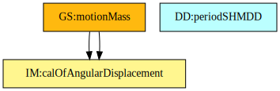
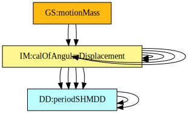

# Software Requirements Specification for Single Pendulum
Olu Owojaiye

# Table of Contents {#Sec:ToC}

An outline of all sections included in this SRS is recorded here for easy reference.

- [Table of Contents](#Sec:ToC)
- [Reference Material](#Sec:RefMat)
  - [Table of Units](#Sec:ToU)
  - [Table of Symbols](#Sec:ToS)
  - [Abbreviations and Acronyms](#Sec:TAbbAcc)
- [Introduction](#Sec:Intro)
  - [Purpose of Document](#Sec:DocPurpose)
  - [Scope of Requirements](#Sec:ReqsScope)
  - [Characteristics of Intended Reader](#Sec:ReaderChars)
  - [Organization of Document](#Sec:DocOrg)
- [General System Description](#Sec:GenSysDesc)
  - [System Context](#Sec:SysContext)
  - [User Characteristics](#Sec:UserChars)
  - [System Constraints](#Sec:SysConstraints)
- [Specific System Description](#Sec:SpecSystDesc)
  - [Problem Description](#Sec:ProbDesc)
    - [Terminology and Definitions](#Sec:TermDefs)
    - [Physical System Description](#Sec:PhysSyst)
    - [Goal Statements](#Sec:GoalStmt)
  - [Solution Characteristics Specification](#Sec:SolCharSpec)
    - [Assumptions](#Sec:Assumps)
    - [Theoretical Models](#Sec:TMs)
    - [General Definitions](#Sec:GDs)
    - [Data Definitions](#Sec:DDs)
    - [Instance Models](#Sec:IMs)
    - [Data Constraints](#Sec:DataConstraints)
    - [Properties of a Correct Solution](#Sec:CorSolProps)
- [Requirements](#Sec:Requirements)
  - [Functional Requirements](#Sec:FRs)
  - [Non-Functional Requirements](#Sec:NFRs)
- [Traceability Matrices and Graphs](#Sec:TraceMatrices)
- [Values of Auxiliary Constants](#Sec:AuxConstants)
- [References](#Sec:References)

# Reference Material {#Sec:RefMat}

This section records information for easy reference.

# Table of Units {#Sec:ToU}

The unit system used throughout is SI (Système International d'Unités). In addition to the basic units, several derived units are also used. For each unit, the [Table of Units](#Table:ToU) lists the symbol, a description, and the SI name.

|Symbol            |Description|SI Name |
|:-----------------|:----------|:-------|
|\\({\text{Hz}}\\) |frequency  |hertz   |
|\\({\text{kg}}\\) |mass       |kilogram|
|\\({\text{m}}\\)  |length     |metre   |
|\\({\text{N}}\\)  |force      |newton  |
|\\({\text{rad}}\\)|angle      |radian  |
|\\({\text{s}}\\)  |time       |second  |

**
Table of Units
**

# Table of Symbols {#Sec:ToS}

The symbols used in this document are summarized in the [Table of Symbols](#Table:ToS) along with their units. Throughout the document, symbols in bold will represent vectors, and scalars otherwise. The symbols are listed in alphabetical order. For vector quantities, the units shown are for each component of the vector.

|Symbol                               |Description                                      |Units                                |
|:------------------------------------|:------------------------------------------------|:------------------------------------|
|\\({a\_{\text{x}}}\\)                |\\(x\\)-component of acceleration                |\\(\frac{\text{m}}{\text{s}^{2}}\\)  |
|\\({a\_{\text{y}}}\\)                |\\(y\\)-component of acceleration                |\\(\frac{\text{m}}{\text{s}^{2}}\\)  |
|\\(\boldsymbol{a}\text{(}t\text{)}\\)|Acceleration                                     |\\(\frac{\text{m}}{\text{s}^{2}}\\)  |
|\\(\boldsymbol{F}\\)                 |Force                                            |\\({\text{N}}\\)                     |
|\\(f\\)                              |Frequency                                        |\\({\text{Hz}}\\)                    |
|\\(\boldsymbol{g}\\)                 |Gravitational acceleration                       |\\(\frac{\text{m}}{\text{s}^{2}}\\)  |
|\\(\boldsymbol{I}\\)                 |Moment of inertia                                |\\(\text{kg}\text{m}^{2}\\)          |
|\\(\boldsymbol{\hat{i}}\\)           |Unit vector                                      |--                                   |
|\\({L\_{\text{rod}}}\\)              |Length of the rod                                |\\({\text{m}}\\)                     |
|\\(m\\)                              |Mass                                             |\\({\text{kg}}\\)                    |
|\\({p\_{\text{x}}}\\)                |\\(x\\)-component of position                    |\\({\text{m}}\\)                     |
|\\({{p\_{\text{x}}}^{\text{i}}}\\)   |\\(x\\)-component of initial position            |\\({\text{m}}\\)                     |
|\\({p\_{\text{y}}}\\)                |\\(y\\)-component of position                    |\\({\text{m}}\\)                     |
|\\({{p\_{\text{y}}}^{\text{i}}}\\)   |\\(y\\)-component of initial position            |\\({\text{m}}\\)                     |
|\\(\boldsymbol{p}\text{(}t\text{)}\\)|Position                                         |\\({\text{m}}\\)                     |
|\\(T\\)                              |Period                                           |\\({\text{s}}\\)                     |
|\\(\boldsymbol{T}\\)                 |Tension                                          |\\({\text{N}}\\)                     |
|\\(t\\)                              |Time                                             |\\({\text{s}}\\)                     |
|\\({v\_{\text{x}}}\\)                |\\(x\\)-component of velocity                    |\\(\frac{\text{m}}{\text{s}}\\)      |
|\\({v\_{\text{y}}}\\)                |\\(y\\)-component of velocity                    |\\(\frac{\text{m}}{\text{s}}\\)      |
|\\(\boldsymbol{v}\text{(}t\text{)}\\)|Velocity                                         |\\(\frac{\text{m}}{\text{s}}\\)      |
|\\(α\\)                              |Angular acceleration                             |\\(\frac{\text{rad}}{\text{s}^{2}}\\)|
|\\(θ\\)                              |Angular displacement                             |\\({\text{rad}}\\)                   |
|\\({θ\_{i}}\\)                       |Initial pendulum angle                           |\\({\text{rad}}\\)                   |
|\\({θ\_{p}}\\)                       |Displacement angle of the pendulum               |\\({\text{rad}}\\)                   |
|\\(π\\)                              |Ratio of circumference to diameter for any circle|--                                   |
|\\(\boldsymbol{τ}\\)                 |Torque                                           |\\(\text{N}\text{m}\\)               |
|\\(Ω\\)                              |Angular frequency                                |\\({\text{s}}\\)                     |
|\\(ω\\)                              |Angular velocity                                 |\\(\frac{\text{rad}}{\text{s}}\\)    |

**
Table of Symbols
**

# Abbreviations and Acronyms {#Sec:TAbbAcc}

|Abbreviation|Full Form                          |
|:-----------|:----------------------------------|
|2D          |Two-Dimensional                    |
|A           |Assumption                         |
|DD          |Data Definition                    |
|GD          |General Definition                 |
|GS          |Goal Statement                     |
|IM          |Instance Model                     |
|PS          |Physical System Description        |
|R           |Requirement                        |
|RefBy       |Referenced by                      |
|Refname     |Reference Name                     |
|SRS         |Software Requirements Specification|
|SglPend     |Single Pendulum                    |
|TM          |Theoretical Model                  |
|Uncert.     |Typical Uncertainty                |

**
Abbreviations and Acronyms
**

# Introduction {#Sec:Intro}

A pendulum consists of mass attached to the end of a rod and its moving curve is highly sensitive to initial conditions. Therefore, it is useful to have a program to simulate the motion of the pendulum to exhibit its chaotic characteristics. The program documented here is called Single Pendulum.

The following section provides an overview of the Software Requirements Specification (SRS) for Single Pendulum. This section explains the purpose of this document, the scope of the requirements, the characteristics of the intended reader, and the organization of the document.

# Purpose of Document {#Sec:DocPurpose}

The primary purpose of this document is to record the requirements of SglPend. Goals, assumptions, theoretical models, definitions, and other model derivation information are specified, allowing the reader to fully understand and verify the purpose and scientific basis of SglPend. With the exception of [system constraints](#Sec:SysConstraints), this SRS will remain abstract, describing what problem is being solved, but not how to solve it.

This document will be used as a starting point for subsequent development phases, including writing the design specification and the software verification and validation plan. The design document will show how the requirements are to be realized, including decisions on the numerical algorithms and programming environment. The verification and validation plan will show the steps that will be used to increase confidence in the software documentation and the implementation. Although the SRS fits in a series of documents that follow the so-called waterfall model, the actual development process is not constrained in any way. Even when the waterfall model is not followed, as Parnas and Clements point out [parnasClements1986](#parnasClements1986), the most logical way to present the documentation is still to "fake" a rational design process.

# Scope of Requirements {#Sec:ReqsScope}

The scope of the requirements includes the analysis of a two-dimensional (2D) pendulum motion problem with various initial conditions.

# Characteristics of Intended Reader {#Sec:ReaderChars}

Reviewers of this documentation should have an understanding of undergraduate level 2 physics, undergraduate level 1 calculus, and ordinary differential equations. The users of SglPend can have a lower level of expertise, as explained in [Sec:User Characteristics](#Sec:UserChars).

# Organization of Document {#Sec:DocOrg}

The organization of this document follows the template for an SRS for scientific computing software proposed by [koothoor2013](#koothoor2013), [smithLai2005](#smithLai2005), [smithEtAl2007](#smithEtAl2007), and [smithKoothoor2016](#smithKoothoor2016). The presentation follows the standard pattern of presenting goals, theories, definitions, and assumptions. For readers that would like a more bottom up approach, they can start reading the [instance models](#Sec:IMs) and trace back to find any additional information they require.

The [goal statements](#Sec:GoalStmt) are refined to the theoretical models and the [theoretical models](#Sec:TMs) to the [instance models](#Sec:IMs).

# General System Description {#Sec:GenSysDesc}

This section provides general information about the system. It identifies the interfaces between the system and its environment, describes the user characteristics, and lists the system constraints.

# System Context {#Sec:SysContext}

[Fig:sysCtxDiag](#Figure:sysCtxDiag) shows the system context. A circle represents an entity external to the software, the user in this case. A rectangle represents the software system itself (SglPend). Arrows are used to show the data flow between the system and its environment.

**
System Context
**

The interaction between the product and the user is through an application programming interface. The responsibilities of the user and the system are as follows:

- User Responsibilities
  - Provide initial conditions of the physical state of the motion and the input data related to the Single Pendulum, ensuring no errors in the data entry.
  - Ensure that consistent units are used for input variables.
  - Ensure required [software assumptions](#Sec:Assumps) are appropriate for any particular problem input to the software.
- SglPend Responsibilities
  - Detect data type mismatch, such as a string of characters input instead of a floating point number.
  - Determine if the inputs satisfy the required physical and software constraints.
  - Calculate the required outputs.
  - Generate the required graphs.

# User Characteristics {#Sec:UserChars}

The end user of SglPend should have an understanding of high school physics, high school calculus and ordinary differential equations.

# System Constraints {#Sec:SysConstraints}

There are no system constraints.

# Specific System Description {#Sec:SpecSystDesc}

This section first presents the problem description, which gives a high-level view of the problem to be solved. This is followed by the solution characteristics specification, which presents the assumptions, theories, and definitions that are used.

# Problem Description {#Sec:ProbDesc}

A system is needed to predict the motion of a single pendulum.

# Terminology and Definitions {#Sec:TermDefs}

This subsection provides a list of terms that are used in the subsequent sections and their meaning, with the purpose of reducing ambiguity and making it easier to correctly understand the requirements.

- Gravity: The force that attracts one physical body with mass to another.
- Cartesian coordinate system: A coordinate system that specifies each point uniquely in a plane by a set of numerical coordinates, which are the signed distances to the point from two fixed perpendicular oriented lines, measured in the same unit of length (from [cartesianWiki](#cartesianWiki)).

# Physical System Description {#Sec:PhysSyst}

The physical system of SglPend, as shown in [Fig:sglpend](#Figure:sglpend), includes the following elements:

PS1: The rod.

PS2: The mass.

**
The physical system
**

# Goal Statements {#Sec:GoalStmt}

Given the mass and length of the rod, initial angle of the mass and the gravitational constant, the goal statement is:

Motion-of-the-mass: Calculate the motion of the mass.

# Solution Characteristics Specification {#Sec:SolCharSpec}

The instance models that govern SglPend are presented in the [Instance Model Section](#Sec:IMs). The information to understand the meaning of the instance models and their derivation is also presented, so that the instance models can be verified.

# Assumptions {#Sec:Assumps}

This section simplifies the original problem and helps in developing the theoretical models by filling in the missing information for the physical system. The assumptions refine the scope by providing more detail.

twoDMotion: The pendulum motion is two-dimensional (2D).

cartSys: A Cartesian coordinate system is used.

cartSysR: The Cartesian coordinate system is right-handed where positive \\(x\\)-axis and \\(y\\)-axis point right up.

yAxisDir: The direction of the \\(y\\)-axis is directed opposite to gravity.

startOrigin: The pendulum is attached to the origin.

# Theoretical Models {#Sec:TMs}

This section focuses on the general equations and laws that SglPend is based on.

## Acceleration {#TM:acceleration}

|Refname    |TM:acceleration                                                                                                                                                                                                                                                 |
|:----------|:---------------------------------------------------------------------------------------------------------------------------------------------------------------------------------------------------------------------------------------------------------------|
|Label      |Acceleration                                                                                                                                                                                                                                                    |
|Equation   |\\[\boldsymbol{a}\text{(}t\text{)}=\frac{\\,d\boldsymbol{v}\text{(}t\text{)}}{\\,dt}\\]                                                                                                                                                                         |
|Description|<ul><li>\\(\boldsymbol{a}\text{(}t\text{)}\\) is the acceleration (\\(\frac{\text{m}}{\text{s}^{2}}\\))</li><li>\\(t\\) is the time (\\({\text{s}}\\))</li><li>\\(\boldsymbol{v}\text{(}t\text{)}\\) is the velocity (\\(\frac{\text{m}}{\text{s}}\\))</li></ul>|
|Source     |[accelerationWiki](#accelerationWiki)                                                                                                                                                                                                                           |
|RefBy      |                                                                                                                                                                                                                                                                |

## Velocity {#TM:velocity}

|Refname    |TM:velocity                                                                                                                                                                                                                              |
|:----------|:----------------------------------------------------------------------------------------------------------------------------------------------------------------------------------------------------------------------------------------|
|Label      |Velocity                                                                                                                                                                                                                                 |
|Equation   |\\[\boldsymbol{v}\text{(}t\text{)}=\frac{\\,d\boldsymbol{p}\text{(}t\text{)}}{\\,dt}\\]                                                                                                                                                  |
|Description|<ul><li>\\(\boldsymbol{v}\text{(}t\text{)}\\) is the velocity (\\(\frac{\text{m}}{\text{s}}\\))</li><li>\\(t\\) is the time (\\({\text{s}}\\))</li><li>\\(\boldsymbol{p}\text{(}t\text{)}\\) is the position (\\({\text{m}}\\))</li></ul>|
|Source     |[velocityWiki](#velocityWiki)                                                                                                                                                                                                            |
|RefBy      |                                                                                                                                                                                                                                         |

## Newton's second law of motion {#TM:NewtonSecLawMot}

|Refname    |TM:NewtonSecLawMot                                                                                                                                                                                                                  |
|:----------|:-----------------------------------------------------------------------------------------------------------------------------------------------------------------------------------------------------------------------------------|
|Label      |Newton's second law of motion                                                                                                                                                                                                       |
|Equation   |\\[\boldsymbol{F}=m \boldsymbol{a}\text{(}t\text{)}\\]                                                                                                                                                                              |
|Description|<ul><li>\\(\boldsymbol{F}\\) is the force (\\({\text{N}}\\))</li><li>\\(m\\) is the mass (\\({\text{kg}}\\))</li><li>\\(\boldsymbol{a}\text{(}t\text{)}\\) is the acceleration (\\(\frac{\text{m}}{\text{s}^{2}}\\))</li></ul>      |
|Notes      |<ul><li>The net force \\(\boldsymbol{F}\\) on a body is proportional to the acceleration \\(\boldsymbol{a}\text{(}t\text{)}\\) of the body, where \\(m\\) denotes the mass of the body as the constant of proportionality.</li></ul>|
|Source     |--                                                                                                                                                                                                                                  |
|RefBy      |                                                                                                                                                                                                                                    |

## Newton's second law for rotational motion {#TM:NewtonSecLawRotMot}

|Refname    |TM:NewtonSecLawRotMot                                                                                                                                                                                                                                |
|:----------|:----------------------------------------------------------------------------------------------------------------------------------------------------------------------------------------------------------------------------------------------------|
|Label      |Newton's second law for rotational motion                                                                                                                                                                                                            |
|Equation   |\\[\boldsymbol{τ}=\boldsymbol{I} α\\]                                                                                                                                                                                                                |
|Description|<ul><li>\\(\boldsymbol{τ}\\) is the torque (\\(\text{N}\text{m}\\))</li><li>\\(\boldsymbol{I}\\) is the moment of inertia (\\(\text{kg}\text{m}^{2}\\))</li><li>\\(α\\) is the angular acceleration (\\(\frac{\text{rad}}{\text{s}^{2}}\\))</li></ul>|
|Notes      |<ul><li>The net torque \\(\boldsymbol{τ}\\) on a rigid body is proportional to its angular acceleration \\(α\\), where \\(\boldsymbol{I}\\) denotes the moment of inertia of the rigid body as the constant of proportionality.</li></ul>            |
|Source     |--                                                                                                                                                                                                                                                   |
|RefBy      |[IM:calOfAngularDisplacement](#IM:calOfAngularDisplacement) and [GD:angFrequencyGD](#GD:angFrequencyGD)                                                                                                                                              |

# General Definitions {#Sec:GDs}

This section collects the laws and equations that will be used to build the instance models.

## The \\(x\\)-component of velocity of the pendulum {#GD:velocityIX}

|Refname    |GD:velocityIX                                                                                                                                                                                                                                                                                                                                               |
|:----------|:-----------------------------------------------------------------------------------------------------------------------------------------------------------------------------------------------------------------------------------------------------------------------------------------------------------------------------------------------------------|
|Label      |The \\(x\\)-component of velocity of the pendulum                                                                                                                                                                                                                                                                                                           |
|Units      |\\(\frac{\text{m}}{\text{s}}\\)                                                                                                                                                                                                                                                                                                                             |
|Equation   |\\[{v\_{\text{x}}}=ω {L\_{\text{rod}}} \cos\left({θ\_{p}}\right)\\]                                                                                                                                                                                                                                                                                         |
|Description|<ul><li>\\({v\_{\text{x}}}\\) is the \\(x\\)-component of velocity (\\(\frac{\text{m}}{\text{s}}\\))</li><li>\\(ω\\) is the angular velocity (\\(\frac{\text{rad}}{\text{s}}\\))</li><li>\\({L\_{\text{rod}}}\\) is the length of the rod (\\({\text{m}}\\))</li><li>\\({θ\_{p}}\\) is the displacement angle of the pendulum (\\({\text{rad}}\\))</li></ul>|
|Source     |--                                                                                                                                                                                                                                                                                                                                                          |
|RefBy      |                                                                                                                                                                                                                                                                                                                                                            |

#### Detailed derivation of the \\(x\\)-component of velocity: {#GD:velocityIXDeriv}

At a given point in time, velocity may be defined as

\\[\boldsymbol{v}\text{(}t\text{)}=\frac{\\,d\boldsymbol{p}\text{(}t\text{)}}{\\,dt}\\]

We also know the horizontal position

\\[{p\_{\text{x}}}={L\_{\text{rod}}} \sin\left({θ\_{p}}\right)\\]

Applying this,

\\[{v\_{\text{x}}}=\frac{\\,d{L\_{\text{rod}}} \sin\left({θ\_{p}}\right)}{\\,dt}\\]

\\({L\_{\text{rod}}}\\) is constant with respect to time, so

\\[{v\_{\text{x}}}={L\_{\text{rod}}} \frac{\\,d\sin\left({θ\_{p}}\right)}{\\,dt}\\]

Therefore, using the chain rule,

\\[{v\_{\text{x}}}=ω {L\_{\text{rod}}} \cos\left({θ\_{p}}\right)\\]

## The \\(y\\)-component of velocity of the pendulum {#GD:velocityIY}

|Refname    |GD:velocityIY                                                                                                                                                                                                                                                                                                                                               |
|:----------|:-----------------------------------------------------------------------------------------------------------------------------------------------------------------------------------------------------------------------------------------------------------------------------------------------------------------------------------------------------------|
|Label      |The \\(y\\)-component of velocity of the pendulum                                                                                                                                                                                                                                                                                                           |
|Units      |\\(\frac{\text{m}}{\text{s}}\\)                                                                                                                                                                                                                                                                                                                             |
|Equation   |\\[{v\_{\text{y}}}=ω {L\_{\text{rod}}} \sin\left({θ\_{p}}\right)\\]                                                                                                                                                                                                                                                                                         |
|Description|<ul><li>\\({v\_{\text{y}}}\\) is the \\(y\\)-component of velocity (\\(\frac{\text{m}}{\text{s}}\\))</li><li>\\(ω\\) is the angular velocity (\\(\frac{\text{rad}}{\text{s}}\\))</li><li>\\({L\_{\text{rod}}}\\) is the length of the rod (\\({\text{m}}\\))</li><li>\\({θ\_{p}}\\) is the displacement angle of the pendulum (\\({\text{rad}}\\))</li></ul>|
|Source     |--                                                                                                                                                                                                                                                                                                                                                          |
|RefBy      |                                                                                                                                                                                                                                                                                                                                                            |

#### Detailed derivation of the \\(y\\)-component of velocity: {#GD:velocityIYDeriv}

At a given point in time, velocity may be defined as

\\[\boldsymbol{v}\text{(}t\text{)}=\frac{\\,d\boldsymbol{p}\text{(}t\text{)}}{\\,dt}\\]

We also know the vertical position

\\[{p\_{\text{y}}}=-{L\_{\text{rod}}} \cos\left({θ\_{p}}\right)\\]

Applying this,

\\[{v\_{\text{y}}}=-\left(\frac{\\,d{L\_{\text{rod}}} \cos\left({θ\_{p}}\right)}{\\,dt}\right)\\]

\\({L\_{\text{rod}}}\\) is constant with respect to time, so

\\[{v\_{\text{y}}}=-{L\_{\text{rod}}} \frac{\\,d\cos\left({θ\_{p}}\right)}{\\,dt}\\]

Therefore, using the chain rule,

\\[{v\_{\text{y}}}=ω {L\_{\text{rod}}} \sin\left({θ\_{p}}\right)\\]

## The \\(x\\)-component of acceleration of the pendulum {#GD:accelerationIX}

|Refname    |GD:accelerationIX                                                                                                                                                                                                                                                                                                                                                                                                                                       |
|:----------|:-------------------------------------------------------------------------------------------------------------------------------------------------------------------------------------------------------------------------------------------------------------------------------------------------------------------------------------------------------------------------------------------------------------------------------------------------------|
|Label      |The \\(x\\)-component of acceleration of the pendulum                                                                                                                                                                                                                                                                                                                                                                                                   |
|Units      |\\(\frac{\text{m}}{\text{s}^{2}}\\)                                                                                                                                                                                                                                                                                                                                                                                                                     |
|Equation   |\\[{a\_{\text{x}}}=-ω^{2} {L\_{\text{rod}}} \sin\left({θ\_{p}}\right)+α {L\_{\text{rod}}} \cos\left({θ\_{p}}\right)\\]                                                                                                                                                                                                                                                                                                                                  |
|Description|<ul><li>\\({a\_{\text{x}}}\\) is the \\(x\\)-component of acceleration (\\(\frac{\text{m}}{\text{s}^{2}}\\))</li><li>\\(ω\\) is the angular velocity (\\(\frac{\text{rad}}{\text{s}}\\))</li><li>\\({L\_{\text{rod}}}\\) is the length of the rod (\\({\text{m}}\\))</li><li>\\({θ\_{p}}\\) is the displacement angle of the pendulum (\\({\text{rad}}\\))</li><li>\\(α\\) is the angular acceleration (\\(\frac{\text{rad}}{\text{s}^{2}}\\))</li></ul>|
|Source     |--                                                                                                                                                                                                                                                                                                                                                                                                                                                      |
|RefBy      |                                                                                                                                                                                                                                                                                                                                                                                                                                                        |

#### Detailed derivation of the \\(x\\)-component of acceleration: {#GD:accelerationIXDeriv}

Our acceleration is:

\\[\boldsymbol{a}\text{(}t\text{)}=\frac{\\,d\boldsymbol{v}\text{(}t\text{)}}{\\,dt}\\]

Earlier, we found the horizontal velocity to be

\\[{v\_{\text{x}}}=ω {L\_{\text{rod}}} \cos\left({θ\_{p}}\right)\\]

Applying this to our equation for acceleration

\\[{a\_{\text{x}}}=\frac{\\,dω {L\_{\text{rod}}} \cos\left({θ\_{p}}\right)}{\\,dt}\\]

By the product and chain rules, we find

\\[{a\_{\text{x}}}=\frac{\\,dω}{\\,dt} {L\_{\text{rod}}} \cos\left({θ\_{p}}\right)-ω {L\_{\text{rod}}} \sin\left({θ\_{p}}\right) \frac{\\,d{θ\_{p}}}{\\,dt}\\]

Simplifying,

\\[{a\_{\text{x}}}=-ω^{2} {L\_{\text{rod}}} \sin\left({θ\_{p}}\right)+α {L\_{\text{rod}}} \cos\left({θ\_{p}}\right)\\]

## The \\(y\\)-component of acceleration of the pendulum {#GD:accelerationIY}

|Refname    |GD:accelerationIY                                                                                                                                                                                                                                                                                                                                                                                                                                       |
|:----------|:-------------------------------------------------------------------------------------------------------------------------------------------------------------------------------------------------------------------------------------------------------------------------------------------------------------------------------------------------------------------------------------------------------------------------------------------------------|
|Label      |The \\(y\\)-component of acceleration of the pendulum                                                                                                                                                                                                                                                                                                                                                                                                   |
|Units      |\\(\frac{\text{m}}{\text{s}^{2}}\\)                                                                                                                                                                                                                                                                                                                                                                                                                     |
|Equation   |\\[{a\_{\text{y}}}=ω^{2} {L\_{\text{rod}}} \cos\left({θ\_{p}}\right)+α {L\_{\text{rod}}} \sin\left({θ\_{p}}\right)\\]                                                                                                                                                                                                                                                                                                                                   |
|Description|<ul><li>\\({a\_{\text{y}}}\\) is the \\(y\\)-component of acceleration (\\(\frac{\text{m}}{\text{s}^{2}}\\))</li><li>\\(ω\\) is the angular velocity (\\(\frac{\text{rad}}{\text{s}}\\))</li><li>\\({L\_{\text{rod}}}\\) is the length of the rod (\\({\text{m}}\\))</li><li>\\({θ\_{p}}\\) is the displacement angle of the pendulum (\\({\text{rad}}\\))</li><li>\\(α\\) is the angular acceleration (\\(\frac{\text{rad}}{\text{s}^{2}}\\))</li></ul>|
|Source     |--                                                                                                                                                                                                                                                                                                                                                                                                                                                      |
|RefBy      |                                                                                                                                                                                                                                                                                                                                                                                                                                                        |

#### Detailed derivation of the \\(y\\)-component of acceleration: {#GD:accelerationIYDeriv}

Our acceleration is:

\\[\boldsymbol{a}\text{(}t\text{)}=\frac{\\,d\boldsymbol{v}\text{(}t\text{)}}{\\,dt}\\]

Earlier, we found the vertical velocity to be

\\[{v\_{\text{y}}}=ω {L\_{\text{rod}}} \sin\left({θ\_{p}}\right)\\]

Applying this to our equation for acceleration

\\[{a\_{\text{y}}}=\frac{\\,dω {L\_{\text{rod}}} \sin\left({θ\_{p}}\right)}{\\,dt}\\]

By the product and chain rules, we find

\\[{a\_{\text{y}}}=\frac{\\,dω}{\\,dt} {L\_{\text{rod}}} \sin\left({θ\_{p}}\right)+ω {L\_{\text{rod}}} \cos\left({θ\_{p}}\right) \frac{\\,d{θ\_{p}}}{\\,dt}\\]

Simplifying,

\\[{a\_{\text{y}}}=ω^{2} {L\_{\text{rod}}} \cos\left({θ\_{p}}\right)+α {L\_{\text{rod}}} \sin\left({θ\_{p}}\right)\\]

## Horizontal force on the pendulum {#GD:hForceOnPendulum}

|Refname    |GD:hForceOnPendulum                                                                                                                                                                                                                                                                                                                                                                     |
|:----------|:---------------------------------------------------------------------------------------------------------------------------------------------------------------------------------------------------------------------------------------------------------------------------------------------------------------------------------------------------------------------------------------|
|Label      |Horizontal force on the pendulum                                                                                                                                                                                                                                                                                                                                                        |
|Units      |\\({\text{N}}\\)                                                                                                                                                                                                                                                                                                                                                                        |
|Equation   |\\[\boldsymbol{F}=m {a\_{\text{x}}}=-\boldsymbol{T} \sin\left({θ\_{p}}\right)\\]                                                                                                                                                                                                                                                                                                        |
|Description|<ul><li>\\(\boldsymbol{F}\\) is the force (\\({\text{N}}\\))</li><li>\\(m\\) is the mass (\\({\text{kg}}\\))</li><li>\\({a\_{\text{x}}}\\) is the \\(x\\)-component of acceleration (\\(\frac{\text{m}}{\text{s}^{2}}\\))</li><li>\\(\boldsymbol{T}\\) is the tension (\\({\text{N}}\\))</li><li>\\({θ\_{p}}\\) is the displacement angle of the pendulum (\\({\text{rad}}\\))</li></ul>|
|Source     |--                                                                                                                                                                                                                                                                                                                                                                                      |
|RefBy      |                                                                                                                                                                                                                                                                                                                                                                                        |

#### Detailed derivation of force on the pendulum: {#GD:hForceOnPendulumDeriv}

\\[\boldsymbol{F}=m {a\_{\text{x}}}=-\boldsymbol{T} \sin\left({θ\_{p}}\right)\\]

## Vertical force on the pendulum {#GD:vForceOnPendulum}

|Refname    |GD:vForceOnPendulum                                                                                                                                                                                                                                                                                                                                                                                                                                                                          |
|:----------|:--------------------------------------------------------------------------------------------------------------------------------------------------------------------------------------------------------------------------------------------------------------------------------------------------------------------------------------------------------------------------------------------------------------------------------------------------------------------------------------------|
|Label      |Vertical force on the pendulum                                                                                                                                                                                                                                                                                                                                                                                                                                                               |
|Units      |\\({\text{N}}\\)                                                                                                                                                                                                                                                                                                                                                                                                                                                                             |
|Equation   |\\[\boldsymbol{F}=m {a\_{\text{y}}}=\boldsymbol{T} \cos\left({θ\_{p}}\right)-m \boldsymbol{g}\\]                                                                                                                                                                                                                                                                                                                                                                                             |
|Description|<ul><li>\\(\boldsymbol{F}\\) is the force (\\({\text{N}}\\))</li><li>\\(m\\) is the mass (\\({\text{kg}}\\))</li><li>\\({a\_{\text{y}}}\\) is the \\(y\\)-component of acceleration (\\(\frac{\text{m}}{\text{s}^{2}}\\))</li><li>\\(\boldsymbol{T}\\) is the tension (\\({\text{N}}\\))</li><li>\\({θ\_{p}}\\) is the displacement angle of the pendulum (\\({\text{rad}}\\))</li><li>\\(\boldsymbol{g}\\) is the gravitational acceleration (\\(\frac{\text{m}}{\text{s}^{2}}\\))</li></ul>|
|Source     |--                                                                                                                                                                                                                                                                                                                                                                                                                                                                                           |
|RefBy      |                                                                                                                                                                                                                                                                                                                                                                                                                                                                                             |

#### Detailed derivation of force on the pendulum: {#GD:vForceOnPendulumDeriv}

\\[\boldsymbol{F}=m {a\_{\text{y}}}=\boldsymbol{T} \cos\left({θ\_{p}}\right)-m \boldsymbol{g}\\]

## The angular frequency of the pendulum {#GD:angFrequencyGD}

|Refname    |GD:angFrequencyGD                                                                                                                                                                                                                                     |
|:----------|:-----------------------------------------------------------------------------------------------------------------------------------------------------------------------------------------------------------------------------------------------------|
|Label      |The angular frequency of the pendulum                                                                                                                                                                                                                 |
|Units      |\\({\text{s}}\\)                                                                                                                                                                                                                                      |
|Equation   |\\[Ω=\sqrt{\frac{\boldsymbol{g}}{{L\_{\text{rod}}}}}\\]                                                                                                                                                                                               |
|Description|<ul><li>\\(Ω\\) is the angular frequency (\\({\text{s}}\\))</li><li>\\(\boldsymbol{g}\\) is the gravitational acceleration (\\(\frac{\text{m}}{\text{s}^{2}}\\))</li><li>\\({L\_{\text{rod}}}\\) is the length of the rod (\\({\text{m}}\\))</li></ul>|
|Notes      |<ul><li>The torque is defined in [TM:NewtonSecLawRotMot](#TM:NewtonSecLawRotMot) and frequency is \\(f\\) is defined in [DD:frequencyDD](#DD:frequencyDD).</li></ul>                                                                                  |
|Source     |--                                                                                                                                                                                                                                                    |
|RefBy      |[GD:periodPend](#GD:periodPend) and [IM:calOfAngularDisplacement](#IM:calOfAngularDisplacement)                                                                                                                                                       |

#### Detailed derivation of the angular frequency of the pendulum: {#GD:angFrequencyGDDeriv}

Consider the torque on a pendulum defined in [TM:NewtonSecLawRotMot](#TM:NewtonSecLawRotMot). The force providing the restoring torque is the component of weight of the pendulum bob that acts along the arc length. The torque is the length of the string \\({L\_{\text{rod}}}\\) multiplied by the component of the net force that is perpendicular to the radius of the arc. The minus sign indicates the torque acts in the opposite direction of the angular displacement:

\\[\boldsymbol{τ}=-{L\_{\text{rod}}} m \boldsymbol{g} \sin\left({θ\_{p}}\right)\\]

So then

\\[\boldsymbol{I} α=-{L\_{\text{rod}}} m \boldsymbol{g} \sin\left({θ\_{p}}\right)\\]

Therefore,

\\[\boldsymbol{I} \frac{\\,d\frac{\\,d{θ\_{p}}}{\\,dt}}{\\,dt}=-{L\_{\text{rod}}} m \boldsymbol{g} \sin\left({θ\_{p}}\right)\\]

Substituting for \\(\boldsymbol{I}\\)

\\[m {L\_{\text{rod}}}^{2} \frac{\\,d\frac{\\,d{θ\_{p}}}{\\,dt}}{\\,dt}=-{L\_{\text{rod}}} m \boldsymbol{g} \sin\left({θ\_{p}}\right)\\]

Crossing out \\(m\\) and \\({L\_{\text{rod}}}\\) we have

\\[\frac{\\,d\frac{\\,d{θ\_{p}}}{\\,dt}}{\\,dt}=-\left(\frac{\boldsymbol{g}}{{L\_{\text{rod}}}}\right) \sin\left({θ\_{p}}\right)\\]

For small angles, we approximate sin \\({θ\_{p}}\\) to \\({θ\_{p}}\\)

\\[\frac{\\,d\frac{\\,d{θ\_{p}}}{\\,dt}}{\\,dt}=-\left(\frac{\boldsymbol{g}}{{L\_{\text{rod}}}}\right) {θ\_{p}}\\]

Because this equation, has the same form as the equation for simple harmonic motion the solution is easy to find.  The angular frequency

\\[Ω=\sqrt{\frac{\boldsymbol{g}}{{L\_{\text{rod}}}}}\\]

## The period of the pendulum {#GD:periodPend}

|Refname    |GD:periodPend                                                                                                                                                                                                                                                                                                                  |
|:----------|:------------------------------------------------------------------------------------------------------------------------------------------------------------------------------------------------------------------------------------------------------------------------------------------------------------------------------|
|Label      |The period of the pendulum                                                                                                                                                                                                                                                                                                     |
|Units      |\\({\text{s}}\\)                                                                                                                                                                                                                                                                                                               |
|Equation   |\\[T=2 π \sqrt{\frac{{L\_{\text{rod}}}}{\boldsymbol{g}}}\\]                                                                                                                                                                                                                                                                    |
|Description|<ul><li>\\(T\\) is the period (\\({\text{s}}\\))</li><li>\\(π\\) is the ratio of circumference to diameter for any circle (Unitless)</li><li>\\({L\_{\text{rod}}}\\) is the length of the rod (\\({\text{m}}\\))</li><li>\\(\boldsymbol{g}\\) is the gravitational acceleration (\\(\frac{\text{m}}{\text{s}^{2}}\\))</li></ul>|
|Notes      |<ul><li>The frequency and period are defined in the data definitions for [frequency](#DD:frequencyDD) and [period](#DD:periodSHMDD) respectively</li></ul>                                                                                                                                                                     |
|Source     |--                                                                                                                                                                                                                                                                                                                             |
|RefBy      |                                                                                                                                                                                                                                                                                                                               |

#### Detailed derivation of the period of the pendulum: {#GD:periodPendDeriv}

The period of the pendulum can be defined from the general definition for the equation of [angular frequency](#GD:angFrequencyGD)

\\[Ω=\sqrt{\frac{\boldsymbol{g}}{{L\_{\text{rod}}}}}\\]

Therefore from the data definition of the equation for [angular frequency](#DD:angFrequencyDD), we have

\\[T=2 π \sqrt{\frac{{L\_{\text{rod}}}}{\boldsymbol{g}}}\\]

# Data Definitions {#Sec:DDs}

This section collects and defines all the data needed to build the instance models.

## \\(x\\)-component of initial position {#DD:positionIX}

|Refname    |DD:positionIX                                                                                                                                                                                                                                                             |
|:----------|:-------------------------------------------------------------------------------------------------------------------------------------------------------------------------------------------------------------------------------------------------------------------------|
|Label      |\\(x\\)-component of initial position                                                                                                                                                                                                                                     |
|Symbol     |\\({{p\_{\text{x}}}^{\text{i}}}\\)                                                                                                                                                                                                                                        |
|Units      |\\({\text{m}}\\)                                                                                                                                                                                                                                                          |
|Equation   |\\[{{p\_{\text{x}}}^{\text{i}}}={L\_{\text{rod}}} \sin\left({θ\_{i}}\right)\\]                                                                                                                                                                                            |
|Description|<ul><li>\\({{p\_{\text{x}}}^{\text{i}}}\\) is the \\(x\\)-component of initial position (\\({\text{m}}\\))</li><li>\\({L\_{\text{rod}}}\\) is the length of the rod (\\({\text{m}}\\))</li><li>\\({θ\_{i}}\\) is the initial pendulum angle (\\({\text{rad}}\\))</li></ul>|
|Notes      |<ul><li>\\({{p\_{\text{x}}}^{\text{i}}}\\) is the horizontal position</li><li>\\({{p\_{\text{x}}}^{\text{i}}}\\) is shown in [Fig:sglpend](#Figure:sglpend).</li></ul>                                                                                                    |
|Source     |--                                                                                                                                                                                                                                                                        |
|RefBy      |                                                                                                                                                                                                                                                                          |

## \\(y\\)-component of initial position {#DD:positionIY}

|Refname    |DD:positionIY                                                                                                                                                                                                                                                             |
|:----------|:-------------------------------------------------------------------------------------------------------------------------------------------------------------------------------------------------------------------------------------------------------------------------|
|Label      |\\(y\\)-component of initial position                                                                                                                                                                                                                                     |
|Symbol     |\\({{p\_{\text{y}}}^{\text{i}}}\\)                                                                                                                                                                                                                                        |
|Units      |\\({\text{m}}\\)                                                                                                                                                                                                                                                          |
|Equation   |\\[{{p\_{\text{y}}}^{\text{i}}}=-{L\_{\text{rod}}} \cos\left({θ\_{i}}\right)\\]                                                                                                                                                                                           |
|Description|<ul><li>\\({{p\_{\text{y}}}^{\text{i}}}\\) is the \\(y\\)-component of initial position (\\({\text{m}}\\))</li><li>\\({L\_{\text{rod}}}\\) is the length of the rod (\\({\text{m}}\\))</li><li>\\({θ\_{i}}\\) is the initial pendulum angle (\\({\text{rad}}\\))</li></ul>|
|Notes      |<ul><li>\\({{p\_{\text{y}}}^{\text{i}}}\\) is the vertical position</li><li>\\({{p\_{\text{y}}}^{\text{i}}}\\) is shown in [Fig:sglpend](#Figure:sglpend).</li></ul>                                                                                                      |
|Source     |--                                                                                                                                                                                                                                                                        |
|RefBy      |                                                                                                                                                                                                                                                                          |

## Frequency {#DD:frequencyDD}

|Refname    |DD:frequencyDD                                                                                                 |
|:----------|:--------------------------------------------------------------------------------------------------------------|
|Label      |Frequency                                                                                                      |
|Symbol     |\\(f\\)                                                                                                        |
|Units      |\\({\text{Hz}}\\)                                                                                              |
|Equation   |\\[f=\frac{1}{T}\\]                                                                                            |
|Description|<ul><li>\\(f\\) is the frequency (\\({\text{Hz}}\\))</li><li>\\(T\\) is the period (\\({\text{s}}\\))</li></ul>|
|Notes      |<ul><li>\\(f\\) is the number of back and forth swings in one second</li></ul>                                 |
|Source     |--                                                                                                             |
|RefBy      |[GD:periodPend](#GD:periodPend), [DD:periodSHMDD](#DD:periodSHMDD), and [GD:angFrequencyGD](#GD:angFrequencyGD)|

## Angular frequency {#DD:angFrequencyDD}

|Refname    |DD:angFrequencyDD                                                                                                                                                                                         |
|:----------|:---------------------------------------------------------------------------------------------------------------------------------------------------------------------------------------------------------|
|Label      |Angular frequency                                                                                                                                                                                         |
|Symbol     |\\(Ω\\)                                                                                                                                                                                                   |
|Units      |\\({\text{s}}\\)                                                                                                                                                                                          |
|Equation   |\\[Ω=\frac{2 π}{T}\\]                                                                                                                                                                                     |
|Description|<ul><li>\\(Ω\\) is the angular frequency (\\({\text{s}}\\))</li><li>\\(π\\) is the ratio of circumference to diameter for any circle (Unitless)</li><li>\\(T\\) is the period (\\({\text{s}}\\))</li></ul>|
|Notes      |<ul><li>\\(T\\) is from [DD:periodSHMDD](#DD:periodSHMDD)</li></ul>                                                                                                                                       |
|Source     |--                                                                                                                                                                                                        |
|RefBy      |[GD:periodPend](#GD:periodPend)                                                                                                                                                                           |

## Period {#DD:periodSHMDD}

|Refname    |DD:periodSHMDD                                                                                                 |
|:----------|:--------------------------------------------------------------------------------------------------------------|
|Label      |Period                                                                                                         |
|Symbol     |\\(T\\)                                                                                                        |
|Units      |\\({\text{s}}\\)                                                                                               |
|Equation   |\\[T=\frac{1}{f}\\]                                                                                            |
|Description|<ul><li>\\(T\\) is the period (\\({\text{s}}\\))</li><li>\\(f\\) is the frequency (\\({\text{Hz}}\\))</li></ul>|
|Notes      |<ul><li>\\(T\\) is from [DD:frequencyDD](#DD:frequencyDD)</li></ul>                                            |
|Source     |--                                                                                                             |
|RefBy      |[GD:periodPend](#GD:periodPend) and [DD:angFrequencyDD](#DD:angFrequencyDD)                                    |

# Instance Models {#Sec:IMs}

This section transforms the problem defined in the [problem description](#Sec:ProbDesc) into one which is expressed in mathematical terms. It uses concrete symbols defined in the [data definitions](#Sec:DDs) to replace the abstract symbols in the models identified in [theoretical models](#Sec:TMs) and [general definitions](#Sec:GDs).

## Calculation of angular displacement {#IM:calOfAngularDisplacement}

|Refname           |IM:calOfAngularDisplacement                                                                                                                                                                                                                                                         |
|:-----------------|:-----------------------------------------------------------------------------------------------------------------------------------------------------------------------------------------------------------------------------------------------------------------------------------|
|Label             |Calculation of angular displacement                                                                                                                                                                                                                                                 |
|Input             |\\({L\_{\text{rod}}}\\), \\({θ\_{i}}\\), \\(\boldsymbol{g}\\)                                                                                                                                                                                                                       |
|Output            |\\({θ\_{p}}\\)                                                                                                                                                                                                                                                                      |
|Input Constraints |\\[{L\_{\text{rod}}}\gt{}0\\]\\[{θ\_{i}}\gt{}0\\]\\[\boldsymbol{g}\gt{}0\\]                                                                                                                                                                                                         |
|Output Constraints|\\[{θ\_{p}}\gt{}0\\]                                                                                                                                                                                                                                                                |
|Equation          |\\[{θ\_{p}}\left(t\right)={θ\_{i}} \cos\left(Ω t\right)\\]                                                                                                                                                                                                                          |
|Description       |<ul><li>\\({θ\_{p}}\\) is the displacement angle of the pendulum (\\({\text{rad}}\\))</li><li>\\(t\\) is the time (\\({\text{s}}\\))</li><li>\\({θ\_{i}}\\) is the initial pendulum angle (\\({\text{rad}}\\))</li><li>\\(Ω\\) is the angular frequency (\\({\text{s}}\\))</li></ul>|
|Notes             |<ul><li>The constraint \\({θ\_{i}}\gt{}0\\) is required. The angular frequency is defined in [GD:angFrequencyGD](#GD:angFrequencyGD).</li></ul>                                                                                                                                     |
|Source            |--                                                                                                                                                                                                                                                                                  |
|RefBy             |[FR:Output-Values](#outputValues) and [FR:Calculate-Angular-Position-Of-Mass](#calcAngPos)                                                                                                                                                                                          |

#### Detailed derivation of angular displacement: {#IM:calOfAngularDisplacementDeriv}

When the pendulum is displaced to an initial angle and released, the pendulum swings back and forth with periodic motion. By applying [Newton's second law for rotational motion](#TM:NewtonSecLawRotMot), the equation of motion for the pendulum may be obtained:

\\[\boldsymbol{τ}=\boldsymbol{I} α\\]

Where \\(\boldsymbol{τ}\\) denotes the torque, \\(\boldsymbol{I}\\) denotes the moment of inertia and \\(α\\) denotes the angular acceleration. This implies:

\\[-m \boldsymbol{g} \sin\left({θ\_{p}}\right) {L\_{\text{rod}}}=m {L\_{\text{rod}}}^{2} \frac{\\,d\frac{\\,d{θ\_{p}}}{\\,dt}}{\\,dt}\\]

And rearranged as:

\\[\frac{\\,d\frac{\\,d{θ\_{p}}}{\\,dt}}{\\,dt}+\frac{\boldsymbol{g}}{{L\_{\text{rod}}}} \sin\left({θ\_{p}}\right)=0\\]

If the amplitude of angular displacement is small enough, we can approximate \\(\sin\left({θ\_{p}}\right)={θ\_{p}}\\) for the purpose of a simple pendulum at very small angles. Then the equation of motion reduces to the equation of simple harmonic motion:

\\[\frac{\\,d\frac{\\,d{θ\_{p}}}{\\,dt}}{\\,dt}+\frac{\boldsymbol{g}}{{L\_{\text{rod}}}} {θ\_{p}}=0\\]

Thus the simple harmonic motion is:

\\[{θ\_{p}}\left(t\right)={θ\_{i}} \cos\left(Ω t\right)\\]

# Data Constraints {#Sec:DataConstraints}

The [Data Constraints Table](#Table:InDataConstraints) shows the data constraints on the input variables. The column for physical constraints gives the physical limitations on the range of values that can be taken by the variable. The uncertainty column provides an estimate of the confidence with which the physical quantities can be measured. This information would be part of the input if one were performing an uncertainty quantification exercise. The constraints are conservative to give the user of the model the flexibility to experiment with unusual situations. The column of typical values is intended to provide a feel for a common scenario.

|Var                    |Physical Constraints         |Typical Value               |Uncert.    |
|:----------------------|:----------------------------|:---------------------------|:----------|
|\\({L\_{\text{rod}}}\\)|\\({L\_{\text{rod}}}\gt{}0\\)|\\(44.2\\) \\({\text{m}}\\) |10\\(\\%\\)|
|\\({θ\_{i}}\\)         |\\({θ\_{i}}\gt{}0\\)         |\\(2.1\\) \\({\text{rad}}\\)|10\\(\\%\\)|

**
Input Data Constraints
**

# Properties of a Correct Solution {#Sec:CorSolProps}

The [Data Constraints Table](#Table:OutDataConstraints) shows the data constraints on the output variables. The column for physical constraints gives the physical limitations on the range of values that can be taken by the variable.

|Var           |Physical Constraints|
|:-------------|:-------------------|
|\\(α\\)       |\\(α\gt{}0\\)       |
|\\({θ\_{p}}\\)|\\({θ\_{p}}\gt{}0\\)|

**
Output Data Constraints
**

# Requirements {#Sec:Requirements}

This section provides the functional requirements, the tasks and behaviours that the software is expected to complete, and the non-functional requirements, the qualities that the software is expected to exhibit.

# Functional Requirements {#Sec:FRs}

This section provides the functional requirements, the tasks and behaviours that the software is expected to complete.

Input-Values: Input the values from [Tab:ReqInputs](#Table:ReqInputs).

Verify-Input-Values: Check the entered input values to ensure that they do not exceed the [data constraints](#Sec:DataConstraints). If any of the input values are out of bounds, an error message is displayed and the calculations stop.

Calculate-Angular-Position-Of-Mass: Calculate the following values: \\(θ\\) and \\({θ\_{p}}\\) (from [IM:calOfAngularDisplacement](#IM:calOfAngularDisplacement)).

Output-Values: Output \\({L\_{\text{rod}}}\\) (from [IM:calOfAngularDisplacement](#IM:calOfAngularDisplacement)).

|Symbol                 |Description                       |Units                                |
|:----------------------|:---------------------------------|:------------------------------------|
|\\({L\_{\text{rod}}}\\)|Length of the rod                 |\\({\text{m}}\\)                     |
|\\(m\\)                |Mass                              |\\({\text{kg}}\\)                    |
|\\(α\\)                |Angular acceleration              |\\(\frac{\text{rad}}{\text{s}^{2}}\\)|
|\\({θ\_{i}}\\)         |Initial pendulum angle            |\\({\text{rad}}\\)                   |
|\\({θ\_{p}}\\)         |Displacement angle of the pendulum|\\({\text{rad}}\\)                   |

**
Required Inputs following [FR:Input-Values](#inputValues)
**

# Non-Functional Requirements {#Sec:NFRs}

This section provides the non-functional requirements, the qualities that the software is expected to exhibit.

Correct: The outputs of the code have the [properties of a correct solution](#Sec:CorSolProps).

Portable: The code is able to be run in different environments.

# Traceability Matrices and Graphs {#Sec:TraceMatrices}

The purpose of the traceability matrices is to provide easy references on what has to be additionally modified if a certain component is changed. Every time a component is changed, the items in the column of that component that are marked with an "X" should be modified as well. [Tab:TraceMatAvsA](#Table:TraceMatAvsA) shows the dependencies of the assumptions on each other. [Tab:TraceMatAvsAll](#Table:TraceMatAvsAll) shows the dependencies of the data definitions, theoretical models, general definitions, instance models, requirements, likely changes, and unlikely changes on the assumptions. [Tab:TraceMatRefvsRef](#Table:TraceMatRefvsRef) shows the dependencies of the data definitions, theoretical models, general definitions, and instance models on each other. [Tab:TraceMatAllvsR](#Table:TraceMatAllvsR) shows the dependencies of the requirements and goal statements on the data definitions, theoretical models, general definitions, and instance models.

|                             |[A:twoDMotion](#twoDMotion)|[A:cartSys](#cartSys)|[A:cartSysR](#cartSysR)|[A:yAxisDir](#yAxisDir)|[A:startOrigin](#startOrigin)|
|:----------------------------|:--------------------------|:--------------------|:----------------------|:----------------------|:----------------------------|
|[A:twoDMotion](#twoDMotion)  |                           |                     |                       |                       |                             |
|[A:cartSys](#cartSys)        |                           |                     |                       |                       |                             |
|[A:cartSysR](#cartSysR)      |                           |                     |                       |                       |                             |
|[A:yAxisDir](#yAxisDir)      |                           |                     |                       |                       |                             |
|[A:startOrigin](#startOrigin)|                           |                     |                       |                       |                             |

**
Traceability Matrix Showing the Connections Between Assumptions and Other Assumptions
**

|                                                           |[A:twoDMotion](#twoDMotion)|[A:cartSys](#cartSys)|[A:cartSysR](#cartSysR)|[A:yAxisDir](#yAxisDir)|[A:startOrigin](#startOrigin)|
|:----------------------------------------------------------|:--------------------------|:--------------------|:----------------------|:----------------------|:----------------------------|
|[DD:positionIX](#DD:positionIX)                            |                           |                     |                       |                       |                             |
|[DD:positionIY](#DD:positionIY)                            |                           |                     |                       |                       |                             |
|[DD:frequencyDD](#DD:frequencyDD)                          |                           |                     |                       |                       |                             |
|[DD:angFrequencyDD](#DD:angFrequencyDD)                    |                           |                     |                       |                       |                             |
|[DD:periodSHMDD](#DD:periodSHMDD)                          |                           |                     |                       |                       |                             |
|[TM:acceleration](#TM:acceleration)                        |                           |                     |                       |                       |                             |
|[TM:velocity](#TM:velocity)                                |                           |                     |                       |                       |                             |
|[TM:NewtonSecLawMot](#TM:NewtonSecLawMot)                  |                           |                     |                       |                       |                             |
|[TM:NewtonSecLawRotMot](#TM:NewtonSecLawRotMot)            |                           |                     |                       |                       |                             |
|[GD:velocityIX](#GD:velocityIX)                            |                           |                     |                       |                       |                             |
|[GD:velocityIY](#GD:velocityIY)                            |                           |                     |                       |                       |                             |
|[GD:accelerationIX](#GD:accelerationIX)                    |                           |                     |                       |                       |                             |
|[GD:accelerationIY](#GD:accelerationIY)                    |                           |                     |                       |                       |                             |
|[GD:hForceOnPendulum](#GD:hForceOnPendulum)                |                           |                     |                       |                       |                             |
|[GD:vForceOnPendulum](#GD:vForceOnPendulum)                |                           |                     |                       |                       |                             |
|[GD:angFrequencyGD](#GD:angFrequencyGD)                    |                           |                     |                       |                       |                             |
|[GD:periodPend](#GD:periodPend)                            |                           |                     |                       |                       |                             |
|[IM:calOfAngularDisplacement](#IM:calOfAngularDisplacement)|                           |                     |                       |                       |                             |
|[FR:Input-Values](#inputValues)                            |                           |                     |                       |                       |                             |
|[FR:Verify-Input-Values](#verifyInptVals)                  |                           |                     |                       |                       |                             |
|[FR:Calculate-Angular-Position-Of-Mass](#calcAngPos)       |                           |                     |                       |                       |                             |
|[FR:Output-Values](#outputValues)                          |                           |                     |                       |                       |                             |
|[NFR:Correct](#correct)                                    |                           |                     |                       |                       |                             |
|[NFR:Portable](#portable)                                  |                           |                     |                       |                       |                             |

**
Traceability Matrix Showing the Connections Between Assumptions and Other Items
**

|                                                           |[DD:positionIX](#DD:positionIX)|[DD:positionIY](#DD:positionIY)|[DD:frequencyDD](#DD:frequencyDD)|[DD:angFrequencyDD](#DD:angFrequencyDD)|[DD:periodSHMDD](#DD:periodSHMDD)|[TM:acceleration](#TM:acceleration)|[TM:velocity](#TM:velocity)|[TM:NewtonSecLawMot](#TM:NewtonSecLawMot)|[TM:NewtonSecLawRotMot](#TM:NewtonSecLawRotMot)|[GD:velocityIX](#GD:velocityIX)|[GD:velocityIY](#GD:velocityIY)|[GD:accelerationIX](#GD:accelerationIX)|[GD:accelerationIY](#GD:accelerationIY)|[GD:hForceOnPendulum](#GD:hForceOnPendulum)|[GD:vForceOnPendulum](#GD:vForceOnPendulum)|[GD:angFrequencyGD](#GD:angFrequencyGD)|[GD:periodPend](#GD:periodPend)|[IM:calOfAngularDisplacement](#IM:calOfAngularDisplacement)|
|:----------------------------------------------------------|:------------------------------|:------------------------------|:--------------------------------|:--------------------------------------|:--------------------------------|:----------------------------------|:--------------------------|:----------------------------------------|:----------------------------------------------|:------------------------------|:------------------------------|:--------------------------------------|:--------------------------------------|:------------------------------------------|:------------------------------------------|:--------------------------------------|:------------------------------|:----------------------------------------------------------|
|[DD:positionIX](#DD:positionIX)                            |                               |                               |                                 |                                       |                                 |                                   |                           |                                         |                                               |                               |                               |                                       |                                       |                                           |                                           |                                       |                               |                                                           |
|[DD:positionIY](#DD:positionIY)                            |                               |                               |                                 |                                       |                                 |                                   |                           |                                         |                                               |                               |                               |                                       |                                       |                                           |                                           |                                       |                               |                                                           |
|[DD:frequencyDD](#DD:frequencyDD)                          |                               |                               |                                 |                                       |                                 |                                   |                           |                                         |                                               |                               |                               |                                       |                                       |                                           |                                           |                                       |                               |                                                           |
|[DD:angFrequencyDD](#DD:angFrequencyDD)                    |                               |                               |                                 |                                       |X                                |                                   |                           |                                         |                                               |                               |                               |                                       |                                       |                                           |                                           |                                       |                               |                                                           |
|[DD:periodSHMDD](#DD:periodSHMDD)                          |                               |                               |X                                |                                       |                                 |                                   |                           |                                         |                                               |                               |                               |                                       |                                       |                                           |                                           |                                       |                               |                                                           |
|[TM:acceleration](#TM:acceleration)                        |                               |                               |                                 |                                       |                                 |                                   |                           |                                         |                                               |                               |                               |                                       |                                       |                                           |                                           |                                       |                               |                                                           |
|[TM:velocity](#TM:velocity)                                |                               |                               |                                 |                                       |                                 |                                   |                           |                                         |                                               |                               |                               |                                       |                                       |                                           |                                           |                                       |                               |                                                           |
|[TM:NewtonSecLawMot](#TM:NewtonSecLawMot)                  |                               |                               |                                 |                                       |                                 |                                   |                           |                                         |                                               |                               |                               |                                       |                                       |                                           |                                           |                                       |                               |                                                           |
|[TM:NewtonSecLawRotMot](#TM:NewtonSecLawRotMot)            |                               |                               |                                 |                                       |                                 |                                   |                           |                                         |                                               |                               |                               |                                       |                                       |                                           |                                           |                                       |                               |                                                           |
|[GD:velocityIX](#GD:velocityIX)                            |                               |                               |                                 |                                       |                                 |                                   |                           |                                         |                                               |                               |                               |                                       |                                       |                                           |                                           |                                       |                               |                                                           |
|[GD:velocityIY](#GD:velocityIY)                            |                               |                               |                                 |                                       |                                 |                                   |                           |                                         |                                               |                               |                               |                                       |                                       |                                           |                                           |                                       |                               |                                                           |
|[GD:accelerationIX](#GD:accelerationIX)                    |                               |                               |                                 |                                       |                                 |                                   |                           |                                         |                                               |                               |                               |                                       |                                       |                                           |                                           |                                       |                               |                                                           |
|[GD:accelerationIY](#GD:accelerationIY)                    |                               |                               |                                 |                                       |                                 |                                   |                           |                                         |                                               |                               |                               |                                       |                                       |                                           |                                           |                                       |                               |                                                           |
|[GD:hForceOnPendulum](#GD:hForceOnPendulum)                |                               |                               |                                 |                                       |                                 |                                   |                           |                                         |                                               |                               |                               |                                       |                                       |                                           |                                           |                                       |                               |                                                           |
|[GD:vForceOnPendulum](#GD:vForceOnPendulum)                |                               |                               |                                 |                                       |                                 |                                   |                           |                                         |                                               |                               |                               |                                       |                                       |                                           |                                           |                                       |                               |                                                           |
|[GD:angFrequencyGD](#GD:angFrequencyGD)                    |                               |                               |X                                |                                       |                                 |                                   |                           |                                         |X                                              |                               |                               |                                       |                                       |                                           |                                           |                                       |                               |                                                           |
|[GD:periodPend](#GD:periodPend)                            |                               |                               |X                                |X                                      |X                                |                                   |                           |                                         |                                               |                               |                               |                                       |                                       |                                           |                                           |X                                      |                               |                                                           |
|[IM:calOfAngularDisplacement](#IM:calOfAngularDisplacement)|                               |                               |                                 |                                       |                                 |                                   |                           |                                         |X                                              |                               |                               |                                       |                                       |                                           |                                           |X                                      |                               |                                                           |

**
Traceability Matrix Showing the Connections Between Items and Other Sections
**

|                                                    |[DD:positionIX](#DD:positionIX)|[DD:positionIY](#DD:positionIY)|[DD:frequencyDD](#DD:frequencyDD)|[DD:angFrequencyDD](#DD:angFrequencyDD)|[DD:periodSHMDD](#DD:periodSHMDD)|[TM:acceleration](#TM:acceleration)|[TM:velocity](#TM:velocity)|[TM:NewtonSecLawMot](#TM:NewtonSecLawMot)|[TM:NewtonSecLawRotMot](#TM:NewtonSecLawRotMot)|[GD:velocityIX](#GD:velocityIX)|[GD:velocityIY](#GD:velocityIY)|[GD:accelerationIX](#GD:accelerationIX)|[GD:accelerationIY](#GD:accelerationIY)|[GD:hForceOnPendulum](#GD:hForceOnPendulum)|[GD:vForceOnPendulum](#GD:vForceOnPendulum)|[GD:angFrequencyGD](#GD:angFrequencyGD)|[GD:periodPend](#GD:periodPend)|[IM:calOfAngularDisplacement](#IM:calOfAngularDisplacement)|[FR:Input-Values](#inputValues)|[FR:Verify-Input-Values](#verifyInptVals)|[FR:Calculate-Angular-Position-Of-Mass](#calcAngPos)|[FR:Output-Values](#outputValues)|[NFR:Correct](#correct)|[NFR:Portable](#portable)|
|:---------------------------------------------------|:------------------------------|:------------------------------|:--------------------------------|:--------------------------------------|:--------------------------------|:----------------------------------|:--------------------------|:----------------------------------------|:----------------------------------------------|:------------------------------|:------------------------------|:--------------------------------------|:--------------------------------------|:------------------------------------------|:------------------------------------------|:--------------------------------------|:------------------------------|:----------------------------------------------------------|:------------------------------|:----------------------------------------|:---------------------------------------------------|:--------------------------------|:----------------------|:------------------------|
|[GS:Motion-of-the-mass](#motionMass)                |                               |                               |                                 |                                       |                                 |                                   |                           |                                         |                                               |                               |                               |                                       |                                       |                                           |                                           |                                       |                               |                                                           |                               |                                         |                                                    |                                 |                       |                         |
|[FR:Input-Values](#inputValues)                     |                               |                               |                                 |                                       |                                 |                                   |                           |                                         |                                               |                               |                               |                                       |                                       |                                           |                                           |                                       |                               |                                                           |                               |                                         |                                                    |                                 |                       |                         |
|[FR:Verify-Input-Values](#verifyInptVals)           |                               |                               |                                 |                                       |                                 |                                   |                           |                                         |                                               |                               |                               |                                       |                                       |                                           |                                           |                                       |                               |                                                           |                               |                                         |                                                    |                                 |                       |                         |
|[FR:Calculate-Angular-Position-Of-Mass](#calcAngPos)|                               |                               |                                 |                                       |                                 |                                   |                           |                                         |                                               |                               |                               |                                       |                                       |                                           |                                           |                                       |                               |X                                                          |                               |                                         |                                                    |                                 |                       |                         |
|[FR:Output-Values](#outputValues)                   |                               |                               |                                 |                                       |                                 |                                   |                           |                                         |                                               |                               |                               |                                       |                                       |                                           |                                           |                                       |                               |X                                                          |                               |                                         |                                                    |                                 |                       |                         |
|[NFR:Correct](#correct)                             |                               |                               |                                 |                                       |                                 |                                   |                           |                                         |                                               |                               |                               |                                       |                                       |                                           |                                           |                                       |                               |                                                           |                               |                                         |                                                    |                                 |                       |                         |
|[NFR:Portable](#portable)                           |                               |                               |                                 |                                       |                                 |                                   |                           |                                         |                                               |                               |                               |                                       |                                       |                                           |                                           |                                       |                               |                                                           |                               |                                         |                                                    |                                 |                       |                         |

**
Traceability Matrix Showing the Connections Between Requirements, Goal Statements and Other Items
**

The purpose of the traceability graphs is also to provide easy references on what has to be additionally modified if a certain component is changed. The arrows in the graphs represent dependencies. The component at the tail of an arrow is depended on by the component at the head of that arrow. Therefore, if a component is changed, the components that it points to should also be changed. [Fig:TraceGraphAvsA](#Figure:TraceGraphAvsA) shows the dependencies of assumptions on each other. [Fig:TraceGraphAvsAll](#Figure:TraceGraphAvsAll) shows the dependencies of data definitions, theoretical models, general definitions, instance models, requirements, likely changes, and unlikely changes on the assumptions. [Fig:TraceGraphRefvsRef](#Figure:TraceGraphRefvsRef) shows the dependencies of data definitions, theoretical models, general definitions, and instance models on each other. [Fig:TraceGraphAllvsR](#Figure:TraceGraphAllvsR) shows the dependencies of requirements and goal statements on the data definitions, theoretical models, general definitions, and instance models. [Fig:TraceGraphAllvsAll](#Figure:TraceGraphAllvsAll) shows the dependencies of dependencies of assumptions, models, definitions, requirements, goals, and changes with each other.

**
TraceGraphAvsA
**

**
TraceGraphAvsAll
**

**
TraceGraphRefvsRef
**

**
TraceGraphAllvsR
**

**
TraceGraphAllvsAll
**

For convenience, the following graphs can be found at the links below:

- [TraceGraphAvsA](../../../../traceygraphs/sglpend/avsa.svg)
- [TraceGraphAvsAll](../../../../traceygraphs/sglpend/avsall.svg)
- [TraceGraphRefvsRef](../../../../traceygraphs/sglpend/refvsref.svg)
- [TraceGraphAllvsR](../../../../traceygraphs/sglpend/allvsr.svg)
- [TraceGraphAllvsAll](../../../../traceygraphs/sglpend/allvsall.svg)

# Values of Auxiliary Constants {#Sec:AuxConstants}

There are no auxiliary constants.

# References {#Sec:References}

[1]: Hibbeler, R. C. *Engineering Mechanics: Dynamics*. Pearson Prentice Hall, 2004. Print.

[2]: Koothoor, Nirmitha. *A Document Driven Approach to Certifying Scientific Computing Software*. McMaster University, Hamilton, ON, Canada: 2013. Print.

[3]: Parnas, David L. and Clements, P. C. "A rational design process: How and why to fake it." *IEEE Transactions on Software Engineering*, vol. 12, no. 2, Washington, USA: February, 1986. pp. 251&ndash;257. Print.

[4]: Smith, W. Spencer and Koothoor, Nirmitha. "A Document-Driven Method for Certifying Scientific Computing Software for Use in Nuclear Safety Analysis." * Nuclear Engineering and Technology*, vol. 48, no. 2, April, 2016. <http://www.sciencedirect.com/science/article/pii/S1738573315002582>. pp. 404&ndash;418.

[5]: Smith, W. Spencer and Lai, Lei. "A new requirements template for scientific computing." *Proceedings of the First International Workshop on Situational Requirements Engineering Processes - Methods, Techniques and Tools to Support Situation-Specific Requirements Engineering Processes, SREP'05*. Edited by PJ Agerfalk, N. Kraiem, and J. Ralyte, Paris, France: 2005. pp. 107&ndash;121. In conjunction with 13th IEEE International Requirements Engineering Conference,

[6]: Smith, W. Spencer, Lai, Lei, and Khedri, Ridha. "Requirements Analysis for Engineering Computation: A Systematic Approach for Improving Software Reliability." *Reliable Computing, Special Issue on Reliable Engineering Computation*, vol. 13, no. 1, February, 2007. <https://doi.org/10.1007/s11155-006-9020-7>. pp. 83&ndash;107.

[7]: Wikipedia Contributors. *Acceleration*. June, 2019. <https://en.wikipedia.org/wiki/Acceleration>.

[8]: Wikipedia Contributors. *Cartesian coordinate system*. June, 2019. <https://en.wikipedia.org/wiki/Cartesian_coordinate_system>.

[9]: Wikipedia Contributors. *Velocity*. June, 2019. <https://en.wikipedia.org/wiki/Velocity>.

