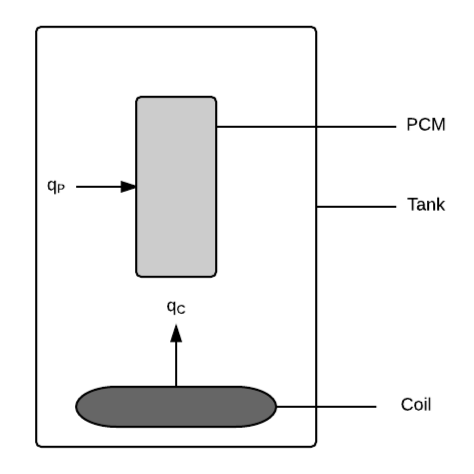

# Physical System Description {#Sec:PhysSyst}

The physical system of SWHS, as shown in [Fig:Tank](./SecPhysSyst.md#Figure:Tank), includes the following elements:

PS1: Tank containing water.

PS2: Heating coil at bottom of tank. (\\({q\_{\text{C}}}\\) represents the heat flux into the water from the coil.)

PS3: PCM suspended in tank. (\\({q\_{\text{P}}}\\) represents the heat flux into the PCM from water.)

**
Solar water heating tank, with heat flux into the water from the coil of \\({q\_{\text{C}}}\\) and heat flux into the PCM from water of \\({q\_{\text{P}}}\\)
**

