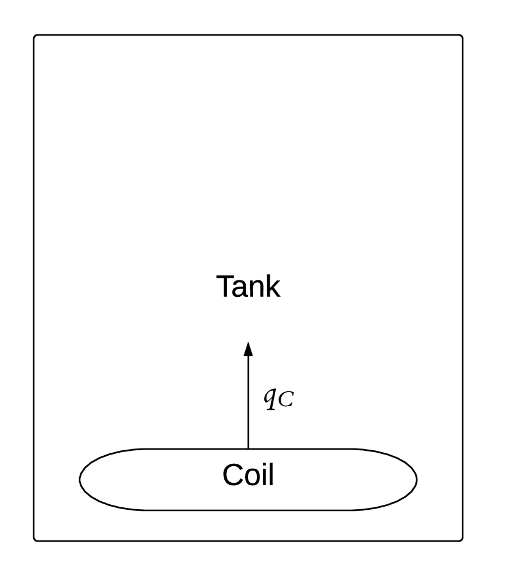
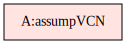
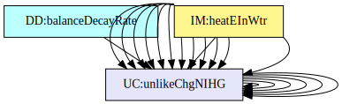
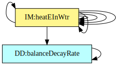
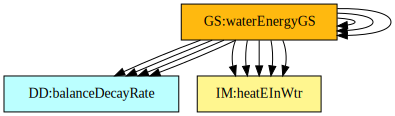
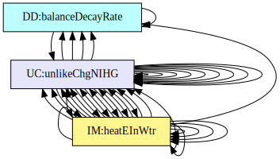

# Software Requirements Specification for Solar Water Heating Systems

Thulasi Jegatheesan

# Table of Contents {#Sec:ToC}

An outline of all sections included in this SRS is recorded here for easy reference.

- [Table of Contents](#Sec:ToC)
- [Reference Material](#Sec:RefMat)
  - [Table of Units](#Sec:ToU)
  - [Table of Symbols](#Sec:ToS)
  - [Abbreviations and Acronyms](#Sec:TAbbAcc)
- [Introduction](#Sec:Intro)
  - [Purpose of Document](#Sec:DocPurpose)
  - [Scope of Requirements](#Sec:ReqsScope)
  - [Characteristics of Intended Reader](#Sec:ReaderChars)
  - [Organization of Document](#Sec:DocOrg)
- [General System Description](#Sec:GenSysDesc)
  - [System Context](#Sec:SysContext)
  - [User Characteristics](#Sec:UserChars)
  - [System Constraints](#Sec:SysConstraints)
- [Specific System Description](#Sec:SpecSystDesc)
  - [Problem Description](#Sec:ProbDesc)
    - [Terminology and Definitions](#Sec:TermDefs)
    - [Physical System Description](#Sec:PhysSyst)
    - [Goal Statements](#Sec:GoalStmt)
  - [Solution Characteristics Specification](#Sec:SolCharSpec)
    - [Assumptions](#Sec:Assumps)
    - [Theoretical Models](#Sec:TMs)
    - [General Definitions](#Sec:GDs)
    - [Data Definitions](#Sec:DDs)
    - [Instance Models](#Sec:IMs)
    - [Data Constraints](#Sec:DataConstraints)
    - [Properties of a Correct Solution](#Sec:CorSolProps)
- [Requirements](#Sec:Requirements)
  - [Functional Requirements](#Sec:FRs)
  - [Non-Functional Requirements](#Sec:NFRs)
- [Likely Changes](#Sec:LCs)
- [Unlikely Changes](#Sec:UCs)
- [Traceability Matrices and Graphs](#Sec:TraceMatrices)
- [Values of Auxiliary Constants](#Sec:AuxConstants)
- [References](#Sec:References)

# Reference Material {#Sec:RefMat}

This section records information for easy reference.

# Table of Units {#Sec:ToU}

The unit system used throughout is SI (Système International d'Unités). In addition to the basic units, several derived units are also used. For each unit, the [Table of Units](#Table:ToU) lists the symbol, a description, and the SI name.

|Symbol                    |Description|SI Name   |
|:-------------------------|:----------|:---------|
|\\({{}^{\circ}\text{C}}\\)|temperature|centigrade|
|\\({\text{J}}\\)          |energy     |joule     |
|\\({\text{kg}}\\)         |mass       |kilogram  |
|\\({\text{m}}\\)          |length     |metre     |
|\\({\text{s}}\\)          |time       |second    |
|\\({\text{W}}\\)          |power      |watt      |

**
Table of Units
**

# Table of Symbols {#Sec:ToS}

The symbols used in this document are summarized in the [Table of Symbols](#Table:ToS) along with their units. The choice of symbols was made to be consistent with the heat transfer literature and with existing documentation for solar water heating systems with no phase change material. The symbols are listed in alphabetical order. For vector quantities, the units shown are for each component of the vector.

|Symbol                                  |Description                                                        |Units                                                |
|:---------------------------------------|:------------------------------------------------------------------|:----------------------------------------------------|
|\\({A\_{\text{C}}}\\)                   |Heating coil surface area                                          |\\({\text{m}^{2}}\\)                                 |
|\\({{A\_{\text{C}}}^{\text{max}}}\\)    |Maximum surface area of coil                                       |\\({\text{m}^{2}}\\)                                 |
|\\({A\_{\text{in}}}\\)                  |Surface area over which heat is transferred in                     |\\({\text{m}^{2}}\\)                                 |
|\\({A\_{\text{out}}}\\)                 |Surface area over which heat is transferred out                    |\\({\text{m}^{2}}\\)                                 |
|\\({A\_{\text{tol}}}\\)                 |Absolute tolerance                                                 |--                                                   |
|\\({\mathit{AR}\_{\text{max}}}\\)       |Maximum aspect ratio                                               |--                                                   |
|\\({\mathit{AR}\_{\text{min}}}\\)       |Minimum aspect ratio                                               |--                                                   |
|\\(C\\)                                 |Specific heat capacity                                             |\\(\frac{\text{J}}{\text{kg}{}^{\circ}\text{C}}\\)   |
|\\({C^{\text{L}}}\\)                    |Specific heat capacity of a liquid                                 |\\(\frac{\text{J}}{\text{kg}{}^{\circ}\text{C}}\\)   |
|\\({C\_{\text{W}}}\\)                   |Specific heat capacity of water                                    |\\(\frac{\text{J}}{\text{kg}{}^{\circ}\text{C}}\\)   |
|\\({{C\_{\text{W}}}^{\text{max}}}\\)    |Maximum specific heat capacity of water                            |\\(\frac{\text{J}}{\text{kg}{}^{\circ}\text{C}}\\)   |
|\\({{C\_{\text{W}}}^{\text{min}}}\\)    |Minimum specific heat capacity of water                            |\\(\frac{\text{J}}{\text{kg}{}^{\circ}\text{C}}\\)   |
|\\(D\\)                                 |Diameter of tank                                                   |\\({\text{m}}\\)                                     |
|\\(E\\)                                 |Sensible heat                                                      |\\({\text{J}}\\)                                     |
|\\({E\_{\text{W}}}\\)                   |Change in heat energy in the water                                 |\\({\text{J}}\\)                                     |
|\\(g\\)                                 |Volumetric heat generation per unit volume                         |\\(\frac{\text{W}}{\text{m}^{3}}\\)                  |
|\\(h\\)                                 |Convective heat transfer coefficient                               |\\(\frac{\text{W}}{\text{m}^{2}{}^{\circ}\text{C}}\\)|
|\\({h\_{\text{C}}}\\)                   |Convective heat transfer coefficient between coil and water        |\\(\frac{\text{W}}{\text{m}^{2}{}^{\circ}\text{C}}\\)|
|\\({{h\_{\text{C}}}^{\text{max}}}\\)    |Maximum convective heat transfer coefficient between coil and water|\\(\frac{\text{W}}{\text{m}^{2}{}^{\circ}\text{C}}\\)|
|\\({{h\_{\text{C}}}^{\text{min}}}\\)    |Minimum convective heat transfer coefficient between coil and water|\\(\frac{\text{W}}{\text{m}^{2}{}^{\circ}\text{C}}\\)|
|\\(L\\)                                 |Length of tank                                                     |\\({\text{m}}\\)                                     |
|\\({L\_{\text{max}}}\\)                 |Maximum length of tank                                             |\\({\text{m}}\\)                                     |
|\\({L\_{\text{min}}}\\)                 |Minimum length of tank                                             |\\({\text{m}}\\)                                     |
|\\(m\\)                                 |Mass                                                               |\\({\text{kg}}\\)                                    |
|\\({m\_{\text{W}}}\\)                   |Mass of water                                                      |\\({\text{kg}}\\)                                    |
|\\(\boldsymbol{\hat{n}}\\)              |Normal vector                                                      |--                                                   |
|\\(q\\)                                 |Heat flux                                                          |\\(\frac{\text{W}}{\text{m}^{2}}\\)                  |
|\\({q\_{\text{C}}}\\)                   |Heat flux into the water from the coil                             |\\(\frac{\text{W}}{\text{m}^{2}}\\)                  |
|\\({q\_{\text{in}}}\\)                  |Heat flux input                                                    |\\(\frac{\text{W}}{\text{m}^{2}}\\)                  |
|\\({q\_{\text{out}}}\\)                 |Heat flux output                                                   |\\(\frac{\text{W}}{\text{m}^{2}}\\)                  |
|\\(\boldsymbol{q}\\)                    |Thermal flux vector                                                |\\(\frac{\text{W}}{\text{m}^{2}}\\)                  |
|\\({R\_{\text{tol}}}\\)                 |Relative tolerance                                                 |--                                                   |
|\\(S\\)                                 |Surface                                                            |\\({\text{m}^{2}}\\)                                 |
|\\(T\\)                                 |Temperature                                                        |\\({{}^{\circ}\text{C}}\\)                           |
|\\(ΔT\\)                                |Change in temperature                                              |\\({{}^{\circ}\text{C}}\\)                           |
|\\({T\_{\text{C}}}\\)                   |Temperature of the heating coil                                    |\\({{}^{\circ}\text{C}}\\)                           |
|\\({T\_{\text{env}}}\\)                 |Temperature of the environment                                     |\\({{}^{\circ}\text{C}}\\)                           |
|\\({T\_{\text{init}}}\\)                |Initial temperature                                                |\\({{}^{\circ}\text{C}}\\)                           |
|\\({T\_{\text{W}}}\\)                   |Temperature of the water                                           |\\({{}^{\circ}\text{C}}\\)                           |
|\\(t\\)                                 |Time                                                               |\\({\text{s}}\\)                                     |
|\\({t\_{\text{final}}}\\)               |Final time                                                         |\\({\text{s}}\\)                                     |
|\\({{t\_{\text{final}}}^{\text{max}}}\\)|Maximum final time                                                 |\\({\text{s}}\\)                                     |
|\\({t\_{\text{step}}}\\)                |Time step for simulation                                           |\\({\text{s}}\\)                                     |
|\\(V\\)                                 |Volume                                                             |\\({\text{m}^{3}}\\)                                 |
|\\({V\_{\text{tank}}}\\)                |Volume of the cylindrical tank                                     |\\({\text{m}^{3}}\\)                                 |
|\\({V\_{\text{W}}}\\)                   |Volume of water                                                    |\\({\text{m}^{3}}\\)                                 |
|\\(π\\)                                 |Ratio of circumference to diameter for any circle                  |--                                                   |
|\\(ρ\\)                                 |Density                                                            |\\(\frac{\text{kg}}{\text{m}^{3}}\\)                 |
|\\({ρ\_{\text{W}}}\\)                   |Density of water                                                   |\\(\frac{\text{kg}}{\text{m}^{3}}\\)                 |
|\\({{ρ\_{\text{W}}}^{\text{max}}}\\)    |Maximum density of water                                           |\\(\frac{\text{kg}}{\text{m}^{3}}\\)                 |
|\\({{ρ\_{\text{W}}}^{\text{min}}}\\)    |Minimum density of water                                           |\\(\frac{\text{kg}}{\text{m}^{3}}\\)                 |
|\\({τ\_{\text{W}}}\\)                   |ODE parameter for water related to decay time                      |\\({\text{s}}\\)                                     |
|\\(∇\\)                                 |Gradient                                                           |--                                                   |

**
Table of Symbols
**

# Abbreviations and Acronyms {#Sec:TAbbAcc}

|Abbreviation|Full Form                                               |
|:-----------|:-------------------------------------------------------|
|A           |Assumption                                              |
|DD          |Data Definition                                         |
|GD          |General Definition                                      |
|GS          |Goal Statement                                          |
|IM          |Instance Model                                          |
|LC          |Likely Change                                           |
|ODE         |Ordinary Differential Equation                          |
|PS          |Physical System Description                             |
|R           |Requirement                                             |
|RefBy       |Referenced by                                           |
|Refname     |Reference Name                                          |
|SRS         |Software Requirements Specification                     |
|SWHSNoPCM   |Solar Water Heating System With No Phase Change Material|
|TM          |Theoretical Model                                       |
|UC          |Unlikely Change                                         |
|Uncert.     |Typical Uncertainty                                     |

**
Abbreviations and Acronyms
**

# Introduction {#Sec:Intro}

Due to increasing costs, diminishing availability, and negative environmental impact of fossil fuels, the demand is high for renewable energy sources and energy storage technology. Solar Water Heating System with no Phase Change Material provide a novel way of storing energy.

The following section provides an overview of the Software Requirements Specification (SRS) for solar water heating systems with no phase change material. The developed program will be referred to as Solar Water Heating System With No Phase Change Material (SWHSNoPCM). This section explains the purpose of this document, the scope of the requirements, the characteristics of the intended reader, and the organization of the document.

# Purpose of Document {#Sec:DocPurpose}

The primary purpose of this document is to record the requirements of SWHSNoPCM. Goals, assumptions, theoretical models, definitions, and other model derivation information are specified, allowing the reader to fully understand and verify the purpose and scientific basis of SWHSNoPCM. With the exception of [system constraints](#Sec:SysConstraints), this SRS will remain abstract, describing what problem is being solved, but not how to solve it.

This document will be used as a starting point for subsequent development phases, including writing the design specification and the software verification and validation plan. The design document will show how the requirements are to be realized, including decisions on the numerical algorithms and programming environment. The verification and validation plan will show the steps that will be used to increase confidence in the software documentation and the implementation. Although the SRS fits in a series of documents that follow the so-called waterfall model, the actual development process is not constrained in any way. Even when the waterfall model is not followed, as Parnas and Clements point out [parnasClements1986](#parnasClements1986), the most logical way to present the documentation is still to "fake" a rational design process.

# Scope of Requirements {#Sec:ReqsScope}

The scope of the requirements includes thermal analysis of a single solar water heating tank.

# Characteristics of Intended Reader {#Sec:ReaderChars}

Reviewers of this documentation should have an understanding of heat transfer theory from level 3 or 4 mechanical engineering and differential equations from level 1 and 2 calculus. The users of SWHSNoPCM can have a lower level of expertise, as explained in [Sec:User Characteristics](#Sec:UserChars).

# Organization of Document {#Sec:DocOrg}

The organization of this document follows the template for an SRS for scientific computing software proposed by [koothoor2013](#koothoor2013), [smithLai2005](#smithLai2005), [smithEtAl2007](#smithEtAl2007), and [smithKoothoor2016](#smithKoothoor2016). The presentation follows the standard pattern of presenting goals, theories, definitions, and assumptions. For readers that would like a more bottom up approach, they can start reading the [instance models](#Sec:IMs) and trace back to find any additional information they require.

The [goal statements](#Sec:GoalStmt) are refined to the theoretical models and the [theoretical models](#Sec:TMs) to the [instance models](#Sec:IMs). The instance model to be solved is referred to as [IM:eBalanceOnWtr](#IM:eBalanceOnWtr). The instance model provides the Ordinary Differential Equation (ODE) that models the solar water heating system with no phase change material. SWHSNoPCM solves this ODE.

# General System Description {#Sec:GenSysDesc}

This section provides general information about the system. It identifies the interfaces between the system and its environment, describes the user characteristics, and lists the system constraints.

# System Context {#Sec:SysContext}

[Fig:SysCon](#Figure:SysCon) shows the system context. A circle represents an external entity outside the software, the user in this case. A rectangle represents the software system itself (SWHSNoPCM). Arrows are used to show the data flow between the system and its environment.

: System Context](../../../../../datafiles/swhsnopcm/SystemContextFigure.png)

**
[Fig:SysCon](#Figure:SysCon): System Context
**

SWHSNoPCM is mostly self-contained. The only external interaction is through the user interface. The responsibilities of the user and the system are as follows:

- User Responsibilities:
  - Provide the input data to the system, ensuring no errors in the data entry
  - Take care that consistent units are used for input variables
- SWHSNoPCM Responsibilities:
  - Detect data type mismatch, such as a string of characters instead of a floating point number
  - Determine if the inputs satisfy the required physical and software constraints
  - Calculate the required outputs

# User Characteristics {#Sec:UserChars}

The end user of SWHSNoPCM should have an understanding of undergraduate Level 1 Calculus and Physics.

# System Constraints {#Sec:SysConstraints}

There are no system constraints.

# Specific System Description {#Sec:SpecSystDesc}

This section first presents the problem description, which gives a high-level view of the problem to be solved. This is followed by the solution characteristics specification, which presents the assumptions, theories, and definitions that are used.

# Problem Description {#Sec:ProbDesc}

A system is needed to investigate the heating of water in a solar water heating tank.

# Terminology and Definitions {#Sec:TermDefs}

This subsection provides a list of terms that are used in the subsequent sections and their meaning, with the purpose of reducing ambiguity and making it easier to correctly understand the requirements.

- Heat flux: The rate of thermal energy transfer through a given surface per unit time.
- Specific heat capacity: The amount of energy required to raise the temperature of the unit mass of a given substance by a given amount.
- Thermal conduction: The transfer of heat energy through a substance.
- Transient: Changing with time.

# Physical System Description {#Sec:PhysSyst}

The physical system of SWHSNoPCM, as shown in [Fig:Tank](#Figure:Tank), includes the following elements:

PS1: Tank containing water.

PS2: Heating coil at bottom of tank. (\\({q\_{\text{C}}}\\) represents the heat flux into the water from the coil.)

**
Solar water heating tank, with heat flux from heating coil of \\({q\_{\text{C}}}\\)
**

# Goal Statements {#Sec:GoalStmt}

Given the temperature of the heating coil, the initial temperature of the water, and the material properties, the goal statements are:

Predict-Water-Temperature: Predict the temperature of the water over time.

Predict-Water-Energy: Predict the change in heat energy in the water over time.

# Solution Characteristics Specification {#Sec:SolCharSpec}

The instance models that govern SWHSNoPCM are presented in the [Instance Model Section](#Sec:IMs). The information to understand the meaning of the instance models and their derivation is also presented, so that the instance models can be verified.

# Assumptions {#Sec:Assumps}

This section simplifies the original problem and helps in developing the theoretical models by filling in the missing information for the physical system. The assumptions refine the scope by providing more detail.

Thermal-Energy-Only: The only form of energy that is relevant for this problem is thermal energy. All other forms of energy, such as mechanical energy, are assumed to be negligible. (RefBy: [TM:consThermE](#TM:consThermE).)

Heat-Transfer-Coeffs-Constant: All heat transfer coefficients are constant over time. (RefBy: [TM:nwtnCooling](#TM:nwtnCooling).)

Constant-Water-Temp-Across-Tank: The water in the tank is fully mixed, so the temperature of the water is the same throughout the entire tank. (RefBy: [GD:rocTempSimp](#GD:rocTempSimp).)

Density-Water-Constant-over-Volume: The density of water has no spatial variation; that is, it is constant over their entire volume. (RefBy: [GD:rocTempSimp](#GD:rocTempSimp).)

Specific-Heat-Energy-Constant-over-Volume: The specific heat capacity of water has no spatial variation; that is, it is constant over its entire volume. (RefBy: [GD:rocTempSimp](#GD:rocTempSimp).)

Newton-Law-Convective-Cooling-Coil-Water: Newton's law of convective cooling applies between the heating coil and the water. (RefBy: [GD:htFluxWaterFromCoil](#GD:htFluxWaterFromCoil).)

Temp-Heating-Coil-Constant-over-Time: The temperature of the heating coil is constant over time. (RefBy: [GD:htFluxWaterFromCoil](#GD:htFluxWaterFromCoil) and [LC:Temperature-Coil-Variable-Over-Day](#likeChgTCVOD).)

Temp-Heating-Coil-Constant-over-Length: The temperature of the heating coil does not vary along its length. (RefBy: [LC:Temperature-Coil-Variable-Over-Length](#likeChgTCVOL).)

Charging-Tank-No-Temp-Discharge: The model only accounts for charging the tank, not discharging. The temperature of the water can only increase, or remain constant; it cannot decrease. This implies that the initial temperature is less than (or equal to) the temperature of the heating coil. (RefBy: [LC:Discharging-Tank](#likeChgDT).)

Water-Always-Liquid: The operating temperature range of the system is such that the material (water in this case) is always in liquid state. That is, the temperature will not drop below the melting point temperature of water, or rise above its boiling point temperature. (RefBy: [TM:sensHtE](#TM:sensHtE), [IM:eBalanceOnWtr](#IM:eBalanceOnWtr), [UC:Water-Fixed-States](#unlikeChgWFS), and [IM:heatEInWtr](#IM:heatEInWtr).)

Perfect-Insulation-Tank: The tank is perfectly insulated so that there is no heat loss from the tank. (RefBy: [IM:eBalanceOnWtr](#IM:eBalanceOnWtr) and [LC:Tank-Lose-Heat](#likeChgTLH).)

No-Internal-Heat-Generation-By-Water: No internal heat is generated by the water; therefore, the volumetric heat generation per unit volume is zero. (RefBy: [IM:eBalanceOnWtr](#IM:eBalanceOnWtr) and [UC:No-Internal-Heat-Generation](#unlikeChgNIHG).)

Atmospheric-Pressure-Tank: The pressure in the tank is atmospheric, so the melting point temperature and boiling point temperature of water are 0\\({{}^{\circ}\text{C}}\\) and 100\\({{}^{\circ}\text{C}}\\), respectively. (RefBy: [IM:heatEInWtr](#IM:heatEInWtr).)

Volume-Coil-Negligible: When considering the volume of water in the tank, the volume of the heating coil is assumed to be negligible. (RefBy: [DD:waterVolume_nopcm](#DD:waterVolume.nopcm).)

# Theoretical Models {#Sec:TMs}

This section focuses on the general equations and laws that SWHSNoPCM is based on.

## Conservation of thermal energy {#TM:consThermE}

|Refname    |TM:consThermE                                                                                                                                                                                                                                                                                                                                                                                                                                                                                                                                     |
|:----------|:-------------------------------------------------------------------------------------------------------------------------------------------------------------------------------------------------------------------------------------------------------------------------------------------------------------------------------------------------------------------------------------------------------------------------------------------------------------------------------------------------------------------------------------------------|
|Label      |Conservation of thermal energy                                                                                                                                                                                                                                                                                                                                                                                                                                                                                                                    |
|Equation   |\\[-∇\cdot{}\boldsymbol{q}+g=ρ C \frac{\\,\partial{}T}{\\,\partial{}t}\\]                                                                                                                                                                                                                                                                                                                                                                                                                                                                         |
|Description|<ul><li>\\(∇\\) is the gradient (Unitless)</li><li>\\(\boldsymbol{q}\\) is the thermal flux vector (\\(\frac{\text{W}}{\text{m}^{2}}\\))</li><li>\\(g\\) is the volumetric heat generation per unit volume (\\(\frac{\text{W}}{\text{m}^{3}}\\))</li><li>\\(ρ\\) is the density (\\(\frac{\text{kg}}{\text{m}^{3}}\\))</li><li>\\(C\\) is the specific heat capacity (\\(\frac{\text{J}}{\text{kg}{}^{\circ}\text{C}}\\))</li><li>\\(t\\) is the time (\\({\text{s}}\\))</li><li>\\(T\\) is the temperature (\\({{}^{\circ}\text{C}}\\))</li></ul>|
|Notes      |<ul><li>The above equation gives the law of conservation of energy for transient heat transfer in a given material.</li><li>For this equation to apply, other forms of energy, such as mechanical energy, are assumed to be negligible in the system ([A:Thermal-Energy-Only](#assumpTEO)).</li></ul>                                                                                                                                                                                                                                             |
|Source     |[Fourier Law of Heat Conduction and Heat Equation](http://www.efunda.com/formulae/heat_transfer/conduction/overview_cond.cfm)                                                                                                                                                                                                                                                                                                                                                                                                                     |
|RefBy      |[GD:rocTempSimp](#GD:rocTempSimp)                                                                                                                                                                                                                                                                                                                                                                                                                                                                                                                 |

## Sensible heat energy (no state change) {#TM:sensHtE}

|Refname    |TM:sensHtE                                                                                                                                                                                                                                                                                                              |
|:----------|:-----------------------------------------------------------------------------------------------------------------------------------------------------------------------------------------------------------------------------------------------------------------------------------------------------------------------|
|Label      |Sensible heat energy (no state change)                                                                                                                                                                                                                                                                                  |
|Equation   |\\[E={C^{\text{L}}} m ΔT\\]                                                                                                                                                                                                                                                                                             |
|Description|<ul><li>\\(E\\) is the sensible heat (\\({\text{J}}\\))</li><li>\\({C^{\text{L}}}\\) is the specific heat capacity of a liquid (\\(\frac{\text{J}}{\text{kg}{}^{\circ}\text{C}}\\))</li><li>\\(m\\) is the mass (\\({\text{kg}}\\))</li><li>\\(ΔT\\) is the change in temperature (\\({{}^{\circ}\text{C}}\\))</li></ul>|
|Notes      |<ul><li>\\(E\\) occurs as long as the material does not reach a temperature where a phase change occurs, as assumed in [A:Water-Always-Liquid](#assumpWAL).</li></ul>                                                                                                                                                   |
|Source     |[Definition of Sensible Heat](http://en.wikipedia.org/wiki/Sensible_heat)                                                                                                                                                                                                                                               |
|RefBy      |[IM:heatEInWtr](#IM:heatEInWtr)                                                                                                                                                                                                                                                                                         |

## Newton's law of cooling {#TM:nwtnCooling}

|Refname    |TM:nwtnCooling                                                                                                                                                                                                                                                                                                                                                                                                                                                                                                      |
|:----------|:-------------------------------------------------------------------------------------------------------------------------------------------------------------------------------------------------------------------------------------------------------------------------------------------------------------------------------------------------------------------------------------------------------------------------------------------------------------------------------------------------------------------|
|Label      |Newton's law of cooling                                                                                                                                                                                                                                                                                                                                                                                                                                                                                             |
|Equation   |\\[q\left(t\right)=h ΔT\left(t\right)\\]                                                                                                                                                                                                                                                                                                                                                                                                                                                                            |
|Description|<ul><li>\\(q\\) is the heat flux (\\(\frac{\text{W}}{\text{m}^{2}}\\))</li><li>\\(t\\) is the time (\\({\text{s}}\\))</li><li>\\(h\\) is the convective heat transfer coefficient (\\(\frac{\text{W}}{\text{m}^{2}{}^{\circ}\text{C}}\\))</li><li>\\(ΔT\\) is the change in temperature (\\({{}^{\circ}\text{C}}\\))</li></ul>                                                                                                                                                                                      |
|Notes      |<ul><li>Newton's law of cooling describes convective cooling from a surface. The law is stated as: the rate of heat loss from a body is proportional to the difference in temperatures between the body and its surroundings.</li><li>\\(h\\) is assumed to be independent of \\(T\\) (from [A:Heat-Transfer-Coeffs-Constant](#assumpHTCC)).</li><li>\\(ΔT\left(t\right)=T\left(t\right)-{T\_{\text{env}}}\left(t\right)\\) is the time-dependant thermal gradient between the environment and the object.</li></ul>|
|Source     |[incroperaEtAl2007](#incroperaEtAl2007) (pg. 8)                                                                                                                                                                                                                                                                                                                                                                                                                                                                     |
|RefBy      |[GD:htFluxWaterFromCoil](#GD:htFluxWaterFromCoil)                                                                                                                                                                                                                                                                                                                                                                                                                                                                   |

# General Definitions {#Sec:GDs}

This section collects the laws and equations that will be used to build the instance models.

## Simplified rate of change of temperature {#GD:rocTempSimp}

|Refname    |GD:rocTempSimp                                                                                                                                                                                                                                                                                                                                                                                                                                                                                                                                                                                                                                                                                                                                                                                                                                              |
|:----------|:-----------------------------------------------------------------------------------------------------------------------------------------------------------------------------------------------------------------------------------------------------------------------------------------------------------------------------------------------------------------------------------------------------------------------------------------------------------------------------------------------------------------------------------------------------------------------------------------------------------------------------------------------------------------------------------------------------------------------------------------------------------------------------------------------------------------------------------------------------------|
|Label      |Simplified rate of change of temperature                                                                                                                                                                                                                                                                                                                                                                                                                                                                                                                                                                                                                                                                                                                                                                                                                    |
|Equation   |\\[m C \frac{\\,dT}{\\,dt}={q\_{\text{in}}} {A\_{\text{in}}}-{q\_{\text{out}}} {A\_{\text{out}}}+g V\\]                                                                                                                                                                                                                                                                                                                                                                                                                                                                                                                                                                                                                                                                                                                                                     |
|Description|<ul><li>\\(m\\) is the mass (\\({\text{kg}}\\))</li><li>\\(C\\) is the specific heat capacity (\\(\frac{\text{J}}{\text{kg}{}^{\circ}\text{C}}\\))</li><li>\\(t\\) is the time (\\({\text{s}}\\))</li><li>\\(T\\) is the temperature (\\({{}^{\circ}\text{C}}\\))</li><li>\\({q\_{\text{in}}}\\) is the heat flux input (\\(\frac{\text{W}}{\text{m}^{2}}\\))</li><li>\\({A\_{\text{in}}}\\) is the surface area over which heat is transferred in (\\({\text{m}^{2}}\\))</li><li>\\({q\_{\text{out}}}\\) is the heat flux output (\\(\frac{\text{W}}{\text{m}^{2}}\\))</li><li>\\({A\_{\text{out}}}\\) is the surface area over which heat is transferred out (\\({\text{m}^{2}}\\))</li><li>\\(g\\) is the volumetric heat generation per unit volume (\\(\frac{\text{W}}{\text{m}^{3}}\\))</li><li>\\(V\\) is the volume (\\({\text{m}^{3}}\\))</li></ul>|
|Source     |--                                                                                                                                                                                                                                                                                                                                                                                                                                                                                                                                                                                                                                                                                                                                                                                                                                                          |
|RefBy      |[GD:rocTempSimp](#GD:rocTempSimp) and [IM:eBalanceOnWtr](#IM:eBalanceOnWtr)                                                                                                                                                                                                                                                                                                                                                                                                                                                                                                                                                                                                                                                                                                                                                                                 |

#### Detailed derivation of simplified rate of change of temperature: {#GD:rocTempSimpDeriv}

Integrating [TM:consThermE](#TM:consThermE) over a volume (\\(V\\)), we have:

\\[-\int\_{V}{∇\cdot{}\boldsymbol{q}}\\,dV+\int\_{V}{g}\\,dV=\int\_{V}{ρ C \frac{\\,\partial{}T}{\\,\partial{}t}}\\,dV\\]

Applying Gauss's Divergence Theorem to the first term over the surface \\(S\\) of the volume, with \\(\boldsymbol{q}\\) as the thermal flux vector for the surface and \\(\boldsymbol{\hat{n}}\\) as a unit outward normal vector for a surface:

\\[-\int\_{S}{\boldsymbol{q}\cdot{}\boldsymbol{\hat{n}}}\\,dS+\int\_{V}{g}\\,dV=\int\_{V}{ρ C \frac{\\,\partial{}T}{\\,\partial{}t}}\\,dV\\]

We consider an arbitrary volume. The volumetric heat generation per unit volume is assumed constant. Then Equation (1) can be written as:

\\[{q\_{\text{in}}} {A\_{\text{in}}}-{q\_{\text{out}}} {A\_{\text{out}}}+g V=\int\_{V}{ρ C \frac{\\,\partial{}T}{\\,\partial{}t}}\\,dV\\]

Where \\({q\_{\text{in}}}\\), \\({q\_{\text{out}}}\\), \\({A\_{\text{in}}}\\), and \\({A\_{\text{out}}}\\) are explained in [GD:rocTempSimp](#GD:rocTempSimp). Assuming \\(ρ\\), \\(C\\), and \\(T\\) are constant over the volume, which is true in our case by [A:Constant-Water-Temp-Across-Tank](#assumpCWTAT), [A:Density-Water-Constant-over-Volume](#assumpDWCoW), and [A:Specific-Heat-Energy-Constant-over-Volume](#assumpSHECoW), we have:

\\[ρ C V \frac{\\,dT}{\\,dt}={q\_{\text{in}}} {A\_{\text{in}}}-{q\_{\text{out}}} {A\_{\text{out}}}+g V\\]

Using the fact that \\(ρ\\)=\\(m\\)/\\(V\\), Equation (2) can be written as:

\\[m C \frac{\\,dT}{\\,dt}={q\_{\text{in}}} {A\_{\text{in}}}-{q\_{\text{out}}} {A\_{\text{out}}}+g V\\]

## Heat flux into the water from the coil {#GD:htFluxWaterFromCoil}

|Refname    |GD:htFluxWaterFromCoil                                                                                                                                                                                                                                                                                                                                                                                                                                                                                                          |
|:----------|:-------------------------------------------------------------------------------------------------------------------------------------------------------------------------------------------------------------------------------------------------------------------------------------------------------------------------------------------------------------------------------------------------------------------------------------------------------------------------------------------------------------------------------|
|Label      |Heat flux into the water from the coil                                                                                                                                                                                                                                                                                                                                                                                                                                                                                          |
|Units      |\\(\frac{\text{W}}{\text{m}^{2}}\\)                                                                                                                                                                                                                                                                                                                                                                                                                                                                                             |
|Equation   |\\[{q\_{\text{C}}}={h\_{\text{C}}} \left({T\_{\text{C}}}-{T\_{\text{W}}}\left(t\right)\right)\\]                                                                                                                                                                                                                                                                                                                                                                                                                                |
|Description|<ul><li>\\({q\_{\text{C}}}\\) is the heat flux into the water from the coil (\\(\frac{\text{W}}{\text{m}^{2}}\\))</li><li>\\({h\_{\text{C}}}\\) is the convective heat transfer coefficient between coil and water (\\(\frac{\text{W}}{\text{m}^{2}{}^{\circ}\text{C}}\\))</li><li>\\({T\_{\text{C}}}\\) is the temperature of the heating coil (\\({{}^{\circ}\text{C}}\\))</li><li>\\({T\_{\text{W}}}\\) is the temperature of the water (\\({{}^{\circ}\text{C}}\\))</li><li>\\(t\\) is the time (\\({\text{s}}\\))</li></ul>|
|Notes      |<ul><li>\\({q\_{\text{C}}}\\) is found by assuming that Newton's law of cooling applies ([A:Newton-Law-Convective-Cooling-Coil-Water](#assumpLCCCW)). This law (defined in [TM:nwtnCooling](#TM:nwtnCooling)) is used on the surface of the heating coil.</li><li>[A:Temp-Heating-Coil-Constant-over-Time](#assumpTHCCoT)</li></ul>                                                                                                                                                                                             |
|Source     |[koothoor2013](#koothoor2013)                                                                                                                                                                                                                                                                                                                                                                                                                                                                                                   |
|RefBy      |[IM:eBalanceOnWtr](#IM:eBalanceOnWtr)                                                                                                                                                                                                                                                                                                                                                                                                                                                                                           |

# Data Definitions {#Sec:DDs}

This section collects and defines all the data needed to build the instance models.

## Mass of water {#DD:waterMass}

|Refname    |DD:waterMass                                                                                                                                                                                                                                             |
|:----------|:--------------------------------------------------------------------------------------------------------------------------------------------------------------------------------------------------------------------------------------------------------|
|Label      |Mass of water                                                                                                                                                                                                                                            |
|Symbol     |\\({m\_{\text{W}}}\\)                                                                                                                                                                                                                                    |
|Units      |\\({\text{kg}}\\)                                                                                                                                                                                                                                        |
|Equation   |\\[{m\_{\text{W}}}={V\_{\text{W}}} {ρ\_{\text{W}}}\\]                                                                                                                                                                                                    |
|Description|<ul><li>\\({m\_{\text{W}}}\\) is the mass of water (\\({\text{kg}}\\))</li><li>\\({V\_{\text{W}}}\\) is the volume of water (\\({\text{m}^{3}}\\))</li><li>\\({ρ\_{\text{W}}}\\) is the density of water (\\(\frac{\text{kg}}{\text{m}^{3}}\\))</li></ul>|
|Source     |--                                                                                                                                                                                                                                                       |
|RefBy      |[FR:Find-Mass](#findMass)                                                                                                                                                                                                                                |

## Volume of water {#DD:waterVolume.nopcm}

|Refname    |DD:waterVolume.nopcm                                                                                                                                                               |
|:----------|:----------------------------------------------------------------------------------------------------------------------------------------------------------------------------------|
|Label      |Volume of water                                                                                                                                                                    |
|Symbol     |\\({V\_{\text{W}}}\\)                                                                                                                                                              |
|Units      |\\({\text{m}^{3}}\\)                                                                                                                                                               |
|Equation   |\\[{V\_{\text{W}}}={V\_{\text{tank}}}\\]                                                                                                                                           |
|Description|<ul><li>\\({V\_{\text{W}}}\\) is the volume of water (\\({\text{m}^{3}}\\))</li><li>\\({V\_{\text{tank}}}\\) is the volume of the cylindrical tank (\\({\text{m}^{3}}\\))</li></ul>|
|Notes      |<ul><li>Based on [A:Volume-Coil-Negligible](#assumpVCN). \\({V\_{\text{tank}}}\\) is defined in [DD:tankVolume](#DD:tankVolume).</li></ul>                                         |
|Source     |--                                                                                                                                                                                 |
|RefBy      |[FR:Find-Mass](#findMass)                                                                                                                                                          |

## Volume of the cylindrical tank {#DD:tankVolume}

|Refname    |DD:tankVolume                                                                                                                                                                                                                                                                                                  |
|:----------|:--------------------------------------------------------------------------------------------------------------------------------------------------------------------------------------------------------------------------------------------------------------------------------------------------------------|
|Label      |Volume of the cylindrical tank                                                                                                                                                                                                                                                                                 |
|Symbol     |\\({V\_{\text{tank}}}\\)                                                                                                                                                                                                                                                                                       |
|Units      |\\({\text{m}^{3}}\\)                                                                                                                                                                                                                                                                                           |
|Equation   |\\[{V\_{\text{tank}}}=π \left(\frac{D}{2}\right)^{2} L\\]                                                                                                                                                                                                                                                      |
|Description|<ul><li>\\({V\_{\text{tank}}}\\) is the volume of the cylindrical tank (\\({\text{m}^{3}}\\))</li><li>\\(π\\) is the ratio of circumference to diameter for any circle (Unitless)</li><li>\\(D\\) is the diameter of tank (\\({\text{m}}\\))</li><li>\\(L\\) is the length of tank (\\({\text{m}}\\))</li></ul>|
|Source     |--                                                                                                                                                                                                                                                                                                             |
|RefBy      |[DD:waterVolume_nopcm](#DD:waterVolume.nopcm) and [FR:Find-Mass](#findMass)                                                                                                                                                                                                                                    |

## ODE parameter for water related to decay time {#DD:balanceDecayRate}

|Refname    |DD:balanceDecayRate                                                                                                                                                                                                                                                                                                                                                                                                                                                                                                                                            |
|:----------|:--------------------------------------------------------------------------------------------------------------------------------------------------------------------------------------------------------------------------------------------------------------------------------------------------------------------------------------------------------------------------------------------------------------------------------------------------------------------------------------------------------------------------------------------------------------|
|Label      |ODE parameter for water related to decay time                                                                                                                                                                                                                                                                                                                                                                                                                                                                                                                  |
|Symbol     |\\({τ\_{\text{W}}}\\)                                                                                                                                                                                                                                                                                                                                                                                                                                                                                                                                          |
|Units      |\\({\text{s}}\\)                                                                                                                                                                                                                                                                                                                                                                                                                                                                                                                                               |
|Equation   |\\[{τ\_{\text{W}}}=\frac{{m\_{\text{W}}} {C\_{\text{W}}}}{{h\_{\text{C}}} {A\_{\text{C}}}}\\]                                                                                                                                                                                                                                                                                                                                                                                                                                                                  |
|Description|<ul><li>\\({τ\_{\text{W}}}\\) is the ODE parameter for water related to decay time (\\({\text{s}}\\))</li><li>\\({m\_{\text{W}}}\\) is the mass of water (\\({\text{kg}}\\))</li><li>\\({C\_{\text{W}}}\\) is the specific heat capacity of water (\\(\frac{\text{J}}{\text{kg}{}^{\circ}\text{C}}\\))</li><li>\\({h\_{\text{C}}}\\) is the convective heat transfer coefficient between coil and water (\\(\frac{\text{W}}{\text{m}^{2}{}^{\circ}\text{C}}\\))</li><li>\\({A\_{\text{C}}}\\) is the heating coil surface area (\\({\text{m}^{2}}\\))</li></ul>|
|Source     |[koothoor2013](#koothoor2013)                                                                                                                                                                                                                                                                                                                                                                                                                                                                                                                                  |
|RefBy      |[IM:eBalanceOnWtr](#IM:eBalanceOnWtr) and [FR:Output-Input-Derived-Values](#outputInputDerivVals)                                                                                                                                                                                                                                                                                                                                                                                                                                                              |

# Instance Models {#Sec:IMs}

This section transforms the problem defined in the [problem description](#Sec:ProbDesc) into one which is expressed in mathematical terms. It uses concrete symbols defined in the [data definitions](#Sec:DDs) to replace the abstract symbols in the models identified in [theoretical models](#Sec:TMs) and [general definitions](#Sec:GDs).

The goal [GS:Predict-Water-Temperature](#waterTempGS) is met by [IM:eBalanceOnWtr](#IM:eBalanceOnWtr) and the goal [GS:Predict-Water-Energy](#waterEnergyGS) is met by [IM:heatEInWtr](#IM:heatEInWtr).

## Energy balance on water to find the temperature of the water {#IM:eBalanceOnWtr}

|Refname           |IM:eBalanceOnWtr                                                                                                                                                                                                                                                                                                                                                                                                                                      |
|:-----------------|:-----------------------------------------------------------------------------------------------------------------------------------------------------------------------------------------------------------------------------------------------------------------------------------------------------------------------------------------------------------------------------------------------------------------------------------------------------|
|Label             |Energy balance on water to find the temperature of the water                                                                                                                                                                                                                                                                                                                                                                                          |
|Input             |\\({T\_{\text{C}}}\\), \\({T\_{\text{init}}}\\), \\({t\_{\text{final}}}\\), \\({A\_{\text{C}}}\\), \\({h\_{\text{C}}}\\), \\({C\_{\text{W}}}\\), \\({m\_{\text{W}}}\\)                                                                                                                                                                                                                                                                                |
|Output            |\\({T\_{\text{W}}}\\)                                                                                                                                                                                                                                                                                                                                                                                                                                 |
|Input Constraints |\\[{T\_{\text{C}}}\geq{}{T\_{\text{init}}}\\]                                                                                                                                                                                                                                                                                                                                                                                                         |
|Output Constraints|                                                                                                                                                                                                                                                                                                                                                                                                                                                      |
|Equation          |\\[\frac{\\,d{T\_{\text{W}}}}{\\,dt}+\frac{1}{{τ\_{\text{W}}}} {{T\_{\text{W}}}}=\frac{1}{{τ\_{\text{W}}}} {T\_{\text{C}}}\\]                                                                                                                                                                                                                                                                                                                         |
|Description       |<ul><li>\\(t\\) is the time (\\({\text{s}}\\))</li><li>\\({T\_{\text{W}}}\\) is the temperature of the water (\\({{}^{\circ}\text{C}}\\))</li><li>\\({τ\_{\text{W}}}\\) is the ODE parameter for water related to decay time (\\({\text{s}}\\))</li><li>\\({T\_{\text{C}}}\\) is the temperature of the heating coil (\\({{}^{\circ}\text{C}}\\))</li></ul>                                                                                           |
|Notes             |<ul><li>\\({τ\_{\text{W}}}\\) is calculated from [DD:balanceDecayRate](#DD:balanceDecayRate).</li><li>The above equation applies as long as the water is in liquid form, \\(0\lt{}{T\_{\text{W}}}\lt{}100\\) (\\({{}^{\circ}\text{C}}\\)) where \\(0\\) (\\({{}^{\circ}\text{C}}\\)) and \\(100\\) (\\({{}^{\circ}\text{C}}\\)) are the melting and boiling point temperatures of water, respectively ([A:Water-Always-Liquid](#assumpWAL)).</li></ul>|
|Source            |[koothoor2013](#koothoor2013) (with PCM removed)                                                                                                                                                                                                                                                                                                                                                                                                      |
|RefBy             |[UC:No-Internal-Heat-Generation](#unlikeChgNIHG), [FR:Output-Values](#outputValues), [FR:Find-Mass](#findMass), and [FR:Calculate-Values](#calcValues)                                                                                                                                                                                                                                                                                                |

#### Detailed derivation of the energy balance on water: {#IM:eBalanceOnWtrDeriv}

To find the rate of change of \\({T\_{\text{W}}}\\), we look at the energy balance on water. The volume being considered is the volume of water in the tank \\({V\_{\text{W}}}\\), which has mass \\({m\_{\text{W}}}\\) and specific heat capacity, \\({C\_{\text{W}}}\\). Heat transfer occurs in the water from the heating coil as \\({q\_{\text{C}}}\\) ([GD:htFluxWaterFromCoil](#GD:htFluxWaterFromCoil)), over area \\({A\_{\text{C}}}\\). No heat transfer occurs to the outside of the tank, since it has been assumed to be perfectly insulated ([A:Perfect-Insulation-Tank](#assumpPIT)). Since the assumption is made that no internal heat is generated ([A:No-Internal-Heat-Generation-By-Water](#assumpNIHGBW)), \\(g=0\\). Therefore, the equation for [GD:rocTempSimp](#GD:rocTempSimp) can be written as:

\\[{m\_{\text{W}}} {C\_{\text{W}}} \frac{\\,d{T\_{\text{W}}}}{\\,dt}={q\_{\text{C}}} {A\_{\text{C}}}\\]

Using [GD:htFluxWaterFromCoil](#GD:htFluxWaterFromCoil) for \\({q\_{\text{C}}}\\), this can be written as:

\\[{m\_{\text{W}}} {C\_{\text{W}}} \frac{\\,d{T\_{\text{W}}}}{\\,dt}={h\_{\text{C}}} {A\_{\text{C}}} \left({T\_{\text{C}}}-{T\_{\text{W}}}\right)\\]

Dividing Equation (2) by \\({m\_{\text{W}}} {C\_{\text{W}}}\\), we obtain:

\\[\frac{\\,d{T\_{\text{W}}}}{\\,dt}=\frac{{h\_{\text{C}}} {A\_{\text{C}}}}{{m\_{\text{W}}} {C\_{\text{W}}}} \left({T\_{\text{C}}}-{T\_{\text{W}}}\right)\\]

By substituting \\({τ\_{\text{W}}}\\) (from [DD:balanceDecayRate](#DD:balanceDecayRate)), this can be written as:

\\[\frac{\\,d{T\_{\text{W}}}}{\\,dt}=\frac{1}{{τ\_{\text{W}}}} \left({T\_{\text{C}}}-{T\_{\text{W}}}\right)\\]

## Heat energy in the water {#IM:heatEInWtr}

|Refname           |IM:heatEInWtr                                                                                                                                                                                                                                                                                                                                                                                                                                                                                                                           |
|:-----------------|:---------------------------------------------------------------------------------------------------------------------------------------------------------------------------------------------------------------------------------------------------------------------------------------------------------------------------------------------------------------------------------------------------------------------------------------------------------------------------------------------------------------------------------------|
|Label             |Heat energy in the water                                                                                                                                                                                                                                                                                                                                                                                                                                                                                                                |
|Input             |\\({T\_{\text{init}}}\\), \\({m\_{\text{W}}}\\), \\({C\_{\text{W}}}\\), \\({m\_{\text{W}}}\\)                                                                                                                                                                                                                                                                                                                                                                                                                                           |
|Output            |\\({E\_{\text{W}}}\\)                                                                                                                                                                                                                                                                                                                                                                                                                                                                                                                   |
|Input Constraints |                                                                                                                                                                                                                                                                                                                                                                                                                                                                                                                                        |
|Output Constraints|                                                                                                                                                                                                                                                                                                                                                                                                                                                                                                                                        |
|Equation          |\\[{E\_{\text{W}}}\left(t\right)={C\_{\text{W}}} {m\_{\text{W}}} \left({T\_{\text{W}}}\left(t\right)-{T\_{\text{init}}}\right)\\]                                                                                                                                                                                                                                                                                                                                                                                                       |
|Description       |<ul><li>\\({E\_{\text{W}}}\\) is the change in heat energy in the water (\\({\text{J}}\\))</li><li>\\(t\\) is the time (\\({\text{s}}\\))</li><li>\\({C\_{\text{W}}}\\) is the specific heat capacity of water (\\(\frac{\text{J}}{\text{kg}{}^{\circ}\text{C}}\\))</li><li>\\({m\_{\text{W}}}\\) is the mass of water (\\({\text{kg}}\\))</li><li>\\({T\_{\text{W}}}\\) is the temperature of the water (\\({{}^{\circ}\text{C}}\\))</li><li>\\({T\_{\text{init}}}\\) is the initial temperature (\\({{}^{\circ}\text{C}}\\))</li></ul>|
|Notes             |<ul><li>The above equation is derived using [TM:sensHtE](#TM:sensHtE).</li><li>The change in temperature is the difference between the temperature at time \\(t\\) (\\({\text{s}}\\)), \\({T\_{\text{W}}}\\) and the initial temperature, \\({T\_{\text{init}}}\\) (\\({{}^{\circ}\text{C}}\\)).</li><li>This equation applies as long as \\(0\lt{}{T\_{\text{W}}}\lt{}100\\)\\({{}^{\circ}\text{C}}\\) ([A:Water-Always-Liquid](#assumpWAL), [A:Atmospheric-Pressure-Tank](#assumpAPT)).</li></ul>                                     |
|Source            |[koothoor2013](#koothoor2013)                                                                                                                                                                                                                                                                                                                                                                                                                                                                                                           |
|RefBy             |[FR:Output-Values](#outputValues) and [FR:Calculate-Values](#calcValues)                                                                                                                                                                                                                                                                                                                                                                                                                                                                |

# Data Constraints {#Sec:DataConstraints}

The [Data Constraints Table](#Table:InDataConstraints) shows the data constraints on the input variables. The column for physical constraints gives the physical limitations on the range of values that can be taken by the variable. The uncertainty column provides an estimate of the confidence with which the physical quantities can be measured. This information would be part of the input if one were performing an uncertainty quantification exercise. The constraints are conservative to give the user of the model the flexibility to experiment with unusual situations. The column of typical values is intended to provide a feel for a common scenario. The column for software constraints restricts the range of inputs to reasonable values.

|Var                      |Physical Constraints                                  |Software Constraints                                                                         |Typical Value                                                   |Uncert.    |
|:------------------------|:-----------------------------------------------------|:--------------------------------------------------------------------------------------------|:---------------------------------------------------------------|:----------|
|\\({A\_{\text{C}}}\\)    |\\({A\_{\text{C}}}\gt{}0\\)                           |\\({A\_{\text{C}}}\leq{}{{A\_{\text{C}}}^{\text{max}}}\\)                                    |\\(0.12\\) \\({\text{m}^{2}}\\)                                 |10\\(\\%\\)|
|\\({C\_{\text{W}}}\\)    |\\({C\_{\text{W}}}\gt{}0\\)                           |\\({{C\_{\text{W}}}^{\text{min}}}\lt{}{C\_{\text{W}}}\lt{}{{C\_{\text{W}}}^{\text{max}}}\\)  |\\(4186\\) \\(\frac{\text{J}}{\text{kg}{}^{\circ}\text{C}}\\)   |10\\(\\%\\)|
|\\(D\\)                  |\\(D\gt{}0\\)                                         |\\({\mathit{AR}\_{\text{min}}}\leq{}D\leq{}{\mathit{AR}\_{\text{max}}}\\)                    |\\(0.412\\) \\({\text{m}}\\)                                    |10\\(\\%\\)|
|\\({h\_{\text{C}}}\\)    |\\({h\_{\text{C}}}\gt{}0\\)                           |\\({{h\_{\text{C}}}^{\text{min}}}\leq{}{h\_{\text{C}}}\leq{}{{h\_{\text{C}}}^{\text{max}}}\\)|\\(1000\\) \\(\frac{\text{W}}{\text{m}^{2}{}^{\circ}\text{C}}\\)|10\\(\\%\\)|
|\\(L\\)                  |\\(L\gt{}0\\)                                         |\\({L\_{\text{min}}}\leq{}L\leq{}{L\_{\text{max}}}\\)                                        |\\(1.5\\) \\({\text{m}}\\)                                      |10\\(\\%\\)|
|\\({T\_{\text{C}}}\\)    |\\(0\lt{}{T\_{\text{C}}}\lt{}100\\)                   |--                                                                                           |\\(50\\) \\({{}^{\circ}\text{C}}\\)                             |10\\(\\%\\)|
|\\({T\_{\text{init}}}\\) |\\(0\lt{}{T\_{\text{init}}}\lt{}100\\)                |--                                                                                           |\\(40\\) \\({{}^{\circ}\text{C}}\\)                             |10\\(\\%\\)|
|\\({t\_{\text{final}}}\\)|\\({t\_{\text{final}}}\gt{}0\\)                       |\\({t\_{\text{final}}}\lt{}{{t\_{\text{final}}}^{\text{max}}}\\)                             |\\(50000\\) \\({\text{s}}\\)                                    |10\\(\\%\\)|
|\\({t\_{\text{step}}}\\) |\\(0\lt{}{t\_{\text{step}}}\lt{}{t\_{\text{final}}}\\)|--                                                                                           |\\(0.01\\) \\({\text{s}}\\)                                     |10\\(\\%\\)|
|\\({ρ\_{\text{W}}}\\)    |\\({ρ\_{\text{W}}}\gt{}0\\)                           |\\({{ρ\_{\text{W}}}^{\text{min}}}\lt{}{ρ\_{\text{W}}}\leq{}{{ρ\_{\text{W}}}^{\text{max}}}\\) |\\(1000\\) \\(\frac{\text{kg}}{\text{m}^{3}}\\)                 |10\\(\\%\\)|

**
Input Data Constraints
**

# Properties of a Correct Solution {#Sec:CorSolProps}

The [Data Constraints Table](#Table:OutDataConstraints) shows the data constraints on the output variables. The column for physical constraints gives the physical limitations on the range of values that can be taken by the variable.

|Var                  |Physical Constraints                                              |
|:--------------------|:-----------------------------------------------------------------|
|\\({T\_{\text{W}}}\\)|\\({T\_{\text{init}}}\leq{}{T\_{\text{W}}}\leq{}{T\_{\text{C}}}\\)|
|\\({E\_{\text{W}}}\\)|\\({E\_{\text{W}}}\geq{}0\\)                                      |

**
Output Data Constraints
**

# Requirements {#Sec:Requirements}

This section provides the functional requirements, the tasks and behaviours that the software is expected to complete, and the non-functional requirements, the qualities that the software is expected to exhibit.

# Functional Requirements {#Sec:FRs}

This section provides the functional requirements, the tasks and behaviours that the software is expected to complete.

Input-Initial-Values: Input the following values described in the table for [Required Inputs](#Table:ReqInputs), which define the tank parameters, material properties, and initial conditions.

Find-Mass: Use the inputs in [FR:Input-Initial-Values](#inputInitVals) to find the mass needed for [IM:eBalanceOnWtr](#IM:eBalanceOnWtr), using [DD:waterMass](#DD:waterMass), [DD:waterVolume_nopcm](#DD:waterVolume.nopcm), and [DD:tankVolume](#DD:tankVolume).

Check-Input-with-Physical_Constraints: Verify that the inputs satisfy the required [physical constraints](#Sec:DataConstraints).

Output-Input-Derived-Values: Output the input values and derived values in the following list: the values (from [FR:Input-Initial-Values](#inputInitVals)), the mass (from [FR:Find-Mass](#findMass)), and \\({τ\_{\text{W}}}\\) (from [DD:balanceDecayRate](#DD:balanceDecayRate)).

Calculate-Values: Calculate the following values: \\({T\_{\text{W}}}\\)(\\(t\\)) (from [IM:eBalanceOnWtr](#IM:eBalanceOnWtr)) and \\({E\_{\text{W}}}\\)(\\(t\\)) (from [IM:heatEInWtr](#IM:heatEInWtr)).

Output-Values: Output \\({T\_{\text{W}}}\\)(\\(t\\)) (from [IM:eBalanceOnWtr](#IM:eBalanceOnWtr)) and \\({E\_{\text{W}}}\\)(\\(t\\)) (from [IM:heatEInWtr](#IM:heatEInWtr)).

|Symbol                   |Description                                                |Units                                                |
|:------------------------|:----------------------------------------------------------|:----------------------------------------------------|
|\\({A\_{\text{C}}}\\)    |Heating coil surface area                                  |\\({\text{m}^{2}}\\)                                 |
|\\({A\_{\text{tol}}}\\)  |Absolute tolerance                                         |--                                                   |
|\\({C\_{\text{W}}}\\)    |Specific heat capacity of water                            |\\(\frac{\text{J}}{\text{kg}{}^{\circ}\text{C}}\\)   |
|\\(D\\)                  |Diameter of tank                                           |\\({\text{m}}\\)                                     |
|\\({h\_{\text{C}}}\\)    |Convective heat transfer coefficient between coil and water|\\(\frac{\text{W}}{\text{m}^{2}{}^{\circ}\text{C}}\\)|
|\\(L\\)                  |Length of tank                                             |\\({\text{m}}\\)                                     |
|\\({R\_{\text{tol}}}\\)  |Relative tolerance                                         |--                                                   |
|\\({T\_{\text{C}}}\\)    |Temperature of the heating coil                            |\\({{}^{\circ}\text{C}}\\)                           |
|\\({T\_{\text{init}}}\\) |Initial temperature                                        |\\({{}^{\circ}\text{C}}\\)                           |
|\\({t\_{\text{final}}}\\)|Final time                                                 |\\({\text{s}}\\)                                     |
|\\({t\_{\text{step}}}\\) |Time step for simulation                                   |\\({\text{s}}\\)                                     |
|\\({ρ\_{\text{W}}}\\)    |Density of water                                           |\\(\frac{\text{kg}}{\text{m}^{3}}\\)                 |

**
Required Inputs following [FR:Input-Initial-Values](#inputInitVals)
**

# Non-Functional Requirements {#Sec:NFRs}

This section provides the non-functional requirements, the qualities that the software is expected to exhibit.

Correct: The outputs of the code have the properties described in [Properties of a Correct Solution](#Sec:CorSolProps).

Verifiable: The code is tested with complete verification and validation plan.

Understandable: The code is modularized with complete module guide and module interface specification.

Reusable: The code is modularized.

Maintainable: If a likely change is made to the finished software, it will take at most 10\\(\\%\\) of the original development time, assuming the same development resources are available.

# Likely Changes {#Sec:LCs}

This section lists the likely changes to be made to the software.

Temperature-Coil-Variable-Over-Day: [A:Temp-Heating-Coil-Constant-over-Time](#assumpTHCCoT) - The temperature of the heating coil will change over the course of the day, depending on the energy received from the sun.

Temperature-Coil-Variable-Over-Length: [A:Temp-Heating-Coil-Constant-over-Length](#assumpTHCCoL) - The temperature of the heating coil will actually change along its length as the water within it cools.

Discharging-Tank: [A:Charging-Tank-No-Temp-Discharge](#assumpCTNTD) - The model currently only accounts for charging of the tank. That is, increasing the temperature of the water to match the temperature of the coil. A more complete model would also account for discharging of the tank.

Tank-Lose-Heat: [A:Perfect-Insulation-Tank](#assumpPIT) - Any real tank cannot be perfectly insulated and will lose heat.

# Unlikely Changes {#Sec:UCs}

This section lists the unlikely changes to be made to the software.

Water-Fixed-States: [A:Water-Always-Liquid](#assumpWAL) - It is unlikely for the change of water from liquid to a solid, or from liquid to gas to be considered.

No-Internal-Heat-Generation: [A:No-Internal-Heat-Generation-By-Water](#assumpNIHGBW) - Is used for the derivations of [IM:eBalanceOnWtr](#IM:eBalanceOnWtr).

# Traceability Matrices and Graphs {#Sec:TraceMatrices}

The purpose of the traceability matrices is to provide easy references on what has to be additionally modified if a certain component is changed. Every time a component is changed, the items in the column of that component that are marked with an "X" should be modified as well. [Tab:TraceMatAvsA](#Table:TraceMatAvsA) shows the dependencies of the assumptions on each other. [Tab:TraceMatAvsAll](#Table:TraceMatAvsAll) shows the dependencies of the data definitions, theoretical models, general definitions, instance models, requirements, likely changes, and unlikely changes on the assumptions. [Tab:TraceMatRefvsRef](#Table:TraceMatRefvsRef) shows the dependencies of the data definitions, theoretical models, general definitions, and instance models on each other. [Tab:TraceMatAllvsR](#Table:TraceMatAllvsR) shows the dependencies of the requirements and goal statements on the data definitions, theoretical models, general definitions, and instance models.

|                                                            |[A:Thermal-Energy-Only](#assumpTEO)|[A:Heat-Transfer-Coeffs-Constant](#assumpHTCC)|[A:Constant-Water-Temp-Across-Tank](#assumpCWTAT)|[A:Density-Water-Constant-over-Volume](#assumpDWCoW)|[A:Specific-Heat-Energy-Constant-over-Volume](#assumpSHECoW)|[A:Newton-Law-Convective-Cooling-Coil-Water](#assumpLCCCW)|[A:Temp-Heating-Coil-Constant-over-Time](#assumpTHCCoT)|[A:Temp-Heating-Coil-Constant-over-Length](#assumpTHCCoL)|[A:Charging-Tank-No-Temp-Discharge](#assumpCTNTD)|[A:Water-Always-Liquid](#assumpWAL)|[A:Perfect-Insulation-Tank](#assumpPIT)|[A:No-Internal-Heat-Generation-By-Water](#assumpNIHGBW)|[A:Atmospheric-Pressure-Tank](#assumpAPT)|[A:Volume-Coil-Negligible](#assumpVCN)|
|:-----------------------------------------------------------|:----------------------------------|:---------------------------------------------|:------------------------------------------------|:---------------------------------------------------|:-----------------------------------------------------------|:---------------------------------------------------------|:------------------------------------------------------|:--------------------------------------------------------|:------------------------------------------------|:----------------------------------|:--------------------------------------|:------------------------------------------------------|:----------------------------------------|:-------------------------------------|
|[A:Thermal-Energy-Only](#assumpTEO)                         |                                   |                                              |                                                 |                                                    |                                                            |                                                          |                                                       |                                                         |                                                 |                                   |                                       |                                                       |                                         |                                      |
|[A:Heat-Transfer-Coeffs-Constant](#assumpHTCC)              |                                   |                                              |                                                 |                                                    |                                                            |                                                          |                                                       |                                                         |                                                 |                                   |                                       |                                                       |                                         |                                      |
|[A:Constant-Water-Temp-Across-Tank](#assumpCWTAT)           |                                   |                                              |                                                 |                                                    |                                                            |                                                          |                                                       |                                                         |                                                 |                                   |                                       |                                                       |                                         |                                      |
|[A:Density-Water-Constant-over-Volume](#assumpDWCoW)        |                                   |                                              |                                                 |                                                    |                                                            |                                                          |                                                       |                                                         |                                                 |                                   |                                       |                                                       |                                         |                                      |
|[A:Specific-Heat-Energy-Constant-over-Volume](#assumpSHECoW)|                                   |                                              |                                                 |                                                    |                                                            |                                                          |                                                       |                                                         |                                                 |                                   |                                       |                                                       |                                         |                                      |
|[A:Newton-Law-Convective-Cooling-Coil-Water](#assumpLCCCW)  |                                   |                                              |                                                 |                                                    |                                                            |                                                          |                                                       |                                                         |                                                 |                                   |                                       |                                                       |                                         |                                      |
|[A:Temp-Heating-Coil-Constant-over-Time](#assumpTHCCoT)     |                                   |                                              |                                                 |                                                    |                                                            |                                                          |                                                       |                                                         |                                                 |                                   |                                       |                                                       |                                         |                                      |
|[A:Temp-Heating-Coil-Constant-over-Length](#assumpTHCCoL)   |                                   |                                              |                                                 |                                                    |                                                            |                                                          |                                                       |                                                         |                                                 |                                   |                                       |                                                       |                                         |                                      |
|[A:Charging-Tank-No-Temp-Discharge](#assumpCTNTD)           |                                   |                                              |                                                 |                                                    |                                                            |                                                          |                                                       |                                                         |                                                 |                                   |                                       |                                                       |                                         |                                      |
|[A:Water-Always-Liquid](#assumpWAL)                         |                                   |                                              |                                                 |                                                    |                                                            |                                                          |                                                       |                                                         |                                                 |                                   |                                       |                                                       |                                         |                                      |
|[A:Perfect-Insulation-Tank](#assumpPIT)                     |                                   |                                              |                                                 |                                                    |                                                            |                                                          |                                                       |                                                         |                                                 |                                   |                                       |                                                       |                                         |                                      |
|[A:No-Internal-Heat-Generation-By-Water](#assumpNIHGBW)     |                                   |                                              |                                                 |                                                    |                                                            |                                                          |                                                       |                                                         |                                                 |                                   |                                       |                                                       |                                         |                                      |
|[A:Atmospheric-Pressure-Tank](#assumpAPT)                   |                                   |                                              |                                                 |                                                    |                                                            |                                                          |                                                       |                                                         |                                                 |                                   |                                       |                                                       |                                         |                                      |
|[A:Volume-Coil-Negligible](#assumpVCN)                      |                                   |                                              |                                                 |                                                    |                                                            |                                                          |                                                       |                                                         |                                                 |                                   |                                       |                                                       |                                         |                                      |

**
Traceability Matrix Showing the Connections Between Assumptions and Other Assumptions
**

|                                                                |[A:Thermal-Energy-Only](#assumpTEO)|[A:Heat-Transfer-Coeffs-Constant](#assumpHTCC)|[A:Constant-Water-Temp-Across-Tank](#assumpCWTAT)|[A:Density-Water-Constant-over-Volume](#assumpDWCoW)|[A:Specific-Heat-Energy-Constant-over-Volume](#assumpSHECoW)|[A:Newton-Law-Convective-Cooling-Coil-Water](#assumpLCCCW)|[A:Temp-Heating-Coil-Constant-over-Time](#assumpTHCCoT)|[A:Temp-Heating-Coil-Constant-over-Length](#assumpTHCCoL)|[A:Charging-Tank-No-Temp-Discharge](#assumpCTNTD)|[A:Water-Always-Liquid](#assumpWAL)|[A:Perfect-Insulation-Tank](#assumpPIT)|[A:No-Internal-Heat-Generation-By-Water](#assumpNIHGBW)|[A:Atmospheric-Pressure-Tank](#assumpAPT)|[A:Volume-Coil-Negligible](#assumpVCN)|
|:---------------------------------------------------------------|:----------------------------------|:---------------------------------------------|:------------------------------------------------|:---------------------------------------------------|:-----------------------------------------------------------|:---------------------------------------------------------|:------------------------------------------------------|:--------------------------------------------------------|:------------------------------------------------|:----------------------------------|:--------------------------------------|:------------------------------------------------------|:----------------------------------------|:-------------------------------------|
|[DD:waterMass](#DD:waterMass)                                   |                                   |                                              |                                                 |                                                    |                                                            |                                                          |                                                       |                                                         |                                                 |                                   |                                       |                                                       |                                         |                                      |
|[DD:waterVolume_nopcm](#DD:waterVolume.nopcm)                   |                                   |                                              |                                                 |                                                    |                                                            |                                                          |                                                       |                                                         |                                                 |                                   |                                       |                                                       |                                         |X                                     |
|[DD:tankVolume](#DD:tankVolume)                                 |                                   |                                              |                                                 |                                                    |                                                            |                                                          |                                                       |                                                         |                                                 |                                   |                                       |                                                       |                                         |                                      |
|[DD:balanceDecayRate](#DD:balanceDecayRate)                     |                                   |                                              |                                                 |                                                    |                                                            |                                                          |                                                       |                                                         |                                                 |                                   |                                       |                                                       |                                         |                                      |
|[TM:consThermE](#TM:consThermE)                                 |X                                  |                                              |                                                 |                                                    |                                                            |                                                          |                                                       |                                                         |                                                 |                                   |                                       |                                                       |                                         |                                      |
|[TM:sensHtE](#TM:sensHtE)                                       |                                   |                                              |                                                 |                                                    |                                                            |                                                          |                                                       |                                                         |                                                 |X                                  |                                       |                                                       |                                         |                                      |
|[TM:nwtnCooling](#TM:nwtnCooling)                               |                                   |X                                             |                                                 |                                                    |                                                            |                                                          |                                                       |                                                         |                                                 |                                   |                                       |                                                       |                                         |                                      |
|[GD:rocTempSimp](#GD:rocTempSimp)                               |                                   |                                              |X                                                |X                                                   |X                                                           |                                                          |                                                       |                                                         |                                                 |                                   |                                       |                                                       |                                         |                                      |
|[GD:htFluxWaterFromCoil](#GD:htFluxWaterFromCoil)               |                                   |                                              |                                                 |                                                    |                                                            |X                                                         |X                                                      |                                                         |                                                 |                                   |                                       |                                                       |                                         |                                      |
|[IM:eBalanceOnWtr](#IM:eBalanceOnWtr)                           |                                   |                                              |                                                 |                                                    |                                                            |                                                          |                                                       |                                                         |                                                 |X                                  |X                                      |X                                                      |                                         |                                      |
|[IM:heatEInWtr](#IM:heatEInWtr)                                 |                                   |                                              |                                                 |                                                    |                                                            |                                                          |                                                       |                                                         |                                                 |X                                  |                                       |                                                       |X                                        |                                      |
|[FR:Input-Initial-Values](#inputInitVals)                       |                                   |                                              |                                                 |                                                    |                                                            |                                                          |                                                       |                                                         |                                                 |                                   |                                       |                                                       |                                         |                                      |
|[FR:Find-Mass](#findMass)                                       |                                   |                                              |                                                 |                                                    |                                                            |                                                          |                                                       |                                                         |                                                 |                                   |                                       |                                                       |                                         |                                      |
|[FR:Check-Input-with-Physical_Constraints](#checkWithPhysConsts)|                                   |                                              |                                                 |                                                    |                                                            |                                                          |                                                       |                                                         |                                                 |                                   |                                       |                                                       |                                         |                                      |
|[FR:Output-Input-Derived-Values](#outputInputDerivVals)         |                                   |                                              |                                                 |                                                    |                                                            |                                                          |                                                       |                                                         |                                                 |                                   |                                       |                                                       |                                         |                                      |
|[FR:Calculate-Values](#calcValues)                              |                                   |                                              |                                                 |                                                    |                                                            |                                                          |                                                       |                                                         |                                                 |                                   |                                       |                                                       |                                         |                                      |
|[FR:Output-Values](#outputValues)                               |                                   |                                              |                                                 |                                                    |                                                            |                                                          |                                                       |                                                         |                                                 |                                   |                                       |                                                       |                                         |                                      |
|[NFR:Correct](#correct)                                         |                                   |                                              |                                                 |                                                    |                                                            |                                                          |                                                       |                                                         |                                                 |                                   |                                       |                                                       |                                         |                                      |
|[NFR:Verifiable](#verifiable)                                   |                                   |                                              |                                                 |                                                    |                                                            |                                                          |                                                       |                                                         |                                                 |                                   |                                       |                                                       |                                         |                                      |
|[NFR:Understandable](#understandable)                           |                                   |                                              |                                                 |                                                    |                                                            |                                                          |                                                       |                                                         |                                                 |                                   |                                       |                                                       |                                         |                                      |
|[NFR:Reusable](#reusable)                                       |                                   |                                              |                                                 |                                                    |                                                            |                                                          |                                                       |                                                         |                                                 |                                   |                                       |                                                       |                                         |                                      |
|[NFR:Maintainable](#maintainable)                               |                                   |                                              |                                                 |                                                    |                                                            |                                                          |                                                       |                                                         |                                                 |                                   |                                       |                                                       |                                         |                                      |
|[LC:Temperature-Coil-Variable-Over-Day](#likeChgTCVOD)          |                                   |                                              |                                                 |                                                    |                                                            |                                                          |X                                                      |                                                         |                                                 |                                   |                                       |                                                       |                                         |                                      |
|[LC:Temperature-Coil-Variable-Over-Length](#likeChgTCVOL)       |                                   |                                              |                                                 |                                                    |                                                            |                                                          |                                                       |X                                                        |                                                 |                                   |                                       |                                                       |                                         |                                      |
|[LC:Discharging-Tank](#likeChgDT)                               |                                   |                                              |                                                 |                                                    |                                                            |                                                          |                                                       |                                                         |X                                                |                                   |                                       |                                                       |                                         |                                      |
|[LC:Tank-Lose-Heat](#likeChgTLH)                                |                                   |                                              |                                                 |                                                    |                                                            |                                                          |                                                       |                                                         |                                                 |                                   |X                                      |                                                       |                                         |                                      |
|[UC:Water-Fixed-States](#unlikeChgWFS)                          |                                   |                                              |                                                 |                                                    |                                                            |                                                          |                                                       |                                                         |                                                 |X                                  |                                       |                                                       |                                         |                                      |
|[UC:No-Internal-Heat-Generation](#unlikeChgNIHG)                |                                   |                                              |                                                 |                                                    |                                                            |                                                          |                                                       |                                                         |                                                 |                                   |                                       |X                                                      |                                         |                                      |

**
Traceability Matrix Showing the Connections Between Assumptions and Other Items
**

|                                                 |[DD:waterMass](#DD:waterMass)|[DD:waterVolume_nopcm](#DD:waterVolume.nopcm)|[DD:tankVolume](#DD:tankVolume)|[DD:balanceDecayRate](#DD:balanceDecayRate)|[TM:consThermE](#TM:consThermE)|[TM:sensHtE](#TM:sensHtE)|[TM:nwtnCooling](#TM:nwtnCooling)|[GD:rocTempSimp](#GD:rocTempSimp)|[GD:htFluxWaterFromCoil](#GD:htFluxWaterFromCoil)|[IM:eBalanceOnWtr](#IM:eBalanceOnWtr)|[IM:heatEInWtr](#IM:heatEInWtr)|
|:------------------------------------------------|:----------------------------|:--------------------------------------------|:------------------------------|:------------------------------------------|:------------------------------|:------------------------|:--------------------------------|:--------------------------------|:------------------------------------------------|:------------------------------------|:------------------------------|
|[DD:waterMass](#DD:waterMass)                    |                             |                                             |                               |                                           |                               |                         |                                 |                                 |                                                 |                                     |                               |
|[DD:waterVolume_nopcm](#DD:waterVolume.nopcm)    |                             |                                             |X                              |                                           |                               |                         |                                 |                                 |                                                 |                                     |                               |
|[DD:tankVolume](#DD:tankVolume)                  |                             |                                             |                               |                                           |                               |                         |                                 |                                 |                                                 |                                     |                               |
|[DD:balanceDecayRate](#DD:balanceDecayRate)      |                             |                                             |                               |                                           |                               |                         |                                 |                                 |                                                 |                                     |                               |
|[TM:consThermE](#TM:consThermE)                  |                             |                                             |                               |                                           |                               |                         |                                 |                                 |                                                 |                                     |                               |
|[TM:sensHtE](#TM:sensHtE)                        |                             |                                             |                               |                                           |                               |                         |                                 |                                 |                                                 |                                     |                               |
|[TM:nwtnCooling](#TM:nwtnCooling)                |                             |                                             |                               |                                           |                               |                         |                                 |                                 |                                                 |                                     |                               |
|[GD:rocTempSimp](#GD:rocTempSimp)                |                             |                                             |                               |                                           |X                              |                         |                                 |X                                |                                                 |                                     |                               |
|[GD:htFluxWaterFromCoil](#GD:htFluxWaterFromCoil)|                             |                                             |                               |                                           |                               |                         |X                                |                                 |                                                 |                                     |                               |
|[IM:eBalanceOnWtr](#IM:eBalanceOnWtr)            |                             |                                             |                               |X                                          |                               |                         |                                 |X                                |X                                                |                                     |                               |
|[IM:heatEInWtr](#IM:heatEInWtr)                  |                             |                                             |                               |                                           |                               |X                        |                                 |                                 |                                                 |                                     |                               |

**
Traceability Matrix Showing the Connections Between Items and Other Sections
**

|                                                                |[DD:waterMass](#DD:waterMass)|[DD:waterVolume_nopcm](#DD:waterVolume.nopcm)|[DD:tankVolume](#DD:tankVolume)|[DD:balanceDecayRate](#DD:balanceDecayRate)|[TM:consThermE](#TM:consThermE)|[TM:sensHtE](#TM:sensHtE)|[TM:nwtnCooling](#TM:nwtnCooling)|[GD:rocTempSimp](#GD:rocTempSimp)|[GD:htFluxWaterFromCoil](#GD:htFluxWaterFromCoil)|[IM:eBalanceOnWtr](#IM:eBalanceOnWtr)|[IM:heatEInWtr](#IM:heatEInWtr)|[FR:Input-Initial-Values](#inputInitVals)|[FR:Find-Mass](#findMass)|[FR:Check-Input-with-Physical_Constraints](#checkWithPhysConsts)|[FR:Output-Input-Derived-Values](#outputInputDerivVals)|[FR:Calculate-Values](#calcValues)|[FR:Output-Values](#outputValues)|[NFR:Correct](#correct)|[NFR:Verifiable](#verifiable)|[NFR:Understandable](#understandable)|[NFR:Reusable](#reusable)|[NFR:Maintainable](#maintainable)|
|:---------------------------------------------------------------|:----------------------------|:--------------------------------------------|:------------------------------|:------------------------------------------|:------------------------------|:------------------------|:--------------------------------|:--------------------------------|:------------------------------------------------|:------------------------------------|:------------------------------|:----------------------------------------|:------------------------|:---------------------------------------------------------------|:------------------------------------------------------|:---------------------------------|:--------------------------------|:----------------------|:----------------------------|:------------------------------------|:------------------------|:--------------------------------|
|[GS:Predict-Water-Temperature](#waterTempGS)                    |                             |                                             |                               |                                           |                               |                         |                                 |                                 |                                                 |                                     |                               |                                         |                         |                                                                |                                                       |                                  |                                 |                       |                             |                                     |                         |                                 |
|[GS:Predict-Water-Energy](#waterEnergyGS)                       |                             |                                             |                               |                                           |                               |                         |                                 |                                 |                                                 |                                     |                               |                                         |                         |                                                                |                                                       |                                  |                                 |                       |                             |                                     |                         |                                 |
|[FR:Input-Initial-Values](#inputInitVals)                       |                             |                                             |                               |                                           |                               |                         |                                 |                                 |                                                 |                                     |                               |                                         |                         |                                                                |                                                       |                                  |                                 |                       |                             |                                     |                         |                                 |
|[FR:Find-Mass](#findMass)                                       |X                            |X                                            |X                              |                                           |                               |                         |                                 |                                 |                                                 |X                                    |                               |X                                        |                         |                                                                |                                                       |                                  |                                 |                       |                             |                                     |                         |                                 |
|[FR:Check-Input-with-Physical_Constraints](#checkWithPhysConsts)|                             |                                             |                               |                                           |                               |                         |                                 |                                 |                                                 |                                     |                               |                                         |                         |                                                                |                                                       |                                  |                                 |                       |                             |                                     |                         |                                 |
|[FR:Output-Input-Derived-Values](#outputInputDerivVals)         |                             |                                             |                               |X                                          |                               |                         |                                 |                                 |                                                 |                                     |                               |X                                        |X                        |                                                                |                                                       |                                  |                                 |                       |                             |                                     |                         |                                 |
|[FR:Calculate-Values](#calcValues)                              |                             |                                             |                               |                                           |                               |                         |                                 |                                 |                                                 |X                                    |X                              |                                         |                         |                                                                |                                                       |                                  |                                 |                       |                             |                                     |                         |                                 |
|[FR:Output-Values](#outputValues)                               |                             |                                             |                               |                                           |                               |                         |                                 |                                 |                                                 |X                                    |X                              |                                         |                         |                                                                |                                                       |                                  |                                 |                       |                             |                                     |                         |                                 |
|[NFR:Correct](#correct)                                         |                             |                                             |                               |                                           |                               |                         |                                 |                                 |                                                 |                                     |                               |                                         |                         |                                                                |                                                       |                                  |                                 |                       |                             |                                     |                         |                                 |
|[NFR:Verifiable](#verifiable)                                   |                             |                                             |                               |                                           |                               |                         |                                 |                                 |                                                 |                                     |                               |                                         |                         |                                                                |                                                       |                                  |                                 |                       |                             |                                     |                         |                                 |
|[NFR:Understandable](#understandable)                           |                             |                                             |                               |                                           |                               |                         |                                 |                                 |                                                 |                                     |                               |                                         |                         |                                                                |                                                       |                                  |                                 |                       |                             |                                     |                         |                                 |
|[NFR:Reusable](#reusable)                                       |                             |                                             |                               |                                           |                               |                         |                                 |                                 |                                                 |                                     |                               |                                         |                         |                                                                |                                                       |                                  |                                 |                       |                             |                                     |                         |                                 |
|[NFR:Maintainable](#maintainable)                               |                             |                                             |                               |                                           |                               |                         |                                 |                                 |                                                 |                                     |                               |                                         |                         |                                                                |                                                       |                                  |                                 |                       |                             |                                     |                         |                                 |

**
Traceability Matrix Showing the Connections Between Requirements, Goal Statements and Other Items
**

The purpose of the traceability graphs is also to provide easy references on what has to be additionally modified if a certain component is changed. The arrows in the graphs represent dependencies. The component at the tail of an arrow is depended on by the component at the head of that arrow. Therefore, if a component is changed, the components that it points to should also be changed. [Fig:TraceGraphAvsA](#Figure:TraceGraphAvsA) shows the dependencies of assumptions on each other. [Fig:TraceGraphAvsAll](#Figure:TraceGraphAvsAll) shows the dependencies of data definitions, theoretical models, general definitions, instance models, requirements, likely changes, and unlikely changes on the assumptions. [Fig:TraceGraphRefvsRef](#Figure:TraceGraphRefvsRef) shows the dependencies of data definitions, theoretical models, general definitions, and instance models on each other. [Fig:TraceGraphAllvsR](#Figure:TraceGraphAllvsR) shows the dependencies of requirements and goal statements on the data definitions, theoretical models, general definitions, and instance models. [Fig:TraceGraphAllvsAll](#Figure:TraceGraphAllvsAll) shows the dependencies of dependencies of assumptions, models, definitions, requirements, goals, and changes with each other.

**
TraceGraphAvsA
**

**
TraceGraphAvsAll
**

**
TraceGraphRefvsRef
**

**
TraceGraphAllvsR
**

**
TraceGraphAllvsAll
**

For convenience, the following graphs can be found at the links below:

- [TraceGraphAvsA](../../../../traceygraphs/swhsnopcm/avsa.svg)
- [TraceGraphAvsAll](../../../../traceygraphs/swhsnopcm/avsall.svg)
- [TraceGraphRefvsRef](../../../../traceygraphs/swhsnopcm/refvsref.svg)
- [TraceGraphAllvsR](../../../../traceygraphs/swhsnopcm/allvsr.svg)
- [TraceGraphAllvsAll](../../../../traceygraphs/swhsnopcm/allvsall.svg)

# Values of Auxiliary Constants {#Sec:AuxConstants}

This section contains the standard values that are used for calculations in SWHSNoPCM.

|Symbol                                  |Description                                                        |Value       |Unit                                                 |
|:---------------------------------------|:------------------------------------------------------------------|:-----------|:----------------------------------------------------|
|\\({{A\_{\text{C}}}^{\text{max}}}\\)    |maximum surface area of coil                                       |\\(100000\\)|\\({\text{m}^{2}}\\)                                 |
|\\({\mathit{AR}\_{\text{max}}}\\)       |maximum aspect ratio                                               |\\(100\\)   |--                                                   |
|\\({\mathit{AR}\_{\text{min}}}\\)       |minimum aspect ratio                                               |\\(0.01\\)  |--                                                   |
|\\({{C\_{\text{W}}}^{\text{max}}}\\)    |maximum specific heat capacity of water                            |\\(4210\\)  |\\(\frac{\text{J}}{\text{kg}{}^{\circ}\text{C}}\\)   |
|\\({{C\_{\text{W}}}^{\text{min}}}\\)    |minimum specific heat capacity of water                            |\\(4170\\)  |\\(\frac{\text{J}}{\text{kg}{}^{\circ}\text{C}}\\)   |
|\\({{h\_{\text{C}}}^{\text{max}}}\\)    |maximum convective heat transfer coefficient between coil and water|\\(10000\\) |\\(\frac{\text{W}}{\text{m}^{2}{}^{\circ}\text{C}}\\)|
|\\({{h\_{\text{C}}}^{\text{min}}}\\)    |minimum convective heat transfer coefficient between coil and water|\\(10\\)    |\\(\frac{\text{W}}{\text{m}^{2}{}^{\circ}\text{C}}\\)|
|\\({L\_{\text{max}}}\\)                 |maximum length of tank                                             |\\(50\\)    |\\({\text{m}}\\)                                     |
|\\({L\_{\text{min}}}\\)                 |minimum length of tank                                             |\\(0.1\\)   |\\({\text{m}}\\)                                     |
|\\({{t\_{\text{final}}}^{\text{max}}}\\)|maximum final time                                                 |\\(86400\\) |\\({\text{s}}\\)                                     |
|\\({{ρ\_{\text{W}}}^{\text{max}}}\\)    |maximum density of water                                           |\\(1000\\)  |\\(\frac{\text{kg}}{\text{m}^{3}}\\)                 |
|\\({{ρ\_{\text{W}}}^{\text{min}}}\\)    |minimum density of water                                           |\\(950\\)   |\\(\frac{\text{kg}}{\text{m}^{3}}\\)                 |

**
Auxiliary Constants
**

# References {#Sec:References}

[1]: Incropera, F. P., Dewitt, D. P., Bergman, T. L., and Lavine, A. S. *Fundamentals of Heat and Mass Transfer*. 6th. ed., Hoboken, New Jersey: John Wiley and Sons, 2007. Print.

[2]: Koothoor, Nirmitha. *A Document Driven Approach to Certifying Scientific Computing Software*. McMaster University, Hamilton, ON, Canada: 2013. Print.

[3]: Lightstone, Marilyn. *Derivation of tank/pcm model*. 2012. From Marilyn Lightstone's Personal Notes

[4]: Parnas, David L. and Clements, P. C. "A rational design process: How and why to fake it." *IEEE Transactions on Software Engineering*, vol. 12, no. 2, Washington, USA: February, 1986. pp. 251&ndash;257. Print.

[5]: Smith, W. Spencer and Koothoor, Nirmitha. "A Document-Driven Method for Certifying Scientific Computing Software for Use in Nuclear Safety Analysis." * Nuclear Engineering and Technology*, vol. 48, no. 2, April, 2016. <http://www.sciencedirect.com/science/article/pii/S1738573315002582>. pp. 404&ndash;418.

[6]: Smith, W. Spencer and Lai, Lei. "A new requirements template for scientific computing." *Proceedings of the First International Workshop on Situational Requirements Engineering Processes - Methods, Techniques and Tools to Support Situation-Specific Requirements Engineering Processes, SREP'05*. Edited by PJ Agerfalk, N. Kraiem, and J. Ralyte, Paris, France: 2005. pp. 107&ndash;121. In conjunction with 13th IEEE International Requirements Engineering Conference,

[7]: Smith, W. Spencer, Lai, Lei, and Khedri, Ridha. "Requirements Analysis for Engineering Computation: A Systematic Approach for Improving Software Reliability." *Reliable Computing, Special Issue on Reliable Engineering Computation*, vol. 13, no. 1, February, 2007. <https://doi.org/10.1007/s11155-006-9020-7>. pp. 83&ndash;107.
